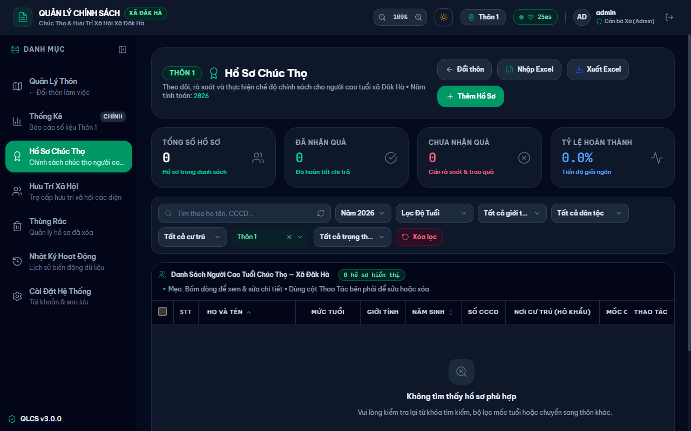
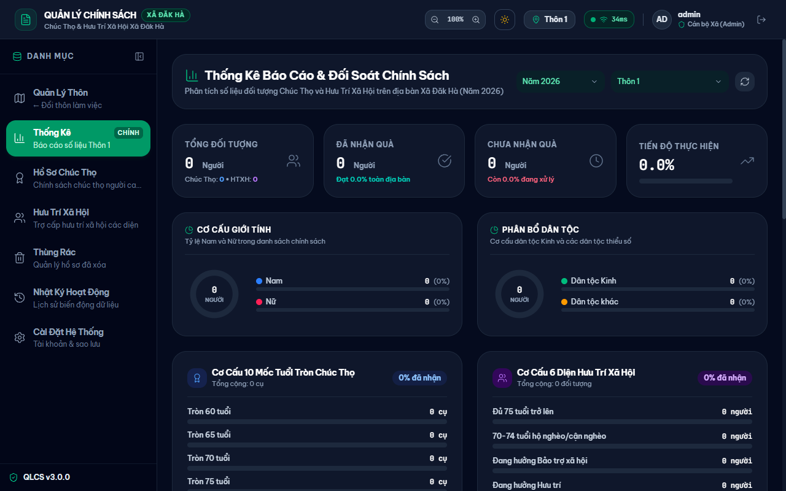
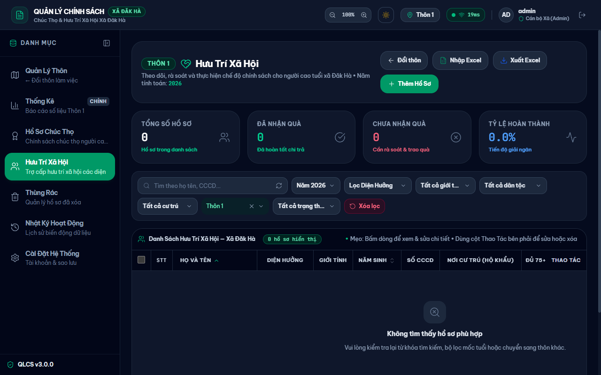
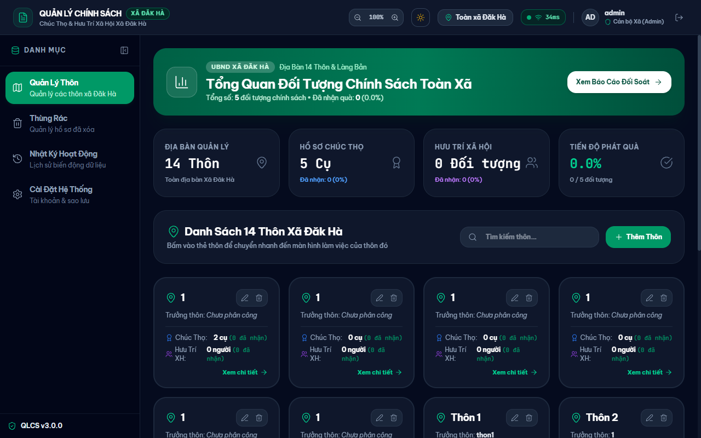
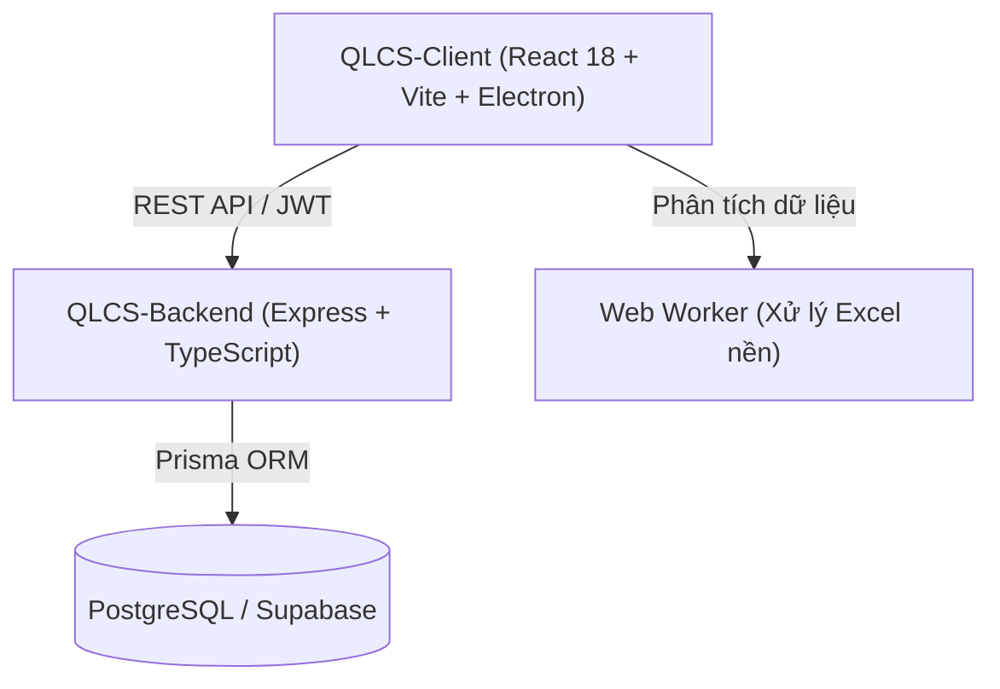

# Quản Lý Chính Sách Người Cao Tuổi — Xã Đăk Hà (QLCS)

Hệ thống số hóa, rà soát và thực hiện chế độ chính sách chúc thọ và hưu trí xã hội cho người cao tuổi tại xã Đăk Hà.

  

> [!IMPORTANT]
> **Bản quyền thuộc về UBND Xã Đăk Hà và Tác giả (Umnuar). Toàn bộ quyền được bảo lưu.**  
> Dự án độc quyền, không áp dụng giấy phép mã nguồn mở (như MIT, Apache). Chi tiết xem tại mục [Giấy phép](#giấy-phép).

---

## Mục lục

- [Tổng quan](#tổng-quan)
- [Ảnh chụp màn hình](#ảnh-chụp-màn-hình)
- [Tính năng](#tính-năng)
- [Kiến trúc](#kiến-trúc)
- [Bắt đầu nhanh](#bắt-đầu-nhanh)
- [Cấu trúc thư mục](#cấu-trúc-thư-mục)
- [Bảo mật](#bảo-mật)
- [Trạng thái và giới hạn đã biết](#trạng-thái-và-giới-hạn-đã-biết)
- [Người duy trì và liên hệ](#người-duy-trì-và-liên-hệ)
- [Giấy phép](#giấy-phép)

---

## Tổng quan

Hệ thống Quản Lý Chính Sách (QLCS) hỗ trợ cán bộ cấp xã và thôn quản lý hồ sơ chính sách người cao tuổi tại xã Đăk Hà. Ứng dụng giải quyết bài toán rà soát mốc chúc thọ theo năm, đối soát diện hưu trí xã hội, tự động hóa xử lý danh sách từ bảng tính Excel và quản lý dữ liệu tập trung.

### Hệ sinh thái Đăk Hà

| Ứng dụng | Vai trò | Kho mã nguồn |
| :--- | :--- | :--- |
| **QLCS** | Quản lý chế độ chính sách người cao tuổi (chúc thọ và hưu trí xã hội) | [Umnuar/QLCS](https://github.com/Umnuar/QLCS) |
| **QLHK** | Quản lý thông tin hộ khẩu, nhân khẩu và biến động cư trú | [Umnuar/QLHK](https://github.com/Umnuar/QLHK) |
| **QLNN** | Quản lý quy hoạch nông nghiệp, diện tích cây trồng và vật nuôi | [Umnuar/QLNN](https://github.com/Umnuar/QLNN) |

---

## Ảnh chụp màn hình

| Danh sách Hồ Sơ Chúc Thọ | Bảng Thống Kê & Đối Soát |
| :---: | :---: |
|  |  |

| Danh sách Hưu Trí Xã Hội | Quản Lý Thôn |
| :---: | :---: |
|  |  |

---

## Tính năng

### Quản lý hồ sơ chính sách
- **Hồ sơ chúc thọ**: Theo dõi danh sách theo mốc tuổi (70, 75, 80, 85, 90, 95, 100, trên 100), tính tuổi tự động theo năm tính toán và ngày sinh, đánh dấu nhận quà.
- **Hưu trí xã hội**: Quản lý các diện trợ cấp (từ 75 tuổi trở lên, 70–74 tuổi hộ nghèo/cận nghèo, bảo trợ xã hội, hưu trí, tuất bảo hiểm, người có công).
- **Bộ lọc đa tiêu chí**: Lọc theo thôn, độ tuổi, giới tính, dân tộc, nơi cư trú và trạng thái chi trả.
- **Thùng rác**: Lưu trữ hồ sơ đã xóa mềm, hỗ trợ khôi phục hoặc xóa vĩnh viễn.

### Xử lý dữ liệu & Báo cáo
- **Nhập dữ liệu Excel**: Kéo thả tệp `.xlsx`, `.xls`, `.csv`, tự động khớp cột, kiểm tra trùng lặp theo mã băm CCCD, xử lý nền qua Web Worker.
- **Xuất bảng tính**: Xuất danh sách theo mẫu chuẩn phục vụ chi trả và báo cáo.
- **Thống kê & Đối soát**: Tổng hợp chỉ số KPI, tỷ lệ đã nhận/chưa nhận theo từng thôn hoặc toàn xã.

### Quản trị & Giám sát
- **Quản lý địa bàn**: Danh sách thôn nạp động từ CSDL, gán tài khoản phụ trách từng thôn.
- **Phân quyền theo vai trò**: Cán bộ Xã (Admin) quản trị toàn xã; Trưởng Thôn quản lý dữ liệu trong phạm vi thôn được giao.
- **Nhật ký hoạt động**: Ghi vết thời gian, địa chỉ IP, cán bộ và nội dung thay đổi dữ liệu.

---

## Kiến trúc



### Bảng công nghệ

| Thành phần | Công nghệ | Phiên bản |
| :--- | :--- | :--- |
| Giao diện người dùng | React, Tailwind CSS, Lucide React | React 18.2.0, Tailwind 4.2.4 |
| Ứng dụng Desktop | Electron, electron-builder | Electron 42.1.0 |
| Công cụ xây dựng Client | Vite, TypeScript, Vitest | Vite 5.1.6, TS 5.2.2, Vitest 4.1.6 |
| Máy chủ API | Node.js, Express, tsx | Node >= 18, Express 4.21.0 |
| Cơ sở dữ liệu & ORM | PostgreSQL, Prisma ORM | Prisma 6.0.0 |
| Bảo mật & Mã hóa | Crypto (AES-256-GCM), bcryptjs, jsonwebtoken | bcryptjs 2.4.3, JWT 9.0.2 |

---

## Bắt đầu nhanh

### Yêu cầu môi trường
- Node.js phiên bản `>= 18.0.0`
- Trình quản lý gói `npm`
- Cơ sở dữ liệu PostgreSQL (hoặc Supabase)

### 1. Cài đặt

```bash
# Cài đặt phụ thuộc cho Backend
cd QLCS-Backend
npm install

# Cài đặt phụ thuộc cho Client
cd ../QLCS-Client
npm install
```

### 2. Cấu hình môi trường

Tạo tệp `.env` tại thư mục `QLCS-Backend/` từ mẫu `.env.example`:

| Tên biến | Ý nghĩa | Bắt buộc |
| :--- | :--- | :---: |
| `PORT` | Cổng dịch vụ Backend (mặc định: `5000`) | Không |
| `NODE_ENV` | Môi trường chạy (`development` / `production`) | Không |
| `DATABASE_URL` | Chuỗi kết nối PostgreSQL (Session / Pooler) | Có |
| `DIRECT_URL` | Chuỗi kết nối trực tiếp PostgreSQL (dùng cho migrate) | Có |
| `JWT_SECRET` | Khóa bí mật ký Access Token | Có |
| `JWT_REFRESH_SECRET` | Khóa bí mật ký Refresh Token | Có |
| `ENCRYPTION_KEY` | Khóa 256-bit (64 ký tự hex) mã hóa CCCD qua AES-256-GCM | Có |
| `BACKUP_ENCRYPTION_KEY` | Khóa mã hóa tệp sao lưu dữ liệu | Không |
| `CORS_ORIGIN` | Nguồn gốc cho phép kết nối API (ví dụ: `http://localhost:5173`) | Có |

Tạo tệp `.env.local` tại thư mục `QLCS-Client/` từ mẫu `.env.example`:

| Tên biến | Ý nghĩa | Bắt buộc |
| :--- | :--- | :---: |
| `VITE_API_URL` | Địa chỉ gốc API Backend (mặc định: `http://localhost:5000/api`) | Có |

### 3. Chạy phát triển

```bash
# Khởi chạy Backend (Cổng 5000)
cd QLCS-Backend
npm run prisma:push
npm run dev

# Khởi chạy Client Web (Cổng 5173, mở terminal mới)
cd QLCS-Client
npm run dev
```

### 4. Chạy kiểm thử

```bash
# Kiểm thử Client (107 bài test)
cd QLCS-Client
npm test

# Kiểm thử Backend (13 bài test)
cd QLCS-Backend
npm test
```

### 5. Đóng gói ứng dụng

```bash
# Đóng gói bản Web
cd QLCS-Client
npm run build:vite

# Đóng gói bản Desktop Windows (bản cài đặt .exe)
npm run build:win
```

---

## Cấu trúc thư mục

```
QLCS/
├── QLCS-Backend/            # Dịch vụ máy chủ Express, Prisma ORM và API
│   ├── prisma/              # Lược đồ CSDL và tệp di chuyển Prisma
│   ├── scripts/             # Kịch bản nạp dữ liệu và bảo trì CSDL
│   └── src/                 # Bộ điều khiển, định tuyến, middleware và tiện ích mã hóa
├── QLCS-Client/             # Ứng dụng giao diện người dùng React và Electron
│   ├── electron/            # Mã nguồn tiến trình chính và preload của Electron
│   └── src/                 # Giao diện, components, hooks, web workers và API client
├── docs/                    # Tài liệu kiểm thử, kiến trúc và ảnh chụp màn hình
├── tests/                   # Kịch bản kiểm thử tích hợp đầu cuối
├── README.md                # Tài liệu tổng quan dự án
└── SECURITY.md              # Chính sách an toàn thông tin và báo cáo lỗ hổng
```

---

## Bảo mật

Hệ thống mã hóa số CCCD bằng thuật toán AES-256-GCM, hiển thị dạng che mờ `••••••••1234` trên giao diện và phân quyền truy cập nghiêm ngặt theo thôn. Mọi thao tác nhạy cảm đều được ghi nhận vào nhật ký kiểm toán. Xem chi tiết quy trình báo cáo lỗ hổng tại [SECURITY.md](SECURITY.md).

---

## Trạng thái và giới hạn đã biết

- **Trạng thái**: Hệ thống đang vận hành trong môi trường mạng nội bộ thử nghiệm tại xã Đăk Hà.
- **Giới hạn đã biết**:
  - Tính năng nhập Excel phụ thuộc cấu trúc cột biểu mẫu; cần ánh xạ cột khi định dạng nguồn thay đổi.
  - Ứng dụng Desktop hiện tối ưu cho hệ điều hành Windows; bản macOS và Linux chưa được đóng gói chính thức.
- **Hướng phát triển**: Tiếp tục tối ưu hóa hiệu năng đồng bộ dữ liệu ngoại tuyến và mở rộng kết nối liên thông với QLHK và QLNN.

---

## Người duy trì và liên hệ

- **Đơn vị quản lý**: Ban Chỉ đạo Chuyển đổi số UBND Xã Đăk Hà.
- **Tác giả phát triển**: [Umnuar (GitHub)](https://github.com/Umnuar).
- **Liên hệ kỹ thuật & an ninh**: Vui lòng xem hướng dẫn tại [SECURITY.md](SECURITY.md).

---

## Giấy phép

Toàn bộ mã nguồn, cấu trúc dữ liệu và tài liệu kỹ thuật của dự án này thuộc quyền sở hữu trí tuệ của **Ủy ban nhân dân Xã Đăk Hà, Huyện Đăk Hà, Tỉnh Kon Tum**. Mọi quyền được bảo lưu (All Rights Reserved). Dự án không áp dụng giấy phép mã nguồn mở (không áp dụng MIT License, Apache hoặc GPL). Nghiêm cấm sao chép, chỉnh sửa, phân phối lại hoặc sử dụng vào mục đích thương mại khi chưa có văn bản chấp thuận chính thức từ cơ quan chủ quản.
