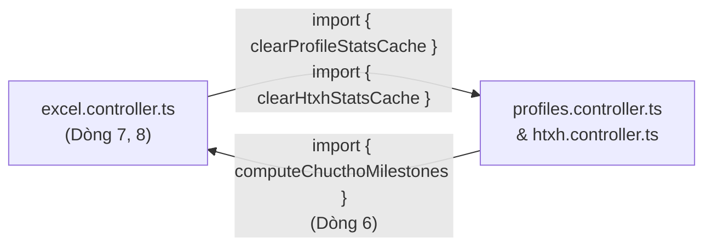
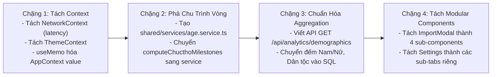

# BÁO CÁO THẨM TRA KIẾN TRÚC HỆ THỐNG (SYSTEM ARCHITECTURE AUDIT)
**Dự án**: Hệ Thống Quản Lý Chính Sách Xã Đăk Hà (QLCS)  
**Phân hệ thẩm tra**: `QLCS-Client` (React + Vite + Electron) & `QLCS-Backend` (Node.js + Express + Prisma)  
**Thời điểm thẩm tra**: 30/09/2026  
**Thực hiện bởi**: AGENT 1 - ARCHITECTURE & CODE QUALITY AUDITOR  
**Mức độ tuân thủ**: 20 Core Engineering Rules & Behavior Baseline  

---

## MỤC LỤC
1. [Tổng Quan Kiến Trúc & Cấu Trúc Thư Mục](#1-tổng-quan-kiến-trúc--cấu-trúc-thư-mục)
2. [Phân Định Ranh Giới Giữa Các Tầng Hệ Thống](#2-phân-định-ranh-giới-giữa-các-tầng-hệ-thống)
3. [Hướng Phụ Thuộc, Khớp Nối & Tính Kết Dính](#3-hướng-phụ-thuộc-khớp-nối--tính-kết-dính)
4. [Phát Hiện Phụ Thuộc Vòng (Circular Dependencies)](#4-phát-hiện-phụ-thuộc-vòng-circular-dependencies)
5. [Trách Nhiệm Bị Trùng Lặp Giữa Client & Backend](#5-trách-nhiệm-bị-trùng-lặp-giữa-client--backend)
6. [Phân Tích Các Module / Component Quá Khổ (Oversized Modules)](#6-phân-tích-các-module--component-quá-khổ-oversized-modules)
7. [Kiến Trúc Quản Lý Trạng Thái & Caching](#7-kiến-trúc-quản-lý-trạng-thái--caching)
8. [Phân Loại Phát Hiện Kiến Trúc (4 Phân Hạng Chuẩn Hóa)](#8-phân-loại-phát-hiện-kiến-trúc-4-phân-hạng-chuẩn-hóa)
9. [Đánh Giá Rủi Ro & Lộ Trình Tái Cấu Trúc Kiến Trúc](#9-đánh-giá-rủi-ro--lộ-trình-tái-cấu-trúc-kiến-trúc)

---

## 1. TỔNG QUAN KIẾN TRÚC & CẤU TRÚC THƯ MỤC

### 1.1. Sơ Đồ Kiến Trúc Tổng Thể (System Topology)

```mermaid
flowchart TD
    subgraph ClientLayer["LỚP CLIENT (QLCS-Client - Port 5173 / Electron 42)"]
        ElectronMain["Electron Main Process<br/>(electron/main.ts)<br/>Single Instance, CSP, Store"]
        Preload["Preload Context Bridge<br/>(electron/preload.ts)<br/>electronAPI / api"]
        ReactUI["React 18 Renderer<br/>(Vite 5 + TailwindCSS v4)<br/>AppLayout, Pages, Modals"]
        AppContext["AppContext (God Context)<br/>Auth, Tab, Zoom, Theme, Heartbeat"]
        IndexedDB["IndexedDB Cache Layer<br/>(idb + WebCrypto AES-GCM)<br/>Cache, Drafts, SyncQueue"]
        WebWorkers["Web Workers Pool<br/>(importChucthoWorker, importHtxhWorker)"]
    end

    subgraph TransportLayer["GIAO THỨC TRUYỀN DẪN"]
        REST["HTTP/1.1 REST API<br/>Bearer JWT Access Token (15m)"]
        SocketIO["Socket.io WebSocket<br/>Room: village:{id}"]
    end

    subgraph BackendLayer["LỚP BACKEND (QLCS-Backend - Port 5000 / qlcs.dulieudakha.vn)"]
        ExpressApp["Express Application (src/index.ts)<br/>Helmet, CORS, Trust Proxy 1"]
        Middlewares["Middlewares Pipeline<br/>requestLogger, authenticateToken, authorizeVillageScope"]
        Controllers["Controllers Layer (10 Controllers)<br/>profiles, htxh, excel, auth, analytics, users, backup, ..."]
        PrismaExt["Prisma Client Extension<br/>(src/config/prisma.ts)<br/>Auto AES-256-GCM CCCD Encrypt/Decrypt"]
        CronModule["Cron Job & Terminal Dashboard<br/>(02:00 AM Cron + 15s Terminal Refresh)"]
    end

    subgraph PersistenceLayer["LỚP CƠ SỞ DỮ LIỆU (Supabase PostgreSQL)"]
        PG[(PostgreSQL 15+)<br/>villages, users, refresh_tokens<br/>profiles, htxh_profiles, profile_audit_log<br/>settings, stats_cache]
    end

    ElectronMain -->|IPC contextBridge| Preload
    Preload --> ReactUI
    ReactUI --> AppContext
    ReactUI --> IndexedDB
    ReactUI --> WebWorkers
    AppContext --> REST
    ReactUI --> REST
    ReactUI -.-> SocketIO

    REST --> ExpressApp
    SocketIO --> ExpressApp
    ExpressApp --> Middlewares
    Middlewares --> Controllers
    Controllers --> PrismaExt
    CronModule --> PrismaExt
    PrismaExt --> PersistenceLayer
```

### 1.2. Phân Tích Cấu Trúc Thư Mục

| Thư mục | Mục đích thực tế | Nhận xét kiến trúc |
| :--- | :--- | :--- |
| `QLCS-Client/electron/` | Khởi tạo cửa sổ BrowserWindow, nạp CSP, đăng ký IPC handlers, tự động cập nhật (electron-updater). | Tách biệt với renderer code. Tuy nhiên, IPC handlers chưa kiểm tra nguồn gốc caller (`event.senderFrame`), và mã hóa Token Store dùng Secret Key hardcode. |
| `QLCS-Client/src/api/` | Bộ các hàm Axios gọi endpoint backend (`profiles.ts`, `htxh.ts`, `analyticsApi.ts`, `auth.ts`, `usersApi.ts`, `villages.ts`, `backupApi.ts`, `auditApi.ts`, `settings.ts`, `excelApi.ts`). | Phân chia module rõ theo resource, nhưng tồn tại `excelApi.ts` hoàn toàn không được import/sử dụng ở bất cứ màn hình nào. |
| `QLCS-Client/src/components/` | Gồm `Layout/` (Header, Sidebar, AppLayout), `common/` (CustomSelect, TablePagination), `network/` (ConnectionBanner, ServerStatusModal), `settings/` (BackupRestoreTab), `ErrorBoundary.tsx`. | Tổ chức hợp lý; tuy nhiên một số component dùng chung như `CustomSelect.tsx` (505 dòng) phình to và chứa cả logic portal vị trí phức tạp. |
| `QLCS-Client/src/db/` | `indexedDB.ts`: Triển khai 3 object stores (`cache`, `drafts`, `syncQueue`) kết hợp mã hóa AES-GCM PII qua `cryptoHelper.ts`. | Kiến trúc cache đọc rất tốt, nhưng `syncQueue` là một tính năng bỏ dở (Dead/Abandoned Abstraction) do không có code nào gọi `enqueueSync`. |
| `QLCS-Client/src/pages/` | Gồm `Dashboard/`, `AnalyticsPage.tsx`, `VillagesPage.tsx`, `RecycleBinPage.tsx`, `AuditLogPage.tsx`, `Settings/`, `Login.tsx`. | Phân chia theo 6 màn hình nghiệp vụ, nhưng kích thước từng trang rất lớn (800 - 1500 dòng), vi phạm nguyên tắc Single Responsibility. |
| `QLCS-Client/src/workers/` | Web Workers xử lý parsing Excel nền: `importChucthoWorker.ts`, `importHtxhWorker.ts`, `importCutriWorker.ts`, `workerUtils.ts`. | Tách biệt luồng xử lý nặng khỏi UI thread. Tuy nhiên, `importCutriWorker.ts` bị bỏ quên không dùng. |
| `QLCS-Backend/src/controllers/` | 10 controllers phụ trách toàn bộ API endpoints. | **Thiếu Tầng Service (No Service Layer)**: Toàn bộ business logic, query CSDL, mã hóa, logging kiểm toán, cache in-memory đều nhồi trực tiếp vào Controller. |
| `QLCS-Backend/src/routes/` | 10 file routes tương ứng với controllers. | Rất chuẩn RESTful, tuy nhiên 100% route handlers đều phải ép kiểu `as any` do xung đột types Express. |
| `QLCS-Backend/src/config/` | `prisma.ts`: Khởi tạo PrismaClient và mở rộng `$extends` để tự động mã hóa/giải mã AES-256-GCM cho cột `cccd`. | Ý tưởng rất tốt, nhưng khi mở rộng Prisma mất type inference dẫn đến 158 lần gọi `(prisma as any)`. |
| `QLCS-Backend/src/utils/` | `jwt.ts`, `audit.ts`, `dashboard.ts`. | `dashboard.ts` (340 dòng) tích hợp giao diện terminal vẽ bảng ANSI và tự động truy vấn CSDL 15s/lần, gây overhead không cần thiết cho server. |

---

## 2. PHÂN ĐỊNH RANH GIỚI GIỮA CÁC TẦNG HỆ THỐNG

### 2.1. Đánh Giá Ranh Giới Logic

```
+-----------------------------------------------------------------------------------------+
| RANH GIỚI KIẾN TRÚC           HIỆN TRẠNG                    ĐÁNH GIÁ CHUẨN HÓA          |
+-----------------------------------------------------------------------------------------+
| UI Logic (Presentation)       Nằm trong React Pages/Modals   VI PHẠM: UI chứa tính toán |
|                                                             nghiệp vụ mốc tuổi và lọc   |
|                                                             demographics mảng lớn.      |
+-----------------------------------------------------------------------------------------+
| Business Logic (Nghiệp vụ)    Phân mảnh giữa Client         VI PHẠM NẶNG: Không có nguồn|
|                               (Worker, Modal, Exporter) và   chân lý duy nhất (Single   |
|                               Backend (Controllers).         Source of Truth) cho tuổi. |
+-----------------------------------------------------------------------------------------+
| Data Access Logic (CSDL)      Nhồi thẳng vào Controllers     VI PHẠM: Thiếu Repository  |
|                               bằng `(prisma as any)`.        hoặc Service layer.        |
+-----------------------------------------------------------------------------------------+
| IPC Logic (Electron)          Tách riêng trong `main.ts` và  ĐẠT: Có contextIsolation.  |
|                               `preload.ts`.                  THIẾU: Không validate frame|
+-----------------------------------------------------------------------------------------+
| Security / Cryptography       Mã hóa Client (IndexedDB) và   ĐẠT NGUYÊN TẮC: Defense in |
|                               Mã hóa Backend (Prisma CCCD).  depth. Tốt cho bảo vệ PII. |
+-----------------------------------------------------------------------------------------+
```

### 2.2. Điểm Gãy Ranh Giới Điển Hình: Thống Kê Nhân Khẩu Học (`AnalyticsPage.tsx`)
- **Bằng chứng**: `QLCS-Client/src/pages/AnalyticsPage.tsx`, dòng 211 - 255:
```typescript
// Client tải tối đa 1000 hồ sơ Chúc Thọ và 1000 hồ sơ HTXH về trình duyệt
const [ovData, bvData, profilesRes, htxhRes] = await Promise.all([
    analyticsApi.getOverview({ villageId: selectedVillage || undefined, calculationYear: selectedYear }),
    analyticsApi.getByVillage({ calculationYear: selectedYear }),
    profilesApi.getProfiles({ villageId: selectedVillage || undefined, limit: 1000 }).catch(() => null),
    htxhApi.getProfiles({ villageId: selectedVillage || undefined, limit: 1000 }).catch(() => null),
]);

// Sau đó tự duyệt mảng trong bộ nhớ Client bằng vòng lặp JS để đếm Nam/Nữ và Dân tộc!
allRecords.forEach((p: any) => {
    const g = (p.gender || "").toLowerCase().trim();
    if (g === "nam") male++;
    else if (g === "nữ" || g === "nu") female++;
    else if (g) male++;

    const eth = (p.ethnicity || "").toLowerCase().trim();
    if (eth === "kinh" || eth === "") kinh++;
    else other++;
});
```
- **Hệ quả kiến trúc**:
  1. *Xâm phạm ranh giới*: Nhiệm vụ tổng hợp dữ liệu thống kê (Aggregation) là trách nhiệm cốt lõi của Backend/Database (SQL `COUNT(*) GROUP BY gender, ethnicity`). Client chỉ việc nhận kết quả đếm dạng `{ male: 120, female: 135 }`.
  2. *Lỗi sai lệch số liệu*: `limit: 1000` khiến các xã/thôn có trên 1,000 hồ sơ bị cắt cụt số liệu, biểu đồ MiniDonut hiển thị sai thực tế.
  3. *Lãng phí băng thông & bảo mật*: Kéo hàng nghìn bản ghi đầy đủ PII (CCCD, địa chỉ, ngày sinh) qua mạng chỉ để đếm 4 con số nguyên.

---

## 3. HƯỚNG PHỤ THUỘC, KHỚP NỐI & TÍNH KẾT DÍNH

### 3.1. Phân Tích Khớp Nối (Coupling) & Kết Dính (Cohesion)

Dựa trên kết quả đo lường AST và Graph Community Analysis từ `graphify-out/GRAPH_REPORT.md`:
- **`QLCS-Backend/src/index.ts`**: Độ kết dính Cohesion cực thấp: **0.0569** (trên thang 1.0). File này ôm đồm: nạp biến môi trường, thiết lập CORS, cấu hình Express, khởi tạo Socket.io, đăng ký 10 route groups, xử lý lỗi toàn cục, khởi động server HTTP, gọi cron job, và kích hoạt Terminal Dashboard.
- **`QLCS-Backend/src/controllers/htxh.controller.ts`**: Cohesion: **0.0885**. Chứa 56 nodes gồm logic lọc, phân trang, kiểm tra OCC, ghi nhật ký audit, mã hóa/giải mã, xuất stream NDJSON, xóa mềm, dọn thùng rác, và cache in-memory.
- **`QLCS-Client/src/AppContext.tsx`**: Cohesion: **0.13**. Nút trung tâm kết nối (God Node) với 23 edges liên kết đến hầu hết các page và hook.

### 3.2. Thiếu Khái Niệm Tầng Dịch Vụ (Service Layer Deficiency)
Trong `QLCS-Backend`, luồng điều khiển đi thẳng:
$$\text{HTTP Request} \longrightarrow \text{Routes} \longrightarrow \text{Controller} \longrightarrow \text{Prisma DB}$$
Không hề tồn tại thư mục `src/services/`. Mọi tính toán logic như:
- Xác định mốc tuổi tròn (`computeChucthoMilestones`)
- Kiểm tra xung đột phiên bản Optimistic Concurrency Control (`currentProfile.version !== data.version`)
- Gom cụm dữ liệu phân tích (`getOverview`, `getByVillage`)
- Đọc/ghi cache ram (`statsCache.get()`, `statsCache.set()`)
đều gắn chặt cứng (tightly coupled) vào các hàm `(req: Request, res: Response)`. Điều này khiến việc viết Unit Test cho logic nghiệp vụ mà không cần mock Express Request/Response trở nên bất khả thi.

---

## 4. PHÁT HIỆN PHỤ THUỘC VÒNG (CIRCULAR DEPENDENCIES)

### 4.1. Phụ Thuộc Vòng Cốt Lõi Tại Backend

Phân tích đồ thị nhập xuất đã phát hiện một chu trình phụ thuộc trực tiếp (Direct Cycle):



- **Bằng chứng mã nguồn**:
  1. `QLCS-Backend/src/controllers/excel.controller.ts`:
     - Dòng 7: `import { clearHtxhStatsCache } from "./htxh.controller";`
     - Dòng 8: `import { clearProfileStatsCache } from "./profiles.controller";`
  2. `QLCS-Backend/src/controllers/profiles.controller.ts`:
     - Dòng 6: `import { computeChucthoMilestones } from "./excel.controller";`
- **Nguyên nhân gốc rễ**: Hàm tính toán mốc tuổi chúc thọ `computeChucthoMilestones` là một pure utility function nhưng lại bị đặt nhầm vào `excel.controller.ts`. Khi `profiles.controller.ts` cần tính toán lại tuổi (`recalculateAgeFields`), nó import từ `excel.controller.ts`. Ngược lại, khi `excel.controller.ts` import Excel xong, nó cần xóa cache của `profiles.controller.ts`.
- **Rủi ro kiến trúc**: Gây lỗi `undefined` khi nạp module runtime trong môi trường CommonJS/Node.js bundling nếu thứ tự module execution bị đảo lộn.

---

## 5. TRÁCH NHIỆM BỊ TRÙNG LẶP GIỮA CLIENT & BACKEND

### 5.1. Ma Trận Trùng Lặp Nghiệp Vụ (Duplication Matrix)

| Nghiệp vụ | Vị trí Client | Vị trí Backend | Đánh giá & Rủi ro |
| :--- | :--- | :--- | :--- |
| **Tính toán Mốc Tuổi Chúc Thọ** | 1. `workerUtils.ts` (`calcAgeFields`, dòng 130)<br/>2. `ProfileModal.tsx` (dòng 214-225)<br/>3. `excelExporter.ts` (dòng 81-90) | 1. `excel.controller.ts` (`computeChucthoMilestones`, dòng 66)<br/>2. `profiles.controller.ts` (dòng 763) | **Trùng lặp 5 lần**: Nếu quy định mốc tuổi chúc thọ thay đổi (hoặc bổ sung mốc 105), kỹ sư phải sửa đồng thời ở 5 file khác nhau. Rất dễ lệch pha giữa giao diện và CSDL. |
| **Phân tích & Parsing Tệp Excel** | `useImportExport.ts` (1,072 dòng) + 3 Web Workers (`importChucthoWorker.ts`, `importHtxhWorker.ts`, `importCutriWorker.ts`) dùng thư viện `xlsx` (SheetJS) | `excel.controller.ts` (`parseExcelBuffer`, dòng 108-160) dùng thư viện `exceljs` | **Kiến trúc phân liệt (Architectural Schism)**: Hệ thống duy trì 2 động cơ parse Excel hoàn chỉnh bằng 2 thư viện khác nhau (`xlsx` ở client, `exceljs` ở backend). Backend controller trở thành code zombie không sử dụng. |
| **Xuất Báo Cáo Excel** | `excelExporter.ts` (`exportExcelClient`, dòng 13) dùng `xlsx-js-style` | `excel.controller.ts` (`exportExcel`, dòng 180-350) dùng `exceljs` | Client tự build buffer và tải về trực tiếp. Endpoint `/api/excel/export` của Backend không bao giờ được gọi. |
| **Lấy Mẫu Tệp Excel** | `excelExporter.ts` (`downloadTemplateClient`, dòng 480) tạo file binary giả lập | `excel.controller.ts` (`downloadTemplate`, dòng 360-450) tạo file qua `exceljs` | Trùng lặp hoàn toàn định dạng bảng mẫu. |
| **Mã hóa Dữ liệu Nhạy Cảm** | `cryptoHelper.ts` (WebCrypto AES-GCM cho IndexedDB) | `config/prisma.ts` (Node crypto AES-256-GCM cho Postgres) | Không phải lỗi mà là hai cơ chế riêng biệt; tuy nhiên tên trường mã hóa và format hex khác nhau (`enc:iv:cipher` vs `iv:authTag:cipher`). |

### 5.2. Sự Bất Nhất Về Quy Chuẩn Tên Trường & Casing
- Database Schema (`schema.prisma`): Chuẩn `snake_case` (`village_id`, `current_address`, `received: Boolean`).
- Frontend Types (`types/shared.ts` và `Dashboard/types.ts`): Hỗn hợp `camelCase` và `snake_case`:
```typescript
// QLCS-Client/src/pages/Dashboard/types.ts: dòng 4-5, dòng 11-12
village_id?: string | null;
villageId?: string | number | null;
currentAddress: string;
received: boolean | number;
```
- Dẫn đến code phòng thủ (defensive programming) lan tràn khắp dự án: `p.currentAddress || p.current_address`, `p.village_id || p.villageId`, `p.ageOver100 || p.age_over_100`.

---

## 6. PHÂN TÍCH CÁC MODULE / COMPONENT QUÁ KHỔ (OVERSIZED MODULES)

Hệ thống có ít nhất 11 tệp mã nguồn vượt ngưỡng 500 dòng (tiêu chuẩn khuyến nghị của Senior Dev: một component/module không nên vượt quá 300 - 400 dòng):

```
+-----------------------------------------------------------------------------------------+
| DANH SÁCH MODULE QUÁ KHỔ (TOP OVERSIZED MODULES)                                        |
+-----------------------------------------------------------------------------------------+
| 1. QLCS-Client/.../modals/ImportModal.tsx        | 1,510 dòng  | 57.5 KB  | P0 (Khẩn cấp)|
| 2. QLCS-Client/.../pages/Settings/index.tsx      | 1,285 dòng  | 49.1 KB  | P0 (Khẩn cấp)|
| 3. QLCS-Client/.../hooks/useImportExport.ts      | 1,072 dòng  | 28.2 KB  | P1 (Nặng)    |
| 4. QLCS-Backend/src/controllers/excel.controller | 1,037 dòng  | 27.7 KB  | P1 (Nặng)    |
| 5. QLCS-Client/src/pages/AuditLogPage.tsx        |   875 dòng  | 30.6 KB  | P1 (Nặng)    |
| 6. QLCS-Client/src/pages/AnalyticsPage.tsx       |   843 dòng  | 30.2 KB  | P1 (Nặng)    |
| 7. QLCS-Backend/src/controllers/htxh.controller  |   805 dòng  | 23.4 KB  | P1 (Nặng)    |
| 8. QLCS-Backend/src/controllers/profiles.ctrl    |   778 dòng  | 22.7 KB  | P1 (Nặng)    |
| 9. QLCS-Client/src/utils/excelExporter.ts        |   667 dòng  | 15.3 KB  | P2 (Vừa)     |
| 10. QLCS-Client/.../modals/ProfileModal.tsx      |   659 dòng  | 22.0 KB  | P2 (Vừa)     |
| 11. QLCS-Client/src/pages/VillagesPage.tsx       |   601 dòng  | 21.5 KB  | P2 (Vừa)     |
+-----------------------------------------------------------------------------------------+
```

### Chi Tiết Điểm Nghẽn Của 2 Module Lớn Nhất:
1. **`ImportModal.tsx` (1,510 dòng)**:
   - Gộp chung toàn bộ: Giao diện kéo thả file, Dropdown ánh xạ cột `MappingSelect` (kèm tính toán Portal DOM viewport `getBoundingClientRect`), bảng preview dữ liệu 30 dòng, thanh tiến trình nhập, bảng tổng kết lỗi, modal template preset lưu vào localStorage.
   - Component này là một quái vật nguyên khối (Monolithic View), bảo trì cực kỳ khó khăn.
2. **`Settings/index.tsx` (1,285 dòng)**:
   - Thay vì chỉ làm trang layout định tuyến 5 tab, file này cài đặt trực tiếp toàn bộ HTML và state cho: Đổi mật khẩu cá nhân, Danh sách quản lý cán bộ, Modal thêm cán bộ, Modal reset mật khẩu cán bộ, Modal gán thôn cho cán bộ, Form thông tin đơn vị xã.
   - Thậm chí đã có file `ProfileCard.tsx` (414 dòng) được viết sẵn để tách tab Profile nhưng không được import!

---

## 7. KIẾN TRÚC QUẢN LÝ TRẠNG THÁI & CACHING

### 7.1. Phân Tích God Context `AppContext.tsx`
- **Hiện trạng**: `AppContext.tsx` quản lý đồng thời 25 trường state/actions trong cùng một context object:
  - Danh tính & Phiên: `user`, `setUser`, `logout`, `isInitializing`
  - Điều hướng: `activeTab`, `setActiveTab`, `selectedVillageId`, `selectedVillageName`
  - Dữ liệu danh mục: `villages`, `setVillages`, `refreshVillages`
  - Giao diện: `theme`, `toggleTheme`, `isDarkMode`, `isSidebarCollapsed`, `toggleSidebar`
  - Thu phóng: `zoomLevel`, `zoomIn`, `zoomOut`, `resetZoom`
  - Mạng & Sức khỏe hệ thống: `isOnline`, `isBackendHealthy`, `latency`, `checkServerHealth`
  - Đồng bộ: `syncQueueCount`
- **Hậu Quả Hiệu Năng Cực Kỳ Nghiêm Trọng**:
  - Dòng 407: `const heartbeatTimer = setInterval(() => { checkServerHealth(); }, 6000);`  
    Mỗi 6 giây, `checkServerHealth` thực hiện ping tới backend và gọi `setLatency`.
  - Dòng 436: `<AppContext.Provider value={{ user, activeTab, latency, ... }}>`  
    Đối tượng `value` **KHÔNG ĐƯỢC BỌC TRONG `useMemo`**, được tạo mới ở MỌI render của `AppProvider`.
  - Kết quả: **Cứ mỗi 6 giây, toàn bộ cây giao diện ứng dụng (bao gồm tất cả component gọi `useApp()`) bị ép buộc RE-RENDER toàn bộ**, bất kể dữ liệu nghiệp vụ có thay đổi hay không!

### 7.2. Tình Trạng Hàng Đợi Đồng Bộ Ngoại Tuyến (Offline Sync Queue)
- **Vấn đề**: File `QLCS-Client/src/db/indexedDB.ts` khai báo đầy đủ bảng `syncQueue` và các hàm:
  - `enqueueSync(action, entity, data)`
  - `getSyncQueue()`
  - `removeSyncQueueItem(id)`
- Tuy nhiên, quét toàn bộ mã nguồn cho thấy **KHÔNG CÓ BẤT KỲ DÒNG CODE NÀO GỌI `enqueueSync` HOẶC `getSyncQueue`**!
- Mọi thao tác ghi dữ liệu (Thêm, Sửa, Xóa hồ sơ trong `useProfiles.ts`) khi mất mạng đều trực tiếp thất bại và bật modal lỗi `showAlert({ title: "Lỗi", type: "error" })`.
- `syncQueueCount` trong `AppContext` luôn luôn bằng 0. Đây là một cơ chế ngoại tuyến dang dở, chưa hoàn thiện kiến trúc Offline-First cho các thao tác Mutation.

---

## 8. PHÂN LOẠI PHÁT HIỆN KIẾN TRÚC (4 PHÂN HẠNG CHUẨN HÓA)

### 8.1. [Existing Intended Behavior] - Hành Vi Mong Muốn Bắt Buộc Bảo Tồn
1. **Kiến trúc Thin-Client Electron**: Client đóng gói chạy qua Electron nhưng bản chất là SPA React kết nối qua HTTP/REST tới Backend Port 5000, cho phép chạy song song bản Web trên trình duyệt.
2. **Bảo vệ PII đa tầng**: CCCD được mã hóa AES-256-GCM ở CSDL, tạo hash SHA-256 để tìm kiếm chính xác, che 8 số đầu trên UI (`••••••••1234`), và mã hóa WebCrypto khi lưu cache IndexedDB.
3. **Optimistic Concurrency Control (OCC)**: Trường `version` trên cả 2 bảng `profiles` và `htxh_profiles` ngăn chặn ghi đè đồng thời khi cán bộ thôn và xã cùng thao tác (HTTP 409).
4. **Phân vùng dữ liệu (Village Scoping RBAC)**: Middleware `authorizeVillageScope` tự động cô lập dữ liệu cho trưởng thôn theo `village_id`.
5. **In-Memory Stats Caching (10s TTL)**: Giảm thiểu tắc nghẽn connection pool trên Supabase bằng Map cache in-memory thay vì truy vấn bảng `stats_cache` liên tục.

### 8.2. [Existing Bug] - Lỗi Kiến Trúc Thực Tế
1. **Phụ thuộc vòng Module Backend**: `excel.controller.ts` $\longleftrightarrow$ `profiles.controller.ts`.
2. **Bão Re-render toàn ứng dụng mỗi 6s**: `AppContext.tsx` cập nhật `latency` định kỳ 6s mà không tách rời Network Context khỏi App State Context, làm vô hiệu hóa `React.memo`.
3. **Aggregation nhân khẩu học sai ranh giới**: `AnalyticsPage.tsx` kéo 2,000 bản ghi thô về Client để lặp mảng tính Nam/Nữ và Kinh/Khác. Giới hạn `limit: 1000` gây sai lệch số liệu thực tế.
4. **Bất nhất khóa ngoại Thôn**: `profiles.village_id` là nullable (`String?`), nhưng `htxh_profiles.village_id` là required (`String @db.Uuid`).

### 8.3. [Unclear Behavior] - Hành Vi Chưa Rõ Ràng Cần Quyết Định
1. **Mục đích của Backend Excel Controller**: Toàn bộ nghiệp vụ Import, Export và Mẫu Excel đang chạy 100% phía Client qua Web Workers. Cần quyết định: Giữ lại backend Excel làm REST API chính thức hay xóa bỏ để tinh gọn backend?
2. **Chính sách Backup 02:00 AM**: Cron job 02:00 AM hiện chỉ đếm số bản ghi và ghi vào audit log, không tạo snapshot file vật lý. Cần làm rõ: Liệu có cần tạo snapshot JSON thực sự và lưu trữ trên ổ đĩa / Cloudflare R2 không?

### 8.4. [Unnecessary Complexity] - Độ Phức Tạp Không Cần Thiết
1. **Terminal Status Dashboard trong Backend (`src/utils/dashboard.ts` - 340 dòng)**: Xây dựng cả một engine vẽ bảng ANSI escape sequences phức tạp chạy mỗi 15s kèm query DB, không phục vụ sản phẩm cho người dùng cuối và gây hao tốn tài nguyên server.
2. **Duy trì đồng thời hai thư viện Excel**: Cả `xlsx` (SheetJS) và `exceljs` cùng tồn tại trong hệ thống, làm tăng kích thước bundle và chi phí bảo trì.
3. **Cấu trúc phản hồi hai tầng trùng lặp**: `bulkAddProfiles` trả về các trường `inserted`, `created`, `updated`, `errors` lặp lại 2 lần (ở cả root JSON và trong `data.*`).

---

## 9. ĐÁNH GIÁ RỦI RO & LỘ TRÌNH TÁI CẤU TRÚC KIẾN TRÚC

### 9.1. Bảng Đánh Giá Rủi Ro

| Mã Rủi Ro | Phân loại | Tác động | Khả năng xảy ra | Mức độ |
| :--- | :--- | :--- | :--- | :--- |
| **ARCH-R01** | Bão re-render do AppContext God Node | Gây giật lag giao diện, giảm tuổi thọ pin máy tính bảng cán bộ thôn | 100% (mỗi 6s) | **CRITICAL (P0)** |
| **ARCH-R02** | Xâm phạm ranh giới Aggregation ở Analytics | Sai lệch báo cáo nhân khẩu học của xã khi số hồ sơ > 1,000 | Cao | **HIGH (P1)** |
| **ARCH-R03** | Phụ thuộc vòng `excel.controller` <-> `profiles.controller` | Nguy cơ crash tiến trình khi tái cấu trúc hoặc thay đổi bundling | Trung bình | **HIGH (P1)** |
| **ARCH-R04** | Monolithic Components (>1,000 dòng) | Khó mở rộng tính năng, xung đột code khi nhiều kỹ sư cùng sửa | Cao | **MEDIUM (P2)** |

### 9.2. Lộ Trình Tái Cấu Trúc Khuyến Nghị (Architecture Remediation Plan)


