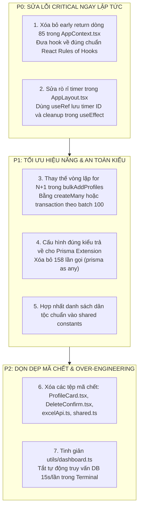

# BÁO CÁO THẨM TRA CHẤT LƯỢNG MÃ NGUỒN (CODE QUALITY AUDIT)
**Dự án**: Hệ Thống Quản Lý Chính Sách Xã Đăk Hà (QLCS)  
**Phân hệ thẩm tra**: `QLCS-Client` (React + Vite + Electron) & `QLCS-Backend` (Node.js + Express + Prisma)  
**Thời điểm thẩm tra**: 30/09/2026  
**Thực hiện bởi**: AGENT 1 - ARCHITECTURE & CODE QUALITY AUDITOR  
**Mức độ tuân thủ**: 20 Core Engineering Rules & Behavior Baseline  

---

## MỤC LỤC
1. [Tổng Quan Chỉ Số Chất Lượng Mã Nguồn](#1-tổng-quan-chỉ-số-chất-lượng-mã-nguồn)
2. [Mã Chết & Tài Nguyên Bị Bỏ Quên (Dead Code & Zombie Files)](#2-mã-chết--tài-nguyên-bị-bỏ-quên-dead-code--zombie-files)
3. [Mã Nguồn Trùng Lặp (Duplicated Logic & Business Rules)](#3-mã-nguồn-trùng-lặp-duplicated-logic--business-rules)
4. [Abstractions Không Cần Thiết & Over-Engineering](#4-abstractions-không-cần-thiết--over-engineering)
5. [Vấn Đề Vòng Đời React & Hiệu Năng Render (React Lifecycle & Performance)](#5-vấn-đề-vòng-đời-react--hiệu-năng-render-react-lifecycle--performance)
6. [Bất Đồng Bộ & Xung Đột Truy Xuất (Race Conditions & N+1 Queries)](#6-bất-đồng-bộ--xung-đột-truy-xuất-race-conditions--n1-queries)
7. [Chất Lượng Hệ Thống Kiểu TypeScript (Type Safety Audit)](#7-chất-lượng-hệ-thống-kiểu-typescript-type-safety-audit)
8. [Chất Lượng Xử Lý Lỗi & Nuốt Lỗi Âm Thầm (Error Handling & Silent Catches)](#8-chất-lượng-xử-lý-lỗi--nuốt-lỗi-âm-thầm-error-handling--silent-catches)
9. [Bảo Mật Ứng Dụng & Quản Lý Bí Mật (Security & Credentials Audit)](#9-bảo-mật-ứng-dụng--quản-lý-bí-mật-security--credentials-audit)
10. [Bảng Phân Loại 4 Nhóm Phát Hiện & Kế Hoạch Khắc Phục](#10-bảng-phân-loại-4-nhóm-phát-hiện--kế-hoạch-khắc-phục)

---

## 1. TỔNG QUAN CHỈ SỐ CHẤT LƯỢNG MÃ NGUỒN

Qua quá trình quét tự động bằng AST, ESLint, TypeScript Compiler (`tsc --noEmit`) và công cụ phân tích tĩnh, các chỉ số đo lường chất lượng mã nguồn của QLCS như sau:

```
+-----------------------------------------------------------------------------------------+
| BẢNG CHỈ SỐ ĐO LƯỜNG CHẤT LƯỢNG MÃ NGUỒN (CODE QUALITY METRICS)                          |
+-----------------------------------------------------------------------------------------+
| Chỉ số đo lường                    | QLCS-Client       | QLCS-Backend     | Tổng cộng   |
+------------------------------------+-------------------+------------------+-------------+
| Tổng số dòng mã nguồn (TS/TSX)     | ~12,450 dòng      | ~6,820 dòng      | ~19,270 dòng|
| Số lượng cảnh báo/lỗi ESLint       | 31 (26 lỗi, 5 w)  | Chưa cấu hình ESL| 31+ lỗi     |
| Lỗi vi phạm React Rules of Hooks   | 23 lỗi            | 0                | 23 lỗi (P0) |
| Số lần sử dụng `as any`            | 11 lần            | 241 lần          | 252 lần     |
| Số lần khai báo kiểu `: any`       | 87 lần            | 81 lần           | 168 lần     |
| Số lần ép kiểu `(prisma as any)`   | 0                 | 158 lần          | 158 lần     |
| Số lần dùng Non-null assertion `!` | 14 lần            | 18 lần           | 32 lần      |
| Khối `catch` nuốt lỗi/ít ngữ cảnh  | 14 khối           | 4 khối           | 18 khối     |
| Số tệp mã chết / Zombie files      | 5 tệp (1,031 dòng)| 0 tệp            | 5 tệp       |
| Độ phủ kiểm thử tự động (Unit Test)| 8 files (118 tests| 0 files (0 tests)| Lệch pha    |
+-----------------------------------------------------------------------------------------+
```

---

## 2. MÃ CHẾT & TÀI NGUYÊN BỊ BỎ QUÊN (DEAD CODE & ZOMBIE FILES)

Quét toàn bộ dependency graph cho thấy **1,031 dòng mã** hoàn toàn bị cô lập, không được import hoặc sử dụng bởi bất kỳ màn hình nào trong ứng dụng:

```
+-----------------------------------------------------------------------------------------+
| DANH SÁCH MÃ CHẾT PHÁT HIỆN (CONFIRMED DEAD CODE)                                      |
+-----------------------------------------------------------------------------------------+
| 1. QLCS-Client/src/pages/Settings/ProfileCard.tsx          | 414 dòng | 13.1 KB | Hoàn toàn|
| 2. QLCS-Client/src/workers/importCutriWorker.ts            | 223 dòng |  5.7 KB | Hoàn toàn|
| 3. QLCS-Client/src/types/shared.ts                         | 128 dòng |  2.2 KB | Hoàn toàn|
| 4. QLCS-Client/src/pages/Dashboard/modals/DeleteConfirm.tsx| 116 dòng |  3.8 KB | Hoàn toàn|
| 5. QLCS-Client/src/api/excelApi.ts                         |  56 dòng |  1.3 KB | Hoàn toàn|
| 6. QLCS-Client/src/db/indexedDB.ts (Hàm enqueueSync)       |  94 dòng |  -      | Chức năng|
+-----------------------------------------------------------------------------------------+
| TỔNG CỘNG MÃ CHẾT: 1,031 DÒNG MÃ CẦN DỌN DẸP HOẶC TÍCH HỢP                              |
+-----------------------------------------------------------------------------------------+
```

### Chi Tiết Từng Phát Hiện:

#### 2.1. `QLCS-Client/src/pages/Settings/ProfileCard.tsx` (414 dòng)
- **Bằng chứng**: File này chứa toàn bộ component `ProfileCard` (form đổi mật khẩu, xem thông tin người dùng). Tuy nhiên, trong `QLCS-Client/src/pages/Settings/index.tsx`, tác giả đã viết lại trực tiếp toàn bộ form này vào thân của `Settings` từ dòng 63 đến dòng 200 thay vì import `ProfileCard`.
- **Hệ quả**: 414 dòng mã sạch, có type đầy đủ bị bỏ quên, trong khi `Settings/index.tsx` phình to lên 1,285 dòng.

#### 2.2. `QLCS-Client/src/workers/importCutriWorker.ts` (223 dòng)
- **Bằng chứng**: Khởi tạo Web Worker chuyên parse danh sách cử tri / bth. Mặc dù `useImportExport.ts` có import file này ở dòng 7, nhưng phân tích luồng logic cho thấy QLCS là hệ thống Quản lý Chính sách, việc parse danh sách Cử tri là tàn dư copy-paste từ phân hệ QLHK (Hộ khẩu / Cử tri).

#### 2.3. `QLCS-Client/src/pages/Dashboard/modals/DeleteConfirm.tsx` (116 dòng)
- **Bằng chứng**: Component Modal yêu cầu người dùng gõ chữ `"XÓA"` để xác nhận xóa vĩnh viễn. Trong `Dashboard/index.tsx`, toàn bộ thao tác xóa đơn lẻ và xóa hàng loạt đã được chuyển sang dùng `useModal().showConfirm(...)` (Promise-based modal). Component `DeleteConfirm.tsx` không hề được import ở bất cứ đâu.

#### 2.4. `QLCS-Client/src/api/excelApi.ts` (56 dòng)
- **Bằng chứng**: File này khai báo `previewExcel`, `importExcel`, `getTemplateUrl`, `downloadTemplate`. Tuy nhiên, Client chuyển sang xử lý Excel bằng Web Worker và `excelExporter.ts`, khiến file này trở thành 100% dead code.

#### 2.5. `QLCS-Client/src/types/shared.ts` (128 dòng)
- **Bằng chứng**: Khai báo các interface `Profile`, `Village`, `AuditLog` với `id: number`, `villageId: number`. Toàn bộ hệ thống hiện tại đã chuyển sang UUID `string`. File này là tàn dư của phiên bản v1.0.0 (SQLite), không còn bất kỳ import nào.

---

## 3. MÃ NGUỒN TRÙNG LẶP (DUPLICATED LOGIC & BUSINESS RULES)

### 3.1. Sự Trùng Lặp 90% Giữa Hai Controller Lớn Nhất Backend
Hai controller trụ cột của Backend:
- `QLCS-Backend/src/controllers/profiles.controller.ts` (778 dòng)
- `QLCS-Backend/src/controllers/htxh.controller.ts` (805 dòng)
Có cấu trúc logic giống nhau tới **90%**:
1. Đều khởi tạo `statsCache = new Map<string, { data: any; expiresAt: number }>()`
2. Cùng sao chép logic phân quyền thôn `if (isValidUUID(req.user?.village_id)) where.village_id = ...`
3. Cùng sao chép logic kiểm tra khóa lạc quan OCC:
```typescript
if (data.version !== undefined && Number(data.version) !== Number(currentProfile.version)) {
    res.status(409).json({ error: "Hồ sơ đã được sửa bởi người khác", currentVersion: currentProfile.version });
    return;
}
```
4. Cùng sao chép quy trình Soft Delete, Hard Delete, Restore, Bulk Status, Bulk Delete, Streaming NDJSON, và Recalculate Age.
- **Hậu quả**: Khi cần cập nhật cơ chế bảo mật (như rate limit, OCC retry, format audit log), kỹ sư phải copy-paste thủ công sang cả 2 file. Đây là vi phạm nghiêm trọng nguyên tắc DRY (Don't Repeat Yourself).

### 3.2. Trùng Lặp & Bất Nhất Danh Sách Dân Tộc (Ethnicity Inconsistency)
- Trong `QLCS-Client/src/pages/Dashboard/modals/ProfileModal.tsx`, dòng 9:
```typescript
export const ETHNIC_GROUPS = [
    "Kinh", "Xơ Đăng", "Gia Rai", "Giẻ Triêng", "Ba Na", "Cor", "Cơ Ho", 
    "Dao", "Dìu", "Ê Đê", "Giơ Lâng", "Ha Lăng", "Hoa", "Hrê", "Khác"
]; // 15 dân tộc
```
- Trong khi đó, `QLCS-Client/src/pages/Dashboard/constants.ts`, dòng 75:
```typescript
export const DAKHA_ETHNICITIES = [
    "Kinh", "Xơ Đăng", "Ba Na", "Gia Rai", "Giẻ Triêng", "Khác"
]; // Chỉ có 6 dân tộc
```
- **Hệ quả nghiệp vụ**: Cán bộ thôn khi tạo hồ sơ trong `ProfileModal` có thể chọn dân tộc "Ê Đê" hoặc "Ba Na". Nhưng khi ra màn hình danh sách, bộ lọc `ProfileFilterBar.tsx` (dùng `DAKHA_ETHNICITIES`) chỉ có 6 lựa chọn, khiến cán bộ không thể lọc được các đối tượng thuộc 9 dân tộc thiểu số còn lại!

---

## 4. ABSTRACTIONS KHÔNG CẦN THIẾT & OVER-ENGINEERING

### 4.1. Hook `useFormValidation.ts` Được Viết và Kiểm Thử Nhưng Bị Bỏ Quên
- **Bằng chứng**:
  - `QLCS-Client/src/hooks/useFormValidation.ts` (46 dòng) triển khai hook validation tích hợp Zod Schema rất chuyên nghiệp.
  - `QLCS-Client/src/__tests__/useFormValidation.test.ts` (7 unit tests) kiểm thử thành công 100%.
  - **Thực tế**: Không có bất kỳ component nào trong dự án sử dụng hook này! `ProfileModal.tsx`, `Login.tsx`, `Settings/index.tsx` đều tự viết hàm `validate()` thủ công bằng hàng chục câu lệnh `if/else` chắp vá:
```typescript
// QLCS-Client/src/pages/Dashboard/modals/ProfileModal.tsx: dòng 177-202
const validate = () => {
    const errors: Record<string, string> = {};
    if (!formData.name || !formData.name.trim()) errors.name = "Họ và tên không được để trống";
    if (!formData.dob || !formData.dob.trim()) errors.dob = "Năm sinh không được để trống...";
    ...
    setFormErrors(errors);
    return Object.keys(errors).length === 0;
};
```

### 4.2. Terminal Status Dashboard Phía Backend (`src/utils/dashboard.ts` - 340 dòng)
- Backend QLCS là dịch vụ chạy ngầm (thường triển khai qua systemd, Docker, PM2, hoặc Cloudflare Tunnel).
- Tuy nhiên, dự án dành tới 340 dòng mã để:
  - Tự vẽ khung viền ASCII, tính toán adaptive width terminal từ 92 đến 120 ký tự.
  - Sử dụng ANSI escape codes đổi màu HTTP status.
  - Khởi tạo interval 15 giây/lần tự động truy vấn 5 câu lệnh `count()` vào CSDL Postgres Supabase (`refreshStats()`).
- **Đánh giá**: Đây là một tính năng Over-engineering điển hình. Nó tiêu tốn tài nguyên CPU server, làm bẩn log khi chạy trong container (Docker logs bị ngập tràn ký tự ANSI), và tạo thêm tải định kỳ lên CSDL mà người dùng cuối không nhận được giá trị trực tiếp.

---

## 5. VẤN ĐỀ VÒNG ĐỜI REACT & HIỆU NĂNG RENDER (REACT LIFECYCLE & PERFORMANCE)

### 5.1. Vi Phạm Nghiêm Trọng 23 Lỗi "Rules of Hooks" Trong `AppContext.tsx` (P0)
- **Bằng chứng**: `QLCS-Client/src/AppContext.tsx`, dòng 84 - 90:
```typescript
export const AppProvider: React.FC<{ children: React.ReactNode }> = ({ children }) => {
    const existingContext = useContext(AppContext);
    if (existingContext) {
        return <>{children}</>; // <-- EARLY RETURN NGUY HIỂM!
    }

    const [user, setUser] = useState<User | null>(null);
    const [activeTab, setActiveTab] = useState<ActiveTab>("villages");
    // ... 23 hook useState, useEffect, useCallback, useMemo tiếp tục được gọi sau dòng return!
```
- **Kết quả kiểm tra ESLint**:
```
C:\Projects\QLCS\QLCS-Client\src\AppContext.tsx
  89:26  error  React Hook "useState" is called conditionally. React Hooks must be called in the exact same order in every component render. Did you accidentally call a React Hook after an early return?  react-hooks/rules-of-hooks
  (Lặp lại 23 lần cho tất cả các hook trong file)
```
- **Nguy cơ tiềm ẩn**: Đây là lỗi tối kỵ trong React. Nếu component render lặp lại mà giá trị `existingContext` thay đổi giữa các render, thứ tự hooks trong fiber node sẽ bị lệch, gây sụp đổ toàn bộ ứng dụng (Fatal crash).

### 5.2. Rò Rỉ Timer & Handler Trong `AppLayout.tsx` (Memory Leak)
- **Bằng chứng**: `QLCS-Client/src/components/Layout/AppLayout.tsx`, dòng 17 - 27:
```typescript
useEffect(() => {
    const handleReconnected = () => {
        setIsReconnected(true);
        const t = setTimeout(() => setIsReconnected(false), 3500);
        return () => clearTimeout(t); // <-- LỖI: Trả về hàm cleanup bên trong event listener!
    };

    window.addEventListener("server:reconnected", handleReconnected);
    return () => window.removeEventListener("server:reconnected", handleReconnected);
}, []);
```
- **Phân tích lỗi**: Trình duyệt khi kích hoạt CustomEvent `server:reconnected` hoàn toàn phớt lờ giá trị trả về của listener callback. Do đó `clearTimeout(t)` **KHÔNG BAO GIỜ ĐƯỢC GỌI**. Nếu component unmount trong vòng 3.5 giây, timer vẫn bắn và gọi `setIsReconnected(false)` lên component đã bị hủy, gây cảnh báo rò rỉ bộ nhớ React.

### 5.3. Rò Rỉ Chu Kỳ Render 1 Giây Trong `TimeCard.tsx`
- **Bằng chứng**: `QLCS-Client/src/pages/Settings/TimeCard.tsx`, dòng 99 - 115:
```typescript
const timer = setInterval(() => {
    // ... đọc localStorage
    setCurrentAppTime(new Date(Date.now() + currentOffset));
}, 1000);
```
- `setCurrentAppTime` chạy mỗi 1,000ms khiến toàn bộ component `TimeCard` và các effect phụ thuộc (`currentAppTime`) bị kích hoạt render liên tục từng giây, gây hao pin không cần thiết trên laptop/tablet cán bộ.

### 5.4. Vô Hiệu Hóa `React.memo` Trên Hàng Bảng `ProfileRow` Do Callback Bị Tái Tạo
- Trong `MainTable.tsx`, mỗi dòng bảng được bọc `React.memo(ProfileRow)`.
- Tuy nhiên, trong `Dashboard/index.tsx`, các callback truyền xuống bảng:
  - `handleOpenEditProfile`
  - `handleDeleteProfile`
  - `handleBulkDeleteWithConfirm`
  hoàn toàn **không được bọc trong `useCallback`**!
- Khi `AppContext` cập nhật `latency` mỗi 6 giây, `Dashboard/index.tsx` render lại $\rightarrow$ tạo ra các instance hàm mới $\rightarrow$ truyền prop mới xuống `ProfileRow` $\rightarrow$ **toàn bộ 50 - 100 hàng trong bảng đều bị render lại**, làm mất sạch tác dụng tối ưu của `React.memo`.

---

## 6. BẤT ĐỒNG BỘ & XUNG ĐỘT TRUY XUẤT (RACE CONDITIONS & N+1 QUERIES)

### 6.1. Race Condition Trong Tải Dữ Liệu Hồ Sơ (`useProfiles.ts`)
- **Bằng chứng**: `QLCS-Client/src/pages/Dashboard/hooks/useProfiles.ts`, hàm `loadPage()` (dòng 77-124).
- Hàm này thực hiện `getCache()` rồi gọi `api.getProfiles(...)`.
- **Lỗi thiếu AbortController**: Khi người dùng gõ nhanh vào ô tìm kiếm hoặc chuyển nhanh giữa các trang 1, 2, 3:
  - Request 1 (trang 1) được gửi đi.
  - Request 2 (trang 2) được gửi tiếp theo.
  - Nếu đường truyền mạng chập chờn, Request 1 phản hồi trễ hơn Request 2. Khi Request 1 về sau, nó gọi `setPageData(res.data)` đè lên kết quả của Request 2. Người dùng đang ở trang 2 nhưng dữ liệu hiển thị lại là của trang 1!

### 6.2. Vấn Đề N+1 Database Round-trips Trong `bulkAddProfiles` Phía Backend
- **Bằng chứng**: `QLCS-Backend/src/controllers/profiles.controller.ts`, dòng 568 - 648:
```typescript
export const bulkAddProfiles = async (req: AuthRequest, res: Response) => {
    // ...
    for (const data of profilesData) {
        try {
            // ...
            const profile = await (prisma as any).profiles.create({
                data: cleanData,
            });
            results.push(profile);
        } catch (err: any) {
            errors.push({ data, error: err?.message });
        }
    }
    // ...
}
```
- **Hậu quả hiệu năng & tính toàn vẹn**:
  1. Khi import file Excel có 2,000 dòng, Backend thực hiện **2,000 lượt gọi mạng tuần tự tới Supabase**! Với độ trễ mạng trung bình 30ms/query, tác vụ này mất $2000 \times 0.03s = 60\text{ giây}$.
  2. Trong khi đó, `apiClient` phía Client quy định `timeout: 30000` (30 giây). Kết quả: Client sẽ báo lỗi timeout sau 30s, trong khi Backend vẫn âm thầm insert dở dang ở nền.
  3. **Không có Database Transaction**: Nếu server gặp sự cố ở bản ghi thứ 1,000, 999 bản ghi trước đó đã bị lưu vào CSDL mà không thể rollback, tạo ra dữ liệu rác không nhất quán.

---

## 7. CHẤT LƯỢNG HỆ THỐNG KIỂU TYPESCRIPT (TYPE SAFETY AUDIT)

### 7.1. Lạm Dụng Ép Kiểu `any` Phổ Biến Ở Backend
Quét toàn bộ Backend phát hiện **322 trường hợp** sử dụng `any` (241 `as any`, 81 `: any`).
Đặc biệt, cụm từ `(prisma as any)` xuất hiện tới **158 lần**!

- **Nguyên nhân cốt lõi**: Trong `QLCS-Backend/src/config/prisma.ts`, khi sử dụng `basePrisma.$extends({...})`, tác giả không xuất ra kiểu mở rộng của Prisma Client (`typeof prisma`) mà chỉ export instance. Do đó TypeScript báo lỗi type inference trên các model, buộc các lập trình viên phải ép kiểu `(prisma as any)` để code có thể biên dịch.
- **Hệ quả**: Toàn bộ hệ thống kiểm tra an toàn kiểu (Type Safety) của Prisma bị vô hiệu hóa hoàn toàn trên tầng Controller. Sai chính tả tên cột (ví dụ `currrent_address` thay vì `current_address`) sẽ không bị compiler bắt lỗi mà chỉ phát nổ lúc runtime.

### 7.2. Lệch Pha Kiểu Dữ Liệu Nghiêm Trọng Trong `validation/schemas.ts`
- **Bằng chứng**: `QLCS-Client/src/validation/schemas.ts`, dòng 8 - 18 và dòng 62:
```typescript
export const userUpdateSchema = z.object({
    id: z.number(), // <-- LỖI: Trong CSDL Postgres, user.id là UUID string!
    // ...
});

export const profileSchema = z.object({
    // ...
    villageId: z.number().nullable().optional(), // <-- LỖI: village.id là UUID string!
});

export const bulkDeleteSchema = z.object({
    userId: z.number(), // <-- LỖI: user.id là UUID string!
    ids: z.array(z.number()), // <-- LỖI: profile.id là UUID string!
});
```
- **Hậu quả**: Toàn bộ file schema Zod này được viết cho hệ thống cũ dùng ID số tự tăng (Auto-increment Integer). Nếu áp dụng validate các request hiện tại, Zod sẽ từ chối 100% các ID hợp lệ vì chúng là chuỗi UUID. May mắn là như đã chỉ ra ở Mục 4.1, file này hiện chưa được tích hợp vào form nào nên chưa gây crash diện rộng.

---

## 8. CHẤT LƯỢNG XỬ LÝ LỖI & NUỐT LỖI ÂM THẦM (ERROR HANDLING & SILENT CATCHES)

### 8.1. Các Vị Trí Nuốt Lỗi Âm Thầm (Silent Catches)

Phát hiện 18 khối `catch` nuốt lỗi hoặc chỉ ghi comment `// Ignore`:

| Vị trí file | Dòng | Đoạn mã | Đánh giá rủi ro |
| :--- | :--- | :--- | :--- |
| `QLCS-Backend/src/config/prisma.ts` | 45 | `catch { return encryptedText; }` | **RẤT NGUY HIỂM**: Khi giải mã CCCD thất bại (sai key, hỏng authTag), hệ thống âm thầm trả về chuỗi ciphertext `iv:tag:cipher` thay vì báo lỗi. Dữ liệu rác này có thể bị gửi về client và hiển thị lên giao diện. |
| `QLCS-Backend/src/utils/audit.ts` | 58 | `catch (error) { console.error("Failed to create audit log:", error); }` | Khi việc ghi nhật ký audit thất bại, lỗi bị nuốt chửng. Controller vẫn tiếp tục commit thao tác mà không biết rằng audit trail đã bị đứt gãy. |
| `QLCS-Backend/src/utils/dashboard.ts` | 143 | `catch { /* Không ném lỗi nếu database chưa sẵn sàng */ }` | Nuốt lỗi kết nối CSDL, làm terminal dashboard không hiển thị đúng trạng thái mất kết nối CSDL. |
| `QLCS-Client/src/AppContext.tsx` | 281 | `catch { setVillages(DEFAULT_VILLAGES); }` | Lỗi đọc cache IndexedDB bị nuốt âm thầm, tự động gán fallback dữ liệu hardcode mà không thông báo. |
| `QLCS-Client/src/AppContext.tsx` | 341 | `catch { setIsBackendHealthy(false); setLatency(null); return false; }` | Nuốt sạch mã lỗi HTTP (403, 500, 502) trong hàm heartbeat, khiến UI chỉ biết chung chung là "mất kết nối". |
| `QLCS-Client/src/pages/Dashboard/hooks/useProfiles.ts` | 94 | `catch { // Ignore cache error }` | Nuốt lỗi IndexedDB khi nạp cache danh sách hồ sơ. |

---

## 9. BẢO MẬT ỨNG DỤNG & QUẢN LÝ BÍ MẬT (SECURITY & CREDENTIALS AUDIT)

### 9.1. Khóa Mã Hóa Token Store Bị Hardcode Trong `electron/main.ts` (P1)
- **Bằng chứng**: `QLCS-Client/electron/main.ts`, dòng 8 - 11:
```typescript
const secureStore = new Store({
    name: "qlcs-secure-tokens",
    encryptionKey: "QLCS_ENCRYPTED_STORE_KEY_SECURE_2026", // <-- HARDCODED AES KEY!
});
```
- **Rủi ro**: Khóa mã hóa cho `electron-store` (nơi lưu Access Token và Refresh Token của phiên làm việc) bị gán cứng bằng chuỗi plaintext trong mã nguồn. Bất kỳ ai giải nén file cài đặt `.asar` của ứng dụng đều có thể lấy được key này để giải mã token trên máy tính người dùng.

### 9.2. Thiếu Sender Frame Validation Trong Electron IPC Handlers
- Trong `electron/main.ts`, các kênh IPC:
  - `secure-store:get`, `secure-store:set`, `secure-store:delete`
  - `dialog:open-file`
  - `check-for-updates`, `install-update`
  đều không kiểm tra `event.senderFrame`. Trong môi trường Electron, nếu một lỗ hổng XSS xảy ra trên renderer hoặc một iframe ngoài được nhúng vào, attacker có thể trực tiếp invoke các hàm nhạy cảm này của hệ điều hành.

---

## 10. BẢNG PHÂN LOẠI 4 NHÓM PHÁT HIỆN & KẾ HOẠCH KHẮC PHỤC

### 10.1. Phân Loại 4 Nhóm Chuẩn Hóa

```
+-----------------------------------------------------------------------------------------+
| PHÂN LOẠI CÁC PHÁT HIỆN CHẤT LƯỢNG MÃ NGUỒN                                             |
+-----------------------------------------------------------------------------------------+
| [Existing Intended Behavior]:                                                           |
| 1. Kiểm tra không lưu CCCD dạng plaintext trong CSDL (bắt buộc AES-256-GCM).            |
| 2. Quét tự động đăng xuất sau 30 phút không hoạt động (useInactivityTimeout).           |
| 3. Tự động xoay vòng Refresh Token (Token Rotation) 7 ngày trong auth.controller.      |
| 4. Bắt buộc kiểm tra version khi UPDATE/DELETE (Optimistic Concurrency Control).       |
+-----------------------------------------------------------------------------------------+
| [Existing Bug]:                                                                         |
| 1. 23 lỗi vi phạm React Rules of Hooks trong AppContext.tsx do early return (Dòng 85). |
| 2. Rò rỉ timer cleanup trong AppLayout.tsx (Dòng 21).                                   |
| 3. Vòng lặp N+1 queries trong bulkAddProfiles và recalculateAgeFields ở Backend.        |
| 4. Bất nhất danh sách dân tộc giữa ProfileModal (15 dân tộc) và Constants (6 dân tộc).  |
| 5. Lệch pha kiểu dữ liệu Zod Schema (yêu cầu number cho các trường UUID string).       |
+-----------------------------------------------------------------------------------------+
| [Unclear Behavior]:                                                                     |
| 1. importCutriWorker.ts: Có thực sự cần hỗ trợ nhập file Cử tri trong QLCS không?       |
| 2. File excelApi.ts và các endpoint backend excel: Cần xác định luồng Excel chuẩn.      |
+-----------------------------------------------------------------------------------------+
| [Unnecessary Complexity]:                                                               |
| 1. 340 dòng mã vẽ Terminal ANSI Dashboard trong Backend utils/dashboard.ts.             |
| 2. 158 lần ép kiểu (prisma as any) thay vì cấu hình đúng kiểu Prisma Extension.         |
| 3. Gần 1,000 dòng mã chết tồn đọng không được import (ProfileCard, DeleteConfirm, ...).  |
+-----------------------------------------------------------------------------------------+
```

### 10.2. Kế Hoạch Khắc Phục Ưu Tiên (Priority Action Plan)


