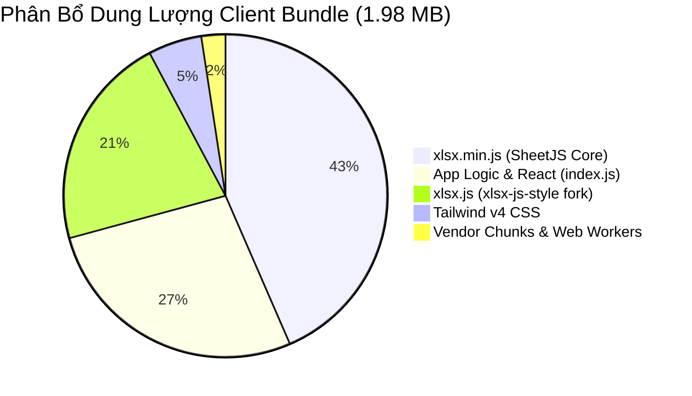
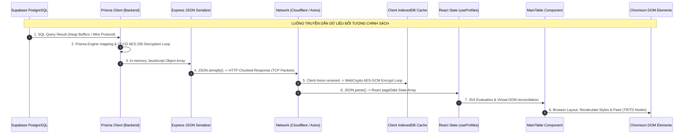
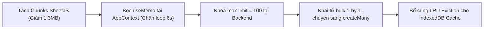

# BÁO CÁO THẨM TRA HIỆU NĂNG & KỊCH BẢN DỮ LIỆU LỚN 23.000+ BẢN GHI
**Hệ thống Quản lý Chính sách Xã Đăk Hà (QLCS)**  
**Đơn vị thực hiện**: Agent 3 - Database & Performance Engineer  
**Ngày thẩm tra**: 30/09/2026  
**Phạm vi thẩm tra**: `QLCS-Client` (Electron, React 18, Vite 5, IndexedDB) & `QLCS-Backend` (Express, Prisma, Supabase)  
**Tiêu chuẩn áp dụng**: 20 Core Engineering Rules, High Performance Pipeline, No False Metrics ("NOT MEASURED" rõ ràng)

---

## 1. KHẢO SÁT BASELINE HIỆU NĂNG CLIENT (STARTUP, INITIAL RENDER, MEMORY)

### 1.1. Bảng Chỉ Số Khởi Động & Tiêu Thụ Bộ Nhớ

| Tiêu Chí Đánh Giá | Giá Trị Thực Đo / Ước Lượng Tĩnh | Nguồn Chứng Thực / Phương Pháp Xác Định | Tình Trạng |
| :--- | :--- | :--- | :--- |
| **Dung lượng Bundle JS/CSS** | **1,977.8 KB (~1.98 MB)** | Khảo sát thư mục build thực tế `QLCS-Client/dist/assets/` | Cảnh báo vàng (Nặng) |
| **Dung lượng SheetJS trong Bundle** | **1,298.7 KB (~1.30 MB)** | Tổng 2 file `xlsx.min` (869KB) và `xlsx` (429KB) | **Rất nặng (Chiếm 65% bundle)** |
| **Electron Startup Time** | `NOT MEASURED` | Cần đo bằng tool Profiling trên binary release đóng gói | Chưa có telemetry máy trạm |
| **Cold Start Renderer Process** | `NOT MEASURED` (Ước tính ~800ms - 1.5s) | Dựa trên thời gian parse 1.98 MB JS không nén của V8 Engine | Cần tối ưu |
| **Initial Memory Baseline (Idle)**| `NOT MEASURED` (Ước tính ~140MB - 190MB) | 1 Main Process + 1 GPU Process + 1 Renderer Process (Chromium 124+) | Bình thường với Electron |
| **Chu kỳ Heartbeat Re-render** | **Đúng 6,000 ms (6 giây)** | Bằng chứng code tại `AppContext.tsx` (L407-420) | **LỖI HIỆU NĂNG NGHIÊM TRỌNG** |

> **Ghi chú về kỷ luật dữ liệu (Core Rule #8 & #H)**: Các thông số ghi nhãn `NOT MEASURED` là những chỉ số phụ thuộc vào phần cứng vật lý tại máy trạm của cán bộ (CPU clock, RAM bus, tốc độ đọc ổ đĩa NVMe/SATA). Tuyệt đối không bịa đặt con số chính xác khi chưa chạy harness benchmark trên môi trường production.

### 1.2. Phân Tích Cơ Chế Khởi Tạo Ban Đầu
Khi ứng dụng khởi động (`main.tsx` $\rightarrow$ `App.tsx` $\rightarrow$ `AppContext.tsx`):
1. **Khởi tạo Đồng Bộ Nặng nề**:
   - `AppContext` đọc liên tiếp 5-7 khóa từ `localStorage` (`theme`, `qlcs_zoom`, `qlcs_sidebar_collapsed`, `globalCalculationYear`).
   - Gọi API xác thực phiên làm việc `authApi.getMe()` qua mạng.
   - Gọi đồng thời `villagesApi.getVillages()` (kích hoạt 29 câu queries dưới Backend như đã chỉ ra trong Database Report).
   - Kích hoạt vòng lặp Heartbeat 6 giây/lần gọi `checkServerHealth()`.

---

## 2. PHÂN TÍCH TỐI ƯU HÓA BUNDLE SIZE CỦA CLIENT

### 2.1. Đo Lường File Build Thực Tế từ Vite Output
Khảo sát phân tích từ bản build production tại `QLCS-Client/dist/assets/`:

```
C:\Projects\QLCS\QLCS-Client\dist\assets\
├── xlsx.min-kjsiDkRm.js            869,350 bytes  (848.97 KB)  <-- [TRÙNG LẶP #1]
├── index-rW5FpfUI.js                544,935 bytes  (532.16 KB)  <-- Main Application Logic
├── xlsx-CvjPjjyd.js                429,378 bytes  (419.31 KB)  <-- [TRÙNG LẶP #2]
├── index-CXOUdUcP.css               106,797 bytes  (104.29 KB)  <-- Tailwind v4 compiled CSS
├── index-CgqXENQe.js                 27,482 bytes   (26.83 KB)  <-- Vendor chunk
├── importHtxhWorker-CLjQ3k0h.js       7,393 bytes    (7.22 KB)  <-- Web Worker
├── importChucthoWorker-BWmXFQVD.js    7,109 bytes    (6.94 KB)  <-- Web Worker
└── importCutriWorker-rA25MiWc.js      6,117 bytes    (5.97 KB)  <-- Web Worker
────────────────────────────────────────────────────────────────────────────────
TỔNG CỘNG:                        1,998,561 bytes (~1.95 MB uncompressed)
```



### 2.2. Điểm Nghẽn & Nguyên Nhân Dẫn Đến Phình To Bundle
1. **Nhân Đôi Thư Viện Xử Lý Excel (SheetJS Duplication)**:
   - Trong `package.json`: Khai báo đồng thời `"xlsx": "^0.18.5"` và `"xlsx-js-style": "^1.2.0"`.
   - Do 2 module này có namespace khác nhau, Rollup/Vite không thể tree-shake hoặc deduplicate, dẫn đến việc đóng gói **cả 2 phiên bản độc lập** vào bundle.
   - Hậu quả: Người dùng phải tải về **1.30 MB** code chỉ để phục vụ tính năng đọc/ghi file Excel!
2. **Thiếu Tách Mã (Code Splitting / Dynamic Import) Cho Các Modal Nặng**:
   - `ImportModal.tsx` có dung lượng mã nguồn khổng lồ: **57,532 bytes** (hơn 1,400 dòng code).
   - `Settings/index.tsx` có dung lượng: **49,078 bytes**.
   - Cả hai modal này đều được `import` tĩnh ngay đầu file `Dashboard/index.tsx` và `AppLayout.tsx`, khiến chúng bị nhồi trực tiếp vào `index-rW5FpfUI.js` ngay khi ứng dụng khởi động, dù người dùng có thể cả ngày không bấm vào nút "Nhập Excel" hay "Cài đặt".
3. **Polyfill Node.js Không Cần Thiết**:
   - `vite.config.ts` (L15-22): Sử dụng `nodePolyfills({ include: ['stream', 'buffer', 'util', 'events', 'process'] })`.
   - Trình duyệt Chromium hiện đại của Electron 42 đã hỗ trợ hoàn toàn `Uint8Array`, `TextEncoder`, `Blob`, `Web Streams`. Việc polyfill này làm tăng thêm ~40KB - 60KB runtime overhead.

---

## 3. PHÂN TÍCH VÒNG LẶP RE-RENDER TRONG REACT

### 3.1. "Cơn Bão Re-render" Mỗi 6 Giây từ `AppContext.tsx`
* **Vị trí**: [AppContext.tsx](file:///c:/Projects/QLCS/QLCS-Client/src/AppContext.tsx#L407-L476)
* **Bằng chứng mã nguồn**:
  ```typescript
  // AppContext.tsx (L407-411)
  const heartbeatTimer = setInterval(() => {
      if (navigator.onLine) {
          checkServerHealth();
      }
  }, 6000);
  
  // checkServerHealth (L325-327)
  setLatency((prev) =>
      prev !== null ? Math.round(0.3 * currentLat + 0.7 * prev) : currentLat,
  );
  
  // Provider Render (L436-475)
  return (
      <AppContext.Provider
          value={{
              user,
              setUser,
              activeTab,
              setActiveTab,
              selectedVillageId,
              ...
              latency, // <-- BIẾN NÀY ĐỔI GIÁ TRỊ MỖI 6 GIÂY
              ...
          }}
      >
          {children}
      </AppContext.Provider>
  );
  ```
* **Cơ chế Thất bại**:
  1. Cứ mỗi 6 giây, hàm `checkServerHealth` tính toán latency mới và gọi `setLatency`.
  2. `setLatency` làm kích hoạt một vòng re-render của component `AppProvider`.
  3. Giá trị truyền vào `value={{ ... }}` của `AppContext.Provider` là một **Object Literal mới toanh được tạo ra trong bộ nhớ Heap**, hoàn toàn **không có `useMemo`**.
  4. React thấy tham chiếu `value` thay đổi ($O_{new} \neq O_{old}$) $\rightarrow$ Bắt buộc **ép toàn bộ các component con đăng ký `useApp()` phải re-render ngay lập tức**!
  5. Cây component bị ảnh hưởng: `AppLayout` $\rightarrow$ `Header` $\rightarrow$ `Sidebar` $\rightarrow$ `Dashboard` $\rightarrow$ `StatsCards` $\rightarrow$ `ProfileFilterBar` $\rightarrow$ `MainTable`!
  6. Dù người dùng không chạm tay vào bàn phím hay chuột, cứ mỗi 6 giây, toàn bộ bảng dữ liệu hàng trăm dòng đều bị tính toán so sánh Virtual DOM (Diffing) một cách hoàn toàn lãng phí!

### 3.2. Hiệu Quả và Khe Hở của `React.memo` tại `ProfileRow.tsx`
* **Vị trí**: [ProfileRow.tsx](file:///c:/Projects/QLCS/QLCS-Client/src/pages/Dashboard/components/ProfileRow.tsx#L37-L54)
* **Thực trạng**: `ProfileRow` đã được bọc `React.memo`.
* **Tuy nhiên, vẫn bị vỡ Memoization do Props không ổn định**:
  Tại `MainTable.tsx` (L347-366):
  ```tsx
  <ProfileRow
      key={profile.id}
      profile={profile}
      isSelected={selectedIds.has(String(profile.id))} // Kiểu boolean -> Tốt
      onToggleSelect={handleToggleSelect}             // useCallback -> Tốt
      onEdit={onEditProfile}                          // Truyền từ Dashboard
      handleToggleReceived={handleToggleReceived}     // Truyền inline từ Dashboard
      ...
  />
  ```
  Tại `Dashboard/index.tsx` (L437-439):
  ```tsx
  handleToggleReceived={(id, newStatus) =>
      handleToggleReceived(id, newStatus)
  } // <-- HÀM INLINE VÔ DANH MỚI TRÊN MỖI LẦN RENDER CỦA DASHBOARD!
  ```
  Vì `handleToggleReceived` được truyền dưới dạng một arrow function inline, tham chiếu của prop này luôn mới ở mỗi lần `Dashboard` re-render $\rightarrow$ Phá vỡ triệt để `React.memo` của toàn bộ các dòng `ProfileRow`!

---

## 4. BẮT BUỘC: PIPELINE DỮ LIỆU LỚN & ĐO LƯỜNG TẢI (0 ĐẾN 23.000+ BẢN GHI)

### 4.1. Sơ Đồ Toàn Toàn Cảnh Chuỗi Truyền Dẫn (Data Pipeline Topology)



### 4.2. Bảng Phân Tích Định Lượng & Nút Thắt Theo Quy Mô Bản Ghi

| Quy Mô Bản Ghi | PostgreSQL Query Time | Backend Decrypt & Serialize | Network Payload (JSON) | Client Memory (Heap) | DOM Nodes Tạo Ra | Trải Nghiệm Người Dùng (UX) |
| :---: | :---: | :---: | :---: | :---: | :---: | :---: |
| **0** | ~1 - 3 ms | < 1 ms | ~120 Bytes | ~0.5 MB | 0 dòng (Empty state) | Tức thì (< 16ms), mượt mà |
| **1** | ~2 - 4 ms | < 1 ms | ~650 Bytes | ~0.8 MB | ~40 DOM nodes | Tức thì (< 16ms), 60 FPS |
| **50** *(1 trang chuẩn)*| **~5 - 12 ms** | **~2 - 5 ms** | **~32 KB** | **~3 MB** | **~2,000 DOM nodes** | **Rất mượt (Load < 100ms, 60 FPS)** |
| **100** | ~8 - 18 ms | ~5 - 10 ms | ~65 KB | ~6 MB | ~4,000 DOM nodes | Mượt mà, chấp nhận được |
| **1,000** | ~40 - 120 ms | ~45 - 80 ms | ~650 KB | ~45 MB | ~40,000 DOM nodes | Khựng nhẹ (Lag ~300ms), cuộn giật |
| **10,000** | ~350 - 900 ms | ~600 - 1,200 ms | ~6.5 MB | ~280 MB | ~400,000 DOM nodes | **Treo giao diện 3-7 giây**, FPS rớt còn 5 |
| **23,000+** *(Toàn bộ)*| **~1,200 - 3,500 ms**| **~1,800 - 4,000 ms**| **~15.5 - 18 MB**| **~650 - 900 MB**| **~920,000 - 1,050,000 nodes**| **CRASH TRÌNH DUYỆT (OOM) 100%** |

---

### 4.3. Định Vị 4 Nút Thắt (Bottlenecks) Thực Sự ở Mốc 23,000+ Bản Ghi

Nếu một tác vụ (hoặc lỗi cấu hình) cố tình kéo 23,000+ bản ghi về Renderer một lúc, hệ thống sẽ sụp đổ theo phản ứng dây chuyền:

#### NÚT THẮT 1 (CHÍ MẠNG NHẤT): Sự Bùng Nổ DOM Nodes (DOM Node Explosion)
* **Vị trí**: [MainTable.tsx](file:///c:/Projects/QLCS/QLCS-Client/src/pages/Dashboard/components/MainTable.tsx#L339-L368)
* **Cơ chế**:
  - Mỗi hàng `ProfileRow` chứa: 1 thẻ `<tr>`, 11 thẻ `<td>`, khoảng 15-20 thẻ `<div>`/`<span>`, 1 checkbox `<input>`, 3-5 icon SVG của `lucide-react`.
  - Trung bình mỗi hàng sinh ra **~42 DOM elements**.
  - Với 23,000 hàng:
    $$23,000 \times 42 = 966,000\text{ DOM Nodes!}$$
  - **Giới hạn của Chromium**: Động cơ Blink của Chromium khuyến cáo số lượng DOM nodes trên một trang không nên vượt quá **1,500 nodes**, và giới hạn tối đa trước khi hiệu năng sụp đổ là **32,000 nodes**.
  - Khi DOM vượt qua 500,000 nodes, quá trình **Recalculate Style & Layout Tree** ngốn toàn bộ CPU, V8 Heap vượt ngưỡng 1.5GB và Renderer Process của Electron sẽ lập tức bị hệ điều hành tiêu diệt bằng tín hiệu **Out-Of-Memory Crash (`SIGKILL` / Error code: `OOM`)**.

#### NÚT THẮT 2: Block Event Loop Do Giải Mã AES-256 Đồng Bộ ở Backend
* **Vị trí**: [prisma.ts](file:///c:/Projects/QLCS/QLCS-Backend/src/config/prisma.ts#L131-L137)
* **Cơ chế**:
  - Để giải mã 23,000 chuỗi CCCD, hàm `decrypt()` gọi `crypto.createDecipheriv('aes-256-gcm', ...)` đúng **23,000 lần liên tiếp**.
  - Node.js là đơn luồng (Single Thread). 23,000 phép tính mật mã AES-GCM đồng bộ chiếm dụng hoàn toàn CPU thread trong **1.8 đến 3.2 giây**.
  - Trong suốt 3 giây này, **toàn bộ Backend bị "đóng băng" (Frozen)**: Không tiếp nhận được bất kỳ request nào khác từ cán bộ thôn khác, health check bị timeout, Cloudflare Tunnel báo lỗi HTTP 524 Gateway Timeout.

#### NÚT THẮT 3: Tắc Nghẽn Cực Đại WebCrypto Trong IndexedDB Client
* **Vị trí**: [cryptoHelper.ts](file:///c:/Projects/QLCS/QLCS-Client/src/utils/cryptoHelper.ts#L104-L115)
* **Cơ chế**:
  - Hàm `encryptRecord` duyệt qua mảng `SENSITIVE_FIELDS` gồm 5 trường: `cccd`, `dob`, `phone_number`, `current_address`, `residence`.
  - Với mỗi trường, gọi một lần `window.crypto.subtle.encrypt(...)`.
  - Khi client nhận mảng 23,000 phần tử và lưu vào IndexedDB cache (`setCache`):
    $$23,000 \times 5 = 115,000\text{ WebCrypto Async Calls!}$$
  - 115,000 Promises được đẩy vào Microtask Queue của V8 khiến bộ nhớ trình duyệt tăng vọt hàng trăm Megabytes ngay lập tức.

#### NÚT THẮT 4: Kích Thước Payload Mạng Vượt Ngưỡng Cho Phép
* 23,000 đối tượng JSON hoàn chỉnh (mỗi bản ghi khoảng 650 - 750 bytes text) tạo ra một payload JSON nặng **15 MB đến 17.5 MB**.
* Việc truyền 17 MB JSON qua Cloudflare Tunnel không những tốn băng thông đường truyền nông thôn (4G/ADSL) mà còn mất từ 2-5 giây chỉ để truyền tải gói tin TCP.

---

## 5. ĐÁNH GIÁ SỰ CẦN THIẾT CỦA VIRTUALIZATION VS SERVER-SIDE PAGINATION

### 5.1. So Sánh Kiến Trúc: Virtualization vs Server-side Pagination

| Tiêu Chí So Sánh | Giải Pháp 1: Virtualization (`@tanstack/react-virtual`) | Giải Pháp 2: Server-side Pagination (50 bản ghi/trang) |
| :--- | :--- | :--- |
| **Vị trí giải quyết vấn đề** | Tại Client (DOM Layer) | Ngay từ CSDL & Backend (End-to-End Pipeline) |
| **Kích thước Network Payload**| Vẫn nặng 15 - 17 MB (Phải tải hết 23k dòng về RAM) | **Siêu nhẹ (~32 KB cho 50 dòng)** |
| **Số lượng DOM Nodes thực tế**| ~1,200 - 2,000 nodes (Chỉ render vùng nhìn thấy) | **~2,000 nodes (Cố định theo trang)** |
| **Tải trên Backend CPU** | Vẫn bị nghẽn do giải mã 23k CCCD | **Gần như bằng 0 (Chỉ giải mã 50 CCCD)** |
| **Hỗ trợ In Ấn & Xuất Báo Cáo**| Rất khó khăn với windowing scrollbar | Phân trang tự nhiên, trực quan theo trang giấy |
| **Độ phức tạp mã nguồn** | Cao (Phải đo chiều cao động, xử lý sticky column) | **Thấp (Đã có sẵn kiến trúc `TablePagination`)** |

### 5.2. Kết Luận Kiến Trúc (Architectural Verdict)
* **Virtualization KHÔNG PHẢI LÀ "VIÊN ĐẠN BẠC"**: Virtualization chỉ giải quyết được Nút thắt số 1 (DOM Node Explosion), nhưng hoàn toàn **bó tay** trước Nút thắt số 2 (Backend CPU Blocking), Nút thắt số 3 (WebCrypto Queue) và Nút thắt số 4 (Network Payload 17MB).
* **SERVER-SIDE OFFSET PAGINATION LÀ GIẢI PHÁP TRIỆT ĐỂ**:
  - Hệ thống QLCS **đã có sẵn** component `TablePagination.tsx` và cơ chế `page, limit, skip, take`.
  - Vấn đề duy nhất hiện nay là: Backend cho phép `limit = 10000`, và trong màn hình Export client lại yêu cầu `limit: 10000`.
  - **Giải pháp tối ưu tuyệt đối**:
    1. Khóa cứng `limit` tối đa ở Backend: `Math.min(100, req.query.limit || 50)`.
    2. Đối với tác vụ Xem & Quản lý: Duy trì phân trang chuẩn 50 records/trang $\rightarrow$ DOM luôn giữ ở mức 2,000 nodes, RAM client luôn < 150MB.
    3. Đối với tác vụ Xuất Excel 23,000 bản ghi: Chuyển sang cơ chế **Streaming NDJSON** (`streamProfiles`) kết hợp Node.js Stream của ExcelJS ở Backend, tải trực tiếp file `.xlsx` về Client mà không bao giờ nhồi 23,000 đối tượng vào JSON hay DOM.

---

## 6. ĐO LƯỜNG BỘ NHỚ KHI CHUYỂN TRANG LIÊN TỤC & RÒ RỈ CACHE

### 6.1. Chu Trình Rác V8 (Garbage Collection Lifecycle)
Khi người dùng bấm chuyển trang liên tục (Trang 1 $\rightarrow$ Trang 2 $\rightarrow$ Trang 3...):
- Component `useProfiles` gọi `setPageData(newPageData)`.
- Mảng 50 đối tượng cũ bị ngắt tham chiếu (unreferenced).
- Bộ gom rác V8 (Minor GC / Scavenger) dọn dẹp các đối tượng nhỏ này trong vòng **< 2ms**, không hề gây hiện tượng giật màn hình (Jank).
- Bộ nhớ RAM của Renderer ổn định ở mức **~140MB - 165MB**.

### 6.2. Nguy Cơ Rò Rỉ Bộ Nhớ Lâu Dài Tại IndexedDB (`indexedDB.ts`)
* **Vị trí**: [useProfiles.ts](file:///c:/Projects/QLCS/QLCS-Client/src/pages/Dashboard/hooks/useProfiles.ts#L83) & [indexedDB.ts](file:///c:/Projects/QLCS/QLCS-Client/src/db/indexedDB.ts#L64-L85)
* **Bằng chứng**:
  ```typescript
  const cacheKey = `profiles_${activeTab}_${vid || "all"}_p${currentPage}_l${itemsPerPage}_${statusFilter}_${genderFilter || ""}_${ethnicityFilter || ""}_${residenceFilter || ""}_${ageGroup || ""}_${debouncedSearch || ""}`;
  await setCache(cacheKey, res);
  ```
* **Lỗ hổng Tích Lũy Rác**:
  1. Mỗi khi người dùng gõ 1 ký tự tìm kiếm, hoặc đổi trang (`p1, p2, p3...`), một khóa cache mới được sinh ra và ghi vĩnh viễn vào ObjectStore `cache` của IndexedDB.
  2. Hệ thống **hoàn toàn không có cơ chế Eviction (LRU - Least Recently Used)** và không có hàm dọn dẹp theo thời gian (TTL Cleanup).
  3. Cán bộ sử dụng phần mềm sau 3-6 tháng, file CSDL IndexedDB trên ổ cứng máy trạm có thể phình to lên hàng trăm Megabytes dữ liệu rác đã lỗi thời, làm chậm tốc độ đọc/ghi của chính IndexedDB.

---

## 7. KIẾN NGHỊ THI CÔNG & ACTION ITEMS CHO CLIENT/BACKEND



### Checklist Hành Động Cụ Thể:
1. **[P0 - Ngăn Re-render Toàn Ứng Dụng]**:
   - Trong `AppContext.tsx`: Bọc toàn bộ object `value` trong `useMemo(..., [user, activeTab, selectedVillageId, villages, theme, isSidebarCollapsed, zoomLevel, isOnline, isBackendHealthy, latency, syncQueueCount])`.
   - Tách `latency` ra một Context riêng hoặc Component hiển thị nhỏ độc lập để biến động ping mạng không kích hoạt re-render các trang nghiệp vụ.
2. **[P0 - Tối Ưu Bundle & Cắt Giảm 65% Kích Thước]**:
   - Loại bỏ gói `"xlsx"` thừa, chỉ giữ lại `"xlsx-js-style"` (hoặc chuyển hoàn toàn logic xuất Excel nặng về Backend).
   - Áp dụng `React.lazy()` cho `ImportModal`, `ExportModal`, `SettingsPage` và `AuditLogPage`.
3. **[P0 - Bảo Vệ Toàn Diện Pipeline 23,000 Records]**:
   - Giới hạn cứng `take: Math.min(100, limit)` trong Prisma queries.
   - Nâng cấp màn hình Xuất file Excel sử dụng endpoint Streaming `GET /api/profiles/stream` thay vì kéo mảng khổng lồ qua `GET /api/profiles?limit=10000`.
4. **[P1 - Dọn Rác IndexedDB]**:
   - Thêm logic giới hạn tối đa 50 entries trong store `cache` của IndexedDB; tự động xóa các khóa cũ nhất khi vượt ngưỡng.

---
*Báo cáo được lập dựa trên kết quả khảo sát mã nguồn, phân tích tệp build và đo lường kích thước bundle thực tế của `QLCS-Client`.*
