# TASKS DAG: BẢN ĐỒ PHỤ THUỘC VÀ KẾ HOẠCH TRIỂN KHAI VÁ LỖI QLCS

Tài liệu này xác định Đồ thị Phụ thuộc có hướng (Directed Acyclic Graph - DAG) cho toàn bộ các tác vụ thực thi, phân định rõ phạm vi file được phép chỉnh sửa (**Allowed Files**) để thực thi cơ chế **File Mutex Lock** chống xung đột giữa các agent.

---

## 1. NGUYÊN TẮC FILE MUTEX & QUY TẮC ĐIỀU PHỐI

1. **Khóa Độc Quyền (File Mutex Lock)**: Không có 2 subagent nào được phép chỉnh sửa cùng 1 file mã nguồn cùng một lúc.
2. **Tuần tự hóa Phụ thuộc**: Mọi task phụ thuộc (`Dependencies`) phải chuyển sang trạng thái `DONE` và vượt qua Local Quality Gate trước khi task con được chuyển từ `BLOCKED` sang `READY`.
3. **Mã Trạng Thái Chuẩn**:
   - `BACKLOG`: Đang xếp hàng đợi.
   - `READY`: Đã đủ điều kiện bắt đầu (không bị phụ thuộc, không bị khóa file).
   - `IN_PROGRESS`: Đang được một Implementation Agent thực thi.
   - `BLOCKED`: Đang đợi task cha hoàn tất hoặc đợi giải phóng file.
   - `REVIEW`: Đang đợi Agent 7 (Independent Reviewer) thẩm định.
   - `TESTING`: Đang chạy test và regression verification.
   - `DONE`: Đã nghiệm thu thành công có bằng chứng.
   - `FAILED`: Lỗi kiểm thử hoặc bị Reviewer từ chối (trả về xử lý lại).

---

## 2. ĐỒ THỊ PHỤ THUỘC TỔNG THỂ (MERMAID DAG)

```mermaid
flowchart TD
    subgraph GROUP_P0 ["Nhóm P0: Bảo Mật, Crash & Mất Dữ Liệu"]
        TASK_P0_01["TASK-P0-01<br/>Fix Silent Data Loss<br/>(Dashboard & Modal)"]
        TASK_P0_02["TASK-P0-02<br/>Fix React Rules of Hooks<br/>(AppContext)"]
        TASK_P0_03["TASK-P0-03<br/>IPC Sender Validation<br/>(electron/main.ts)"]
        TASK_P0_04["TASK-P0-04<br/>Fix CSP Google Fonts<br/>(electron/main.ts)"]
        TASK_P0_05["TASK-P0-05<br/>Fix Keyboard Access<br/>(VillagesPage)"]
        TASK_P0_06["TASK-P0-06<br/>Focus Trap & ActiveElement<br/>(ProfileModal)"]
        TASK_P0_07["TASK-P0-07<br/>Fix Timer Leak<br/>(AppLayout)"]
        TASK_P0_08["TASK-P0-08<br/>Protect PII CCCD Exposure<br/>(Backend Prisma)"]
    end

    subgraph GROUP_P1 ["Nhóm P1: Nghiệp Vụ, Index, Hiệu Năng & Test"]
        TASK_P1_01["TASK-P1-01<br/>Reset Page on Limit Change<br/>(Dashboard)"]
        TASK_P1_02["TASK-P1-02<br/>AbortController Stale UI<br/>(useProfiles)"]
        TASK_P1_03["TASK-P1-03<br/>Add Missing DB Indexes<br/>(Prisma Schema)"]
        TASK_P1_04["TASK-P1-04<br/>Eliminate 4N+1 Queries<br/>(Villages & Analytics)"]
        TASK_P1_05["TASK-P1-05<br/>Break Circular Dep<br/>(Excel & Profiles Controller)"]
        TASK_P1_06["TASK-P1-06<br/>Rewrite Fake Client Tests<br/>(src/__tests__)"]
        TASK_P1_07["TASK-P1-07<br/>Setup Backend Test Suite<br/>(QLCS-Backend)"]
        TASK_P1_08["TASK-P1-08<br/>Fix Sequential Bulk Inserts<br/>(profiles.controller)"]
        TASK_P1_09["TASK-P1-09<br/>Electron safeStorage<br/>(main.ts)"]
    end

    subgraph GROUP_P2 ["Nhóm P2: Tối Ưu Hiệu Năng & UX"]
        TASK_P2_01["TASK-P2-01<br/>Eliminate 6s Re-render Storm<br/>(AppContext with useMemo)"]
        TASK_P2_02["TASK-P2-02<br/>Deduplicate SheetJS Bundle<br/>(Vite Config)"]
        TASK_P2_03["TASK-P2-03<br/>Fix OCC 409 Form Refresh<br/>(ProfileModal)"]
        TASK_P2_04["TASK-P2-04<br/>Disable Gift Button In-flight<br/>(ProfileRow)"]
        TASK_P2_05["TASK-P2-05<br/>MainTable Empty State<br/>(MainTable)"]
        TASK_P2_06["TASK-P2-06<br/>Fix WCAG Color Contrast<br/>(Styles/Components)"]
        TASK_P2_07["TASK-P2-07<br/>Audit Log userId Param<br/>(audit.controller)"]
        TASK_P2_08["TASK-P2-08<br/>Add Windows .ico Icon<br/>(build/icon.ico)"]
    end

    subgraph GROUP_P3_P4 ["Nhóm P3 & P4: Dọn Dẹp Mã & Hoàn Thiện"]
        TASK_P3_01["TASK-P3-01<br/>Purge 1,031 LOC Dead Code<br/>(Client & Backend)"]
        TASK_P3_02["TASK-P3-02<br/>Consolidate Age Milestone Logic<br/>(Shared Utils)"]
        TASK_P4_01["TASK-P4-01<br/>Accessibility Form Labels<br/>(Components)"]
    end

    %% Dependencies
    TASK_P0_03 --> TASK_P0_04
    TASK_P0_04 --> TASK_P1_09
    TASK_P0_01 --> TASK_P1_01
    TASK_P1_01 --> TASK_P1_02
    TASK_P0_02 --> TASK_P2_01
    TASK_P1_03 --> TASK_P1_04
    TASK_P1_05 --> TASK_P1_08
    TASK_P1_08 --> TASK_P1_07
    TASK_P1_06 --> TASK_P1_07
    TASK_P0_06 --> TASK_P2_03
    TASK_P2_01 --> TASK_P3_01
    TASK_P1_05 --> TASK_P3_02
    TASK_P2_06 --> TASK_P4_01
```

---

## 3. ĐẶC TẢ CHI TIẾT TỪNG TÁC VỤ (TASK SPECIFICATIONS)

### 3.1. NHÓM TASK P0 — CRITICAL

#### [TASK-P0-01] Sửa lỗi mất dữ liệu hồ sơ khi lưu thất bại (Silent Data Loss)
- **Status**: `READY`
- **Category**: UI/UX & Reliability | **Severity**: P0
- **Root Cause**: `handleSaveProfileFromModal` trong `Dashboard/index.tsx` thiếu `return success;` khiến `ProfileModal.tsx` luôn coi là thành công và tự đóng modal xóa sạch form.
- **Allowed Files**:
  - `QLCS-Client/src/pages/Dashboard/index.tsx`
  - `QLCS-Client/src/pages/Dashboard/modals/ProfileModal.tsx`
- **Potentially Affected Files**: Không.
- **Blocked Files**: Không có.
- **Dependencies**: Không.
- **Implementation Plan**:
  1. Trong `Dashboard/index.tsx`: Sửa `handleSaveProfileFromModal` để return boolean kết quả từ `handleSave`.
  2. Trong `ProfileModal.tsx`: Kiểm tra `if (saveResult === false) return;` giữ nguyên modal và hiển thị banner lỗi nếu có.
- **Acceptance Criteria**: Khi API trả về lỗi 400 hoặc 409 hoặc 500, modal vẫn mở, form giữ nguyên 100% dữ liệu đã nhập, có thông báo lỗi rõ ràng.
- **Test Plan**: Unit test mô phỏng `onSave` reject hoặc return false, kiểm tra `onClose` không được gọi.
- **Rollback Plan**: `git checkout -- QLCS-Client/src/pages/Dashboard/index.tsx QLCS-Client/src/pages/Dashboard/modals/ProfileModal.tsx`.

---

#### [TASK-P0-02] Vá lỗi vi phạm React Rules of Hooks trong AppContext
- **Status**: `READY`
- **Category**: Architecture | **Severity**: P0
- **Root Cause**: Early return `if (existingContext) return <>{children}</>;` tại dòng 85 nằm trước 23 hook state/effect.
- **Allowed Files**:
  - `QLCS-Client/src/AppContext.tsx`
- **Potentially Affected Files**: Không.
- **Blocked Files**: Không.
- **Dependencies**: Không.
- **Implementation Plan**:
  1. Loại bỏ hoàn toàn guard `if (existingContext)` ở đầu hàm vì `<AppContextProvider>` là duy nhất tại root.
  2. Đảm bảo toàn bộ 23 hook được gọi nhất quán và không điều kiện ở đầu component.
- **Acceptance Criteria**: 0 lỗi vi phạm React Rules of Hooks, không có lỗi React Error #310 khi hot reload hoặc re-mount.
- **Test Plan**: Vitest render `<AppContextProvider>` trong vòng lặp mount/unmount.
- **Rollback Plan**: `git checkout -- QLCS-Client/src/AppContext.tsx`.

---

#### [TASK-P0-03] Triển khai IPC Sender Validation trong Electron Main Process
- **Status**: `READY`
- **Category**: Electron Security | **Severity**: P0
- **Root Cause**: Toàn bộ `ipcMain.handle` bỏ qua tham số `event`, không kiểm tra `event.senderFrame`.
- **Allowed Files**:
  - `QLCS-Client/electron/main.ts`
- **Potentially Affected Files**: `QLCS-Client/electron/preload.ts`.
- **Blocked Files**: `QLCS-Client/electron/main.ts` (Khóa file cho các task sau).
- **Dependencies**: Không.
- **Implementation Plan**:
  1. Tạo hàm tiện ích `validateSender(event: IpcMainInvokeEvent): boolean`: kiểm tra `event.senderFrame === win?.webContents.mainFrame`.
  2. Bọc toàn bộ các IPC handlers (`secure-store:*`, `dialog:open-file`, `app:set-zoom`, `install-update`) bằng `validateSender`. Nếu không khớp, throw Error và log cảnh báo.
- **Acceptance Criteria**: Mọi lời gọi IPC từ nguồn lạ hoặc iframe bị từ chối; ứng dụng chính hoạt động bình thường.
- **Test Plan**: Khởi động Electron app, verify các tính năng zoom, secure store hoạt động bình thường.
- **Rollback Plan**: `git checkout -- QLCS-Client/electron/main.ts`.

---

#### [TASK-P0-04] Sửa lỗi CSP chặn Stylesheet Google Fonts trong Electron Production
- **Status**: `BLOCKED` (Đợi TASK-P0-03 giải phóng `electron/main.ts`)
- **Category**: Release & Build | **Severity**: P0
- **Root Cause**: Domain `https://fonts.googleapis.com` bị đặt nhầm vào `connect-src` thay vì `style-src`.
- **Allowed Files**:
  - `QLCS-Client/electron/main.ts`
- **Potentially Affected Files**: Không.
- **Blocked Files**: Không.
- **Dependencies**: `TASK-P0-03`.
- **Implementation Plan**:
  1. Trong chuỗi cấu hình CSP của `main.ts`, chuyển `https://fonts.googleapis.com` sang chỉ thị `style-src 'self' 'unsafe-inline' https://fonts.googleapis.com;`.
- **Acceptance Criteria**: Production app tải Google Fonts Inter/Roboto thành công, không có cảnh báo CSP violation trong console.
- **Test Plan**: Kiểm tra chuỗi CSP trong `dist-electron/main.js`.
- **Rollback Plan**: `git checkout -- QLCS-Client/electron/main.ts`.

---

#### [TASK-P0-05] Mở khóa tiếp cận bàn phím tại Màn hình Thôn (VillagesPage)
- **Status**: `READY`
- **Category**: Accessibility (WCAG 2.1 AA) | **Severity**: P0
- **Root Cause**: Thẻ chọn thôn dùng thẻ `
` thuần thiếu `tabIndex={0}`, `role="button"` và `onKeyDown`.
- **Allowed Files**:
  - `QLCS-Client/src/pages/VillagesPage.tsx`
- **Potentially Affected Files**: Không.
- **Blocked Files**: Không.
- **Dependencies**: Không.
- **Implementation Plan**:
  1. Chuyển thẻ bao thôn thành thẻ `
` hoặc thẻ `<button type="button">`.
  2. Bổ sung `onKeyDown={(e) => { if (e.key === 'Enter' || e.key === ' ') { e.preventDefault(); handleVillageClick(village.id); } }}`.
  3. Bổ sung viền focus rõ ràng `focus-visible:ring-2 focus-visible:ring-emerald-500 focus-visible:outline-none`.
- **Acceptance Criteria**: Người dùng có thể nhấn phím `Tab` để di chuyển qua từng thôn và nhấn `Enter` để chọn thôn vào làm việc.
- **Test Plan**: Unit test kích hoạt `fireEvent.keyDown(villageCard, { key: 'Enter' })`.
- **Rollback Plan**: `git checkout -- QLCS-Client/src/pages/VillagesPage.tsx`.

---

#### [TASK-P0-06] Triển khai Focus Trap và Phục hồi Tiêu điểm cho ProfileModal
- **Status**: `BLOCKED` (Đợi TASK-P0-01 giải phóng `ProfileModal.tsx`)
- **Category**: Accessibility (WCAG 2.1 AA) | **Severity**: P0
- **Root Cause**: Thiếu cơ chế giữ focus bên trong Modal và phục hồi `previousActiveElement` khi đóng.
- **Allowed Files**:
  - `QLCS-Client/src/pages/Dashboard/modals/ProfileModal.tsx`
  - `QLCS-Client/src/hooks/useModal.tsx`
- **Potentially Affected Files**: Không.
- **Blocked Files**: Không.
- **Dependencies**: `TASK-P0-01`.
- **Implementation Plan**:
  1. Trong `ProfileModal.tsx`: Lắng nghe phím `Tab` để vòng lặp giữa phần tử đầu và phần tử cuối của modal.
  2. Khi modal mở: Lưu `document.activeElement` vào ref và focus vào ô input đầu tiên (`Họ và tên`).
  3. Khi modal đóng: Phục hồi focus lại cho nút đã trigger mở modal.
- **Acceptance Criteria**: Tab không thể thoát ra ngoài modal khi modal đang mở; khi đóng modal bằng Esc, nút bấm trước đó được focus lại.
- **Test Plan**: Test phím Tab lặp trong modal.
- **Rollback Plan**: `git checkout -- QLCS-Client/src/pages/Dashboard/modals/ProfileModal.tsx`.

---

#### [TASK-P0-07] Khắc phục Timer Leak trong AppLayout
- **Status**: `READY`
- **Category**: Code Quality | **Severity**: P0
- **Root Cause**: `setTimeout` cleanup đặt trong callback của `addEventListener`.
- **Allowed Files**:
  - `QLCS-Client/src/components/Layout/AppLayout.tsx`
- **Potentially Affected Files**: Không.
- **Blocked Files**: Không.
- **Dependencies**: Không.
- **Implementation Plan**:
  1. Dùng `useRef<NodeJS.Timeout | null>(null)` lưu timer ID.
  2. Trong listener callback: dọn dẹp timer cũ trước khi tạo timer mới.
  3. Trong return của `useEffect`: gọi `clearTimeout(timerRef.current)`.
- **Acceptance Criteria**: 0 cảnh báo memory leak hoặc state update trên unmounted component khi server reconnect liên tục.
- **Test Plan**: Test mount/unmount `AppLayout` kèm event `server:reconnected`.
- **Rollback Plan**: `git checkout -- QLCS-Client/src/components/Layout/AppLayout.tsx`.

---

#### [TASK-P0-08] Bảo vệ dữ liệu nhạy cảm CCCD (Ngắt Auto-Decrypt và Tách Endpoint Chi Tiết)
- **Status**: `READY`
- **Category**: Security | **Severity**: P0
- **Root Cause**: Prisma Client Extension tự động giải mã CCCD cho mọi câu lệnh `findMany`.
- **Allowed Files**:
  - `QLCS-Backend/src/config/prisma.ts`
  - `QLCS-Backend/src/controllers/profiles.controller.ts`
  - `QLCS-Backend/src/controllers/htxh.controller.ts`
  - `QLCS-Backend/src/routes/profiles.routes.ts`
- **Potentially Affected Files**: `QLCS-Client/src/pages/Dashboard/components/ProfileRow.tsx`.
- **Blocked Files**: Không.
- **Dependencies**: Không.
- **Implementation Plan**:
  1. Trong `prisma.ts`: Ngắt bỏ giải mã CCCD tự động trên `findMany`. Chỉ mã hóa khi ghi (`create`, `update`).
  2. Trong `profiles.controller.ts` và `htxh.controller.ts`: API danh sách chỉ trả về `cccd_last4` và `id`.
  3. Tạo endpoint `POST /api/profiles/:id/reveal-cccd` kiểm tra quyền của user (admin hoặc cán bộ đúng thôn), giải mã và trả về số CCCD đầy đủ, đồng thời ghi log vào `profile_audit_log`.
- **Acceptance Criteria**: Payload `GET /api/profiles` không chứa số CCCD 12 số trần.
- **Test Plan**: Gọi `GET /api/profiles` và kiểm tra response body bằng test tự động.
- **Rollback Plan**: `git checkout -- QLCS-Backend/src/config/prisma.ts QLCS-Backend/src/controllers/profiles.controller.ts`.

---

### 3.2. NHÓM TASK P1 — HIGH PRIORITY

#### [TASK-P1-01] Tự động Reset Trang về 1 khi Đổi Số Dòng / Trang (Limit)
- **Status**: `BLOCKED` (Đợi TASK-P0-01 giải phóng `Dashboard/index.tsx`)
- **Allowed Files**: `QLCS-Client/src/pages/Dashboard/index.tsx`, `QLCS-Client/src/pages/Dashboard/hooks/useProfiles.ts`
- **Dependencies**: `TASK-P0-01`.
- **Implementation**: Bổ sung logic `setPage(1)` khi `pageSize` / `limit` thay đổi.

#### [TASK-P1-02] Tích hợp AbortController chống Stale UI trong useProfiles
- **Status**: `BLOCKED` (Đợi TASK-P1-01)
- **Allowed Files**: `QLCS-Client/src/pages/Dashboard/hooks/useProfiles.ts`
- **Dependencies**: `TASK-P1-01`.
- **Implementation**: Tạo `abortControllerRef.current?.abort()`, tạo controller mới trước mỗi `fetchProfiles`.

#### [TASK-P1-03] Bổ sung Missing Composite Indexes trên bảng htxh_profiles và profiles
- **Status**: `READY`
- **Allowed Files**: `QLCS-Backend/prisma/schema.prisma`
- **Dependencies**: Không.
- **Implementation**: Thêm `@@index([village_id, is_deleted, calculation_year])` và `@@index([is_deleted, calculation_year])`.

#### [TASK-P1-04] Triệt tiêu 4N+1 Queries trong villages.controller và analytics.controller
- **Status**: `BLOCKED` (Đợi TASK-P1-03)
- **Allowed Files**: `QLCS-Backend/src/controllers/villages.controller.ts`, `QLCS-Backend/src/controllers/analytics.controller.ts`
- **Dependencies**: `TASK-P1-03`.
- **Implementation**: Dùng `prisma.profiles.groupBy` và `prisma.htxh_profiles.groupBy` gom nhóm theo `village_id` chỉ trong 2 câu queries duy nhất thay vì 29 queries.

#### [TASK-P1-05] Phá vỡ Phụ thuộc vòng giữa excel.controller và profiles.controller
- **Status**: `READY`
- **Allowed Files**: `QLCS-Backend/src/utils/age.ts` [NEW], `QLCS-Backend/src/controllers/excel.controller.ts`, `QLCS-Backend/src/controllers/profiles.controller.ts`
- **Dependencies**: Không.
- **Implementation**: Rút hàm `computeChucthoMilestones` ra file `src/utils/age.ts`.

#### [TASK-P1-06] Viết lại các Test Suites ngụy tạo thành Test Thực tế
- **Status**: `READY`
- **Allowed Files**: `QLCS-Client/src/__tests__/age.test.ts`, `QLCS-Client/src/__tests__/helpers.test.ts`, `QLCS-Client/src/__tests__/useUndo.test.ts`
- **Dependencies**: Không.
- **Implementation**: Xóa bỏ toàn bộ mã nguồn copy-paste inline trong file test. Import hàm trực tiếp từ `src/utils/` và `src/hooks/`.

#### [TASK-P1-07] Khởi tạo Hệ thống Kiểm thử Tự động cho QLCS-Backend
- **Status**: `BLOCKED` (Đợi TASK-P1-04 và TASK-P1-05)
- **Allowed Files**: `QLCS-Backend/package.json`, `QLCS-Backend/vitest.config.ts` [NEW], `QLCS-Backend/src/__tests__/auth.test.ts` [NEW], `QLCS-Backend/src/__tests__/profiles.test.ts` [NEW]
- **Dependencies**: `TASK-P1-04`, `TASK-P1-05`.
- **Implementation**: Cài `vitest`, `supertest` làm devDependencies, viết test suites kiểm thử Auth và Profiles OCC.

#### [TASK-P1-08] Tối ưu hóa Bulk Inserts thành Batch SQL Chống Timeout 30s
- **Status**: `BLOCKED` (Đợi TASK-P1-05)
- **Allowed Files**: `QLCS-Backend/src/controllers/profiles.controller.ts`
- **Dependencies**: `TASK-P1-05`.
- **Implementation**: Thay vòng lặp tuần tự bằng `prisma.profiles.createMany` theo từng batch 500 bản ghi.

#### [TASK-P1-09] Chuyển đổi mã hóa electron-store sang Electron safeStorage native (DPAPI)
- **Status**: `BLOCKED` (Đợi TASK-P0-04)
- **Allowed Files**: `QLCS-Client/electron/main.ts`
- **Dependencies**: `TASK-P0-04`.
- **Implementation**: Dùng `safeStorage.encryptString` và `safeStorage.decryptString` thay cho chuỗi khóa hardcode.

---

### 3.3. NHÓM TASK P2 — MEDIUM PRIORITY

#### [TASK-P2-01] Triệt tiêu Cơn bão Re-render định kỳ 6s trong AppContext bằng useMemo
- **Status**: `BLOCKED` (Đợi TASK-P0-02)
- **Allowed Files**: `QLCS-Client/src/AppContext.tsx`
- **Dependencies**: `TASK-P0-02`.
- **Implementation**: Bọc toàn bộ đối tượng `value={{ ... }}` của context bằng `useMemo`.

#### [TASK-P2-02] Khử trùng lặp SheetJS trong Bundle Client
- **Status**: `READY`
- **Allowed Files**: `QLCS-Client/vite.config.ts`, `QLCS-Client/src/utils/excelExporter.ts`
- **Dependencies**: Không.
- **Implementation**: Alias `xlsx` đồng nhất về 1 bản phân phối minified, loại bỏ việc nạp đồng thời cả `xlsx.min.js` và `xlsx.js`.

#### [TASK-P2-03] Khắc phục Lặp lỗi OCC 409 trong ProfileModal
- **Status**: `BLOCKED` (Đợi TASK-P0-06)
- **Allowed Files**: `QLCS-Client/src/pages/Dashboard/modals/ProfileModal.tsx`
- **Dependencies**: `TASK-P0-06`.
- **Implementation**: Khi gặp HTTP 409, fetch lại bản ghi mới nhất hoặc tăng local version để người dùng có thể đối soát và lưu lại.

#### [TASK-P2-04] Vô hiệu hóa Nút Nhận Quà In-Flight chống Click Spam
- **Status**: `READY`
- **Allowed Files**: `QLCS-Client/src/pages/Dashboard/components/ProfileRow.tsx`
- **Dependencies**: Không.
- **Implementation**: Thêm state `isMutating` cục bộ, disable nút và hiển thị spinner nhỏ khi request đang gửi.

#### [TASK-P2-05] Thêm Empty State Placeholder cho MainTable
- **Status**: `READY`
- **Allowed Files**: `QLCS-Client/src/pages/Dashboard/components/MainTable.tsx`
- **Dependencies**: Không.
- **Implementation**: Thêm hàng `<tr>` thông báo "Không tìm thấy hồ sơ phù hợp" khi danh sách rỗng.

#### [TASK-P2-06] Sửa Độ tương phản Màu sắc đạt chuẩn WCAG 1.4.3
- **Status**: `READY`
- **Allowed Files**: `QLCS-Client/src/index.css`, các component text
- **Dependencies**: Không.
- **Implementation**: Nâng màu text phụ từ `text-slate-400` lên `text-slate-500` / `text-slate-600` để đạt độ tương phản $\ge 4.5:1$.

#### [TASK-P2-07] Hỗ trợ tham số userId trong Backend Audit Log Controller
- **Status**: `READY`
- **Allowed Files**: `QLCS-Backend/src/controllers/audit.controller.ts`
- **Dependencies**: Không.
- **Implementation**: Bổ sung `if (req.query.userId) where.user_id = String(req.query.userId);`.

#### [TASK-P2-08] Khởi tạo Icon Windows chuẩn `.ico`
- **Status**: `READY`
- **Allowed Files**: `QLCS-Client/build/icon.ico` [NEW], `QLCS-Client/electron-builder.json5`
- **Dependencies**: Không.
- **Implementation**: Tạo icon native và khai báo trong cấu hình đóng gói NSIS.

---

### 3.4. NHÓM TASK P3 & P4 — DỌN DẸP & HOÀN THIỆN

#### [TASK-P3-01] Xóa bỏ 1,031 dòng Mã Chết (Dead Code)
- **Status**: `BLOCKED` (Đợi các task nhóm P1 và P2 hoàn tất)
- **Allowed Files**:
  - `QLCS-Client/src/pages/Settings/ProfileCard.tsx` [DELETE]
  - `QLCS-Client/src/workers/importCutriWorker.ts` [DELETE]
  - `QLCS-Client/src/types/shared.ts` [DELETE]
  - `QLCS-Client/src/pages/Dashboard/modals/DeleteConfirm.tsx` [DELETE]
  - `QLCS-Client/src/api/excelApi.ts` [DELETE]
- **Dependencies**: Toàn bộ P0, P1, P2.

#### [TASK-P3-02] Hợp nhất Thuật toán Tính Mốc Tuổi Tròn
- **Status**: `BLOCKED` (Đợi TASK-P1-05)
- **Allowed Files**: `QLCS-Client/src/workers/workerUtils.ts`, `QLCS-Client/src/utils/excelExporter.ts`
- **Dependencies**: `TASK-P1-05`.

#### [TASK-P4-01] Hoàn thiện Nhãn Semantic Form và Viền Focus Rõ Nét
- **Status**: `BLOCKED` (Đợi TASK-P2-06)
- **Allowed Files**: `QLCS-Client/src/pages/Dashboard/modals/ProfileModal.tsx`, `QLCS-Client/src/components/common/CustomSelect.tsx`
- **Dependencies**: `TASK-P2-06`.
