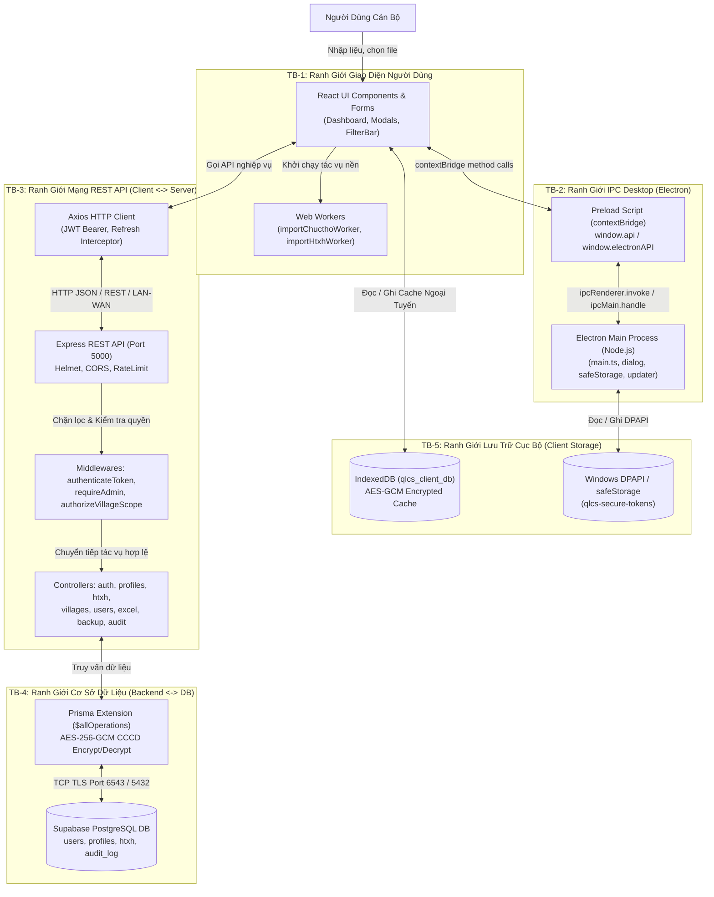

# BÁO CÁO BƯỚC 0: KIỂM KÊ KIẾN TRÚC & MÔ HÌNH HÓA MỐI ĐE DỌA (THREAT MODELING - STRIDE)
## Dự án: Quản Lý Chính Sách (QLCS v3.0.0) — UBND Xã Đăk Hà

---

## 1. GIỚI THIỆU & TỔNG QUAN KIẾN TRÚC HỆ THỐNG

### 1.1. Bối cảnh & Mục đích
Hệ thống **Quản Lý Chính Sách (QLCS)** là phần mềm chuyên trách quản lý chính sách chúc thọ người cao tuổi và trợ cấp hưu trí xã hội (HTXH) tại xã Đăk Hà, phục vụ khoảng 23.000+ nhân khẩu trải đều trên 7 thôn. Hệ thống lưu trữ và xử lý thông tin cá nhân đặc biệt nhạy cảm (PII), bao gồm số Căn cước công dân (CCCD 12 chữ số), ngày tháng năm sinh, nơi thường trú, và diện đối tượng chính sách.

### 1.2. Các bên liên quan & Mô hình vai trò (Actors & Roles)
1. **Quản trị viên (Admin - Xã)**:
   - Toàn quyền quản trị hệ thống, tài khoản cán bộ, danh mục thôn, xem/sửa hồ sơ toàn xã.
   - Xuất/nhập file Excel, xem nhật ký kiểm toán toàn xã, thực hiện sao lưu/khôi phục CSDL.
2. **Cán bộ thôn (User - Trưởng thôn/Cán bộ phụ trách)**:
   - Được phân công quản lý duy nhất 1 thôn (`village_id`).
   - Có quyền xem, thêm, sửa, đánh dấu nhận quà, nhập/xuất Excel cho hồ sơ thuộc thôn mình phụ trách.
   - Không được phép truy cập, sửa đổi dữ liệu hồ sơ của các thôn khác, không có quyền quản lý người dùng hay cấu hình hệ thống.
3. **Kẻ tấn công nội bộ (Malicious Insider / Compromised User Account)**:
   - Người dùng có tài khoản cán bộ thôn hợp lệ nhưng tìm cách leo thang đặc quyền (BFLA), đọc trộm hoặc sửa đổi hồ sơ của thôn khác (BOLA/IDOR), hoặc trích xuất hàng loạt số CCCD trần.
4. **Kẻ tấn công bên ngoài (External Attacker)**:
   - Đối tượng trên mạng LAN hoặc Internet (nếu kết nối qua domain `qlcs.dulieudakha.vn`) tìm cách tấn công vét cạn mật khẩu (Brute-force), khai thác lỗ hổng xác thực, giải mã token hoặc gửi payload độc hại (Excel bomb).

---

## 2. SƠ ĐỒ THÀNH PHẦN & LUỒNG DỮ LIỆU (DATA FLOW DIAGRAMS)

### 2.1. DFD Cấp độ 0 — Sơ đồ Ngữ cảnh Toàn hệ thống (Context Diagram)

```mermaid
flowchart TB
    subgraph USERS ["Người Dùng Hệ Thống"]
        Admin["Quản Trị Viên (Xã)"]
        CanBo["Cán Bộ Thôn (Trưởng Thôn)"]
    end

    subgraph CLIENT_APP ["QLCS Client Application"]
        Electron["Electron Shell (Desktop)"]
        ReactUI["React 18 SPA (Renderer)"]
        LocalCache[("IndexedDB & SecureStore")]
    end

    subgraph BACKEND_SYS ["QLCS Backend Server"]
        Express["Express.js REST API Server"]
        PrismaORM["Prisma Client & Encryption Extension"]
    end

    subgraph CLOUD_DB ["Cơ Sở Dữ Liệu"]
        Supabase[("Supabase PostgreSQL")]
    end

    Admin -->|Tương tác UI / Phím / Chuột| ReactUI
    CanBo -->|Tương tác UI / Phím / Chuột| ReactUI
    ReactUI <-->|IPC Bridge (Preload)| Electron
    ReactUI <-->|Đọc / Ghi Cache| LocalCache
    ReactUI <-->|HTTPS / REST API / JWT| Express
    Express <-->|Query & AES Encryption| PrismaORM
    PrismaORM <-->|TLS Connection Pool| Supabase
```

---

### 2.2. DFD Cấp độ 1 — Luồng Dữ liệu Chi tiết & Ranh giới Tin cậy



---

## 3. RANH GIỚI TIN CẬY (TRUST BOUNDARIES)

Hệ thống QLCS thiết lập 5 ranh giới tin cậy rõ rệt:

| Mã TB | Ranh Giới Tin Cậy | Bên Trong (Tin cậy hơn) | Bên Ngoài (Ít tin cậy hơn) | Cơ Chế Kiểm Soát Hiện Tại |
| :--- | :--- | :--- | :--- | :--- |
| **TB-1** | **User $\leftrightarrow$ UI Renderer** | React UI Component State, Memory State | Bàn phím, Chuột, Clipboard, Màn hình hiển thị | Form validation (Zod schemas), che giấu CCCD (`••••••••1234`), Escape/Blur modal guards. |
| **TB-2** | **Renderer $\leftrightarrow$ Electron Main** | Electron Main Process (Node.js runtime, Filesystem, DPAPI) | Chromium Renderer (DOM, XSS surface nếu có) | `contextIsolation: true`, `nodeIntegration: false`, `preload.mjs` contextBridge, `validateSender(event)` kiểm tra `mainFrame`. |
| **TB-3** | **Client Process $\leftrightarrow$ Backend REST API** | Express API Controllers, Server Memory | Mạng truyền dẫn (Localhost / LAN / Internet), Axios Client | JWT Access Token (15m), Refresh Token (7d, DB rotation), CORS whitelist, Helmet, express-rate-limit. |
| **TB-4** | **Backend $\leftrightarrow$ Supabase PostgreSQL** | Supabase Cloud Database | Express Server Node.js Process | TLS connection pool, Prisma ORM (tránh SQL injection), Extension AES-256-GCM tự động mã hóa CCCD. |
| **TB-5** | **Client Process $\leftrightarrow$ Local Persistence** | Bộ nhớ ứng dụng Client | Ổ đĩa máy tính người dùng (IndexedDB, AppData JSON) | Windows DPAPI native (`safeStorage`) cho Token, Web Crypto AES-GCM cho IndexedDB cache. |

---

## 4. DANH MỤC ĐIỂM VÀO HỆ THỐNG (ENTRY POINTS INVENTORY)

Toàn bộ các điểm tiếp nhận dữ liệu từ bên ngoài vào hệ thống:

### 4.1. REST API Endpoints (Express Server)

| STT | Endpoint | Method | Phân Quyền Yêu Cầu | Định Dạng Dữ Liệu | Rủi Ro Tiềm Ẩn Chính |
| :---: | :--- | :---: | :--- | :--- | :--- |
| 1 | `/api/auth/setup` | `POST` | Công khai (Public - 1 lần) | JSON: `{ username, password }` | Tạo tài khoản admin nếu CSDL rỗng. |
| 2 | `/api/auth/login` | `POST` | Công khai + Rate Limiter | JSON: `{ username, password }` | Brute-force mật khẩu cán bộ, Timing attack. |
| 3 | `/api/auth/refresh` | `POST` | Công khai (Cần token hợp lệ) | JSON: `{ refreshToken }` | Sử dụng refresh token đánh cắp để duy trì phiên. |
| 4 | `/api/auth/me` | `GET` | Authenticated | Header: Bearer Token | Information disclosure (user profile). |
| 5 | `/api/auth/password` | `PUT` | Authenticated | JSON: `{ currentPassword, newPassword }` | Leo thang chiếm đoạt nếu phiên bị hijack. |
| 6 | `/api/auth/username` | `PUT` | Authenticated | JSON: `{ newUsername }` | Đổi tên tài khoản, tranh chấp username. |
| 7 | `/api/auth/avatar` | `PUT` | Authenticated | JSON: `{ avatar: base64/url }` | DoS bộ nhớ (payload avatar base64 quá lớn). |
| 8 | `/api/auth/logout` | `POST` | Authenticated | JSON: `{ refreshToken }` | Thu hồi refresh token trong DB. |
| 9 | `/api/profiles` | `GET` | Authenticated + VillageScope | Query: `page, limit, villageId, search, status...` | Lộ CCCD trần, N+1 query DoS, BOLA qua query. |
| 10 | `/api/profiles` | `POST` | Authenticated + VillageScope | JSON: Profile payload (CCCD, Họ tên, Ngày sinh...) | Trùng lặp CCCD, giả mạo thôn. |
| 11 | `/api/profiles/:id` | `PUT` | Authenticated + VillageScope | Path: `id`, JSON: Profile updates + `version` | Xung đột OCC (409), BOLA/IDOR thôn khác. |
| 12 | `/api/profiles/:id` | `DELETE` | Authenticated + VillageScope | Path: `id` (UUID) | Xóa mềm hồ sơ thôn khác nếu thiếu kiểm tra thôn. |
| 13 | `/api/profiles/:id/restore` | `POST` | Authenticated + VillageScope | Path: `id` (UUID) | Khôi phục trái phép hồ sơ đã xóa. |
| 14 | `/api/profiles/:id/hard-delete`| `DELETE` | Authenticated + VillageScope | Path: `id` (UUID) | Xóa vĩnh viễn dữ liệu (Mất dấu vết hoàn toàn). |
| 15 | `/api/profiles/:id/reveal-cccd`| `POST` | Authenticated + RBAC (Thôn/Admin) | Path: `id` (UUID) | Rò rỉ CCCD trần giải mã, thiếu log kiểm toán. |
| 16 | `/api/profiles/stats` | `GET` | Authenticated + VillageScope | Query: `villageId, calculationYear` | Lộ số liệu đối soát toàn xã. |
| 17 | `/api/profiles/bulk-status` | `PUT` | Authenticated + VillageScope | JSON: `{ ids: string[], received: boolean }` | Sửa trạng thái hàng loạt của hồ sơ thôn khác. |
| 18 | `/api/profiles/bulk-delete` | `POST` | Authenticated + VillageScope | JSON: `{ ids: string[] }` | Xóa hàng loạt hồ sơ trái thẩm quyền. |
| 19 | `/api/htxh` | `GET` | Authenticated + VillageScope | Query: `page, limit, villageId, search, category...` | BOLA qua query, lộ PII diện trợ cấp. |
| 20 | `/api/htxh` | `POST` | Authenticated + VillageScope | JSON: HTXH profile payload | Nhập sai diện trợ cấp, giả mạo thôn. |
| 21 | `/api/htxh/:id` | `PUT` | Authenticated + VillageScope | Path: `id`, JSON: payload + `version` | BOLA/IDOR sửa hồ sơ HTXH thôn khác. |
| 22 | `/api/htxh/:id` | `DELETE` | Authenticated + VillageScope | Path: `id` (UUID) | Xóa trái thẩm quyền hồ sơ HTXH. |
| 23 | `/api/htxh/:id/restore` | `POST` | Authenticated + VillageScope | Path: `id` (UUID) | Khôi phục trái thẩm quyền hồ sơ HTXH. |
| 24 | `/api/htxh/:id/hard-delete` | `DELETE` | Authenticated + VillageScope | Path: `id` (UUID) | Xóa vĩnh viễn hồ sơ HTXH. |
| 25 | `/api/htxh/stats` | `GET` | Authenticated + VillageScope | Query: `villageId, calculationYear` | Tràn bộ nhớ tính toán thống kê. |
| 26 | `/api/villages` | `GET` | Authenticated | Query parameters | Xem danh sách thôn xã Đăk Hà. |
| 27 | `/api/villages/stats` | `GET` | Authenticated | Query parameters | Thống kê tổng quan các thôn. |
| 28 | `/api/villages` | `POST` | Authenticated (Check trong controller) | JSON: `{ name }` | BFLA: Cán bộ thôn tự tạo thôn mới nếu thiếu check. |
| 29 | `/api/villages/:id` | `PUT` | Authenticated (Check trong controller) | Path: `id`, JSON: `{ name }` | BFLA: Cán bộ thôn sửa tên thôn. |
| 30 | `/api/villages/:id` | `DELETE` | Authenticated (Check trong controller) | Path: `id` (UUID) | BFLA: Cán bộ thôn xóa thôn. |
| 31 | `/api/users` | `GET` | Authenticated + Admin | Query parameters | Lộ danh sách toàn bộ cán bộ và username. |
| 32 | `/api/users` | `POST` | Authenticated + Admin | JSON: `{ username, password, role, village_id }` | BFLA: Tạo tài khoản cán bộ/admin mới. |
| 33 | `/api/users/:id` | `PUT` | Authenticated + Admin | Path: `id`, JSON: User updates | Sửa tài khoản, gán thôn, nâng quyền admin. |
| 34 | `/api/users/:id/reset-password`| `POST` | Authenticated + Admin | Path: `id`, JSON: `{ newPassword }` | Đặt lại mật khẩu cán bộ khác. |
| 35 | `/api/users/:id` | `DELETE` | Authenticated + Admin | Path: `id` (UUID) | Xóa tài khoản cán bộ. |
| 36 | `/api/excel/preview` | `POST` | Authenticated | Multer Multipart File (Max 20MB) | File parser DoS (Zip bomb), Tràn RAM Node.js. |
| 37 | `/api/excel/import` | `POST` | Authenticated | Multipart File hoặc JSON `records` | Import hàng ngàn bản ghi sai thôn (BOLA). |
| 38 | `/api/excel/template` | `GET` | Authenticated | Query: `type` | Tải biểu mẫu chuẩn (.xlsx). |
| 39 | `/api/analytics/overview` | `GET` | Authenticated | Query: `calculationYear` | Xem tổng quan báo cáo toàn xã. |
| 40 | `/api/analytics/by-village` | `GET` | Authenticated | Query: `calculationYear` | Xem cơ cấu số liệu 7 thôn. |
| 41 | `/api/audit-logs` | `GET` | Authenticated + VillageScope | Query: `page, limit, villageId, action, search` | Lộ lịch sử biến động dữ liệu nhạy cảm. |
| 42 | `/api/backups/snapshot` | `GET` | Authenticated + Admin | Query: `download=true` | Trích xuất toàn bộ bản ghi hệ thống dạng JSON. |
| 43 | `/api/backups/restore` | `POST` | Authenticated + Admin | JSON: Snapshot payload | Ghi đè toàn bộ CSDL hệ thống. |
| 44 | `/api/settings` | `GET` | Authenticated | Query parameters | Đọc cấu hình hệ thống. |
| 45 | `/api/settings` | `PUT` | Authenticated + Admin | JSON: Settings payload | Sửa cấu hình năm, chế độ làm việc. |

---

### 4.2. Kênh Giao tiếp WebSocket (Socket.io)

| STT | Event Name | Hướng | Cơ Chế Xác Thực | Dữ Liệu | Rủi Ro Tiềm Ẩn |
| :---: | :--- | :---: | :--- | :--- | :--- |
| 1 | `connection` | Client $\rightarrow$ Server | Không có JWT handshake | Socket handshake | Ai kết nối được vào port 5000 cũng tạo được socket. |
| 2 | `join-village` | Client $\rightarrow$ Server | Không kiểm tra `village_id` | String: `villageId` | Cán bộ thôn 1 có thể join room của thôn 2 để nghe lén events. |
| 3 | `profile:created` | Server $\rightarrow$ Client | Phát theo room `village:${id}` | JSON Profile | Lộ thông tin tạo mới hồ sơ ra clients trong room. |
| 4 | `profile:updated` | Server $\rightarrow$ Client | Phát theo room `village:${id}` | JSON Profile | Lộ thông tin cập nhật hồ sơ. |
| 5 | `profile:deleted` | Server $\rightarrow$ Client | Phát theo room `village:${id}` | JSON: `{ id }` | Lộ thông tin xóa hồ sơ. |

---

### 4.3. Kênh Giao tiếp IPC (Electron Desktop)

| STT | Kênh IPC | Hướng | Cơ Chế Kiểm Soát | Rủi Ro Tiềm Ẩn |
| :---: | :--- | :---: | :--- | :--- |
| 1 | `secure-store:get` | Renderer $\rightarrow$ Main | `validateSender(event)` (`mainFrame`) | Trích xuất token/khóa nếu XSS lọt vào mainFrame. |
| 2 | `secure-store:set` | Renderer $\rightarrow$ Main | `validateSender(event)` (`mainFrame`) | Ghi đè token/khóa mã hóa. |
| 3 | `secure-store:delete` | Renderer $\rightarrow$ Main | `validateSender(event)` (`mainFrame`) | Xóa token gây logout ép buộc. |
| 4 | `secure-store:clear` | Renderer $\rightarrow$ Main | `validateSender(event)` (`mainFrame`) | Xóa toàn bộ token lưu trữ. |
| 5 | `dialog:open-file` | Renderer $\rightarrow$ Main | `validateSender(event)` (`mainFrame`) | Đọc file bất kỳ trên máy người dùng nếu filter bị bypass. |
| 6 | `app:set-zoom` | Renderer $\rightarrow$ Main | `validateSender(event)` + Bounds `[0.5, 2.0]` | Phá vỡ bố cục hiển thị nếu vượt ngưỡng. |
| 7 | `get-app-version` | Renderer $\rightarrow$ Main | `validateSender(event)` (`mainFrame`) | Lộ phiên bản client. |
| 8 | `install-update` | Renderer $\rightarrow$ Main | `validateSender(event)` (`mainFrame`) | Thực thi cài đặt file binary cập nhật. |
| 9 | `check-for-updates` | Renderer $\rightarrow$ Main | `validateSender(event)` (`mainFrame`) | Kích hoạt kiểm tra phiên bản mới từ GitHub. |

---

## 5. NƠI LƯU TRỮ DỮ LIỆU (DATA STORES INVENTORY)

| STT | Kho Lưu Trữ | Vị Trí Vận Hành | Các Bảng / Object Stores | Định Dạng Dữ Liệu | Cơ Chế Bảo Vệ Hiện Tại |
| :---: | :--- | :--- | :--- | :--- | :--- |
| 1 | **Supabase PostgreSQL** | Cloud Supabase (TCP TLS) | `users`, `villages`, `profiles`, `htxh_profiles`, `profile_audit_log`, `settings`, `stats_cache`, `refresh_tokens` | Quan hệ RDBMS (PostgreSQL 15+) | - Mật khẩu hash qua `bcryptjs` (salt 12).<br/>- CCCD mã hóa `AES-256-GCM`.<br/>- `cccd_hash` băm `SHA-256` để tìm kiếm.<br/>- OCC `version` int4. |
| 2 | **IndexedDB** | Client Browser / Electron | `cache`, `drafts`, `syncQueue` (Database: `qlcs_client_db`) | Bán cấu trúc JSON | Mã hóa Web Crypto API `AES-GCM` trước khi ghi, dùng khóa lưu trong secureStorage. |
| 3 | **Secure Store** | Máy trạm Desktop (AppData) | File cấu hình `qlcs-secure-tokens.json` | JSON mã hóa | Tận dụng `safeStorage` (Windows DPAPI) mã hóa chuỗi token trước khi ghi vào đĩa. |
| 4 | **Bộ nhớ đệm Runtime** | RAM Node.js Server | Multer Buffer, Profile Cache Map | Binary Buffer / JS Objects | Tự động giải phóng khi request kết thúc. Giới hạn 20MB file. |

---

## 6. KIỂM KÊ BÍ MẬT HỆ THỐNG (SECRETS INVENTORY)

> [!IMPORTANT]
> **Tuân thủ Tuyệt đối Luật Bất Khả Xâm Phạm**: Bảng này chỉ liệt kê **vị trí tệp, tên khóa và mục đích**, tuyệt đối KHÔNG in hoặc lưu giá trị bí mật thực tế.

| STT | Tên Khóa / Biến | Vị Trí Lưu Trữ | Phạm Vi Sử Dụng | Mức Độ Nhạy Cảm | Rủi Ro Khi Bị Lộ |
| :---: | :--- | :--- | :--- | :---: | :--- |
| 1 | `JWT_SECRET` | `QLCS-Backend/.env` | Ký và xác thực Access Token (15 phút) | **Cực cao (P0)** | Giả mạo danh tính bất kỳ cán bộ hoặc Admin. |
| 2 | `JWT_REFRESH_SECRET` | `QLCS-Backend/.env` | Ký và xác thực Refresh Token (7 ngày) | **Cực cao (P0)** | Tự sinh refresh token mới để duy trì phiên trái phép. |
| 3 | `DATABASE_URL` | `QLCS-Backend/.env` | Chuỗi kết nối PostgreSQL (Connection Pooler) | **Cực cao (P0)** | Đọc/ghi toàn bộ CSDL Supabase, bypass API server. |
| 4 | `DIRECT_URL` | `QLCS-Backend/.env` | Chuỗi kết nối trực tiếp PostgreSQL (Migration) | **Cực cao (P0)** | Thao túng cấu trúc schema CSDL, drop bảng. |
| 5 | `ENCRYPTION_KEY` | `QLCS-Backend/.env` | Khóa 256-bit (64 hex chars) giải mã CCCD AES-256-GCM | **Cực cao (P0)** | Giải mã toàn bộ số CCCD của công dân trong CSDL. |
| 6 | `BACKUP_ENCRYPTION_KEY`| `QLCS-Backend/.env` | Khóa mã hóa tệp snapshot sao lưu | **Cao (P1)** | Giải mã các bản snapshot sao lưu hệ thống. |
| 7 | `accessToken` | Windows DPAPI / SecureStore | Token xác thực phiên làm việc người dùng hiện tại | **Cao (P1)** | Mạo danh người dùng gửi API request trong 15 phút. |
| 8 | `refreshToken` | Windows DPAPI / SecureStore | Token gia hạn phiên làm việc (7 ngày) | **Cao (P1)** | Gia hạn phiên làm việc và trích xuất access token mới. |
| 9 | `qlcs_client_master_key`| Windows DPAPI / SecureStore | Khóa Web Crypto AES-GCM mã hóa cache IndexedDB | **Trung bình (P2)**| Giải mã cache hồ sơ lưu trên máy trạm. |

---

## 7. KIỂM KÊ PHỤ THUỘC BÊN THỨ BA (THIRD-PARTY DEPENDENCIES)

### 7.1. Backend Dependencies (`QLCS-Backend/package.json`)
- `@prisma/client` (^6.0.0): ORM kết nối CSDL Supabase.
- `bcryptjs` (^2.4.3): Băm mật khẩu người dùng (12 rounds).
- `cors` (^2.8.5): Kiểm soát miền truy cập CORS.
- `dotenv` (^16.4.0): Nạp biến môi trường từ `.env`.
- `exceljs` (^4.4.0): Đọc và phân tích file bảng tính Excel (XLSX).
- `express` (^4.21.0): HTTP web application framework.
- `express-rate-limit` (^8.0.0): Giới hạn tần suất request chống brute-force.
- `helmet` (^8.0.0): Thiết lập các HTTP security headers.
- `jsonwebtoken` (^9.0.2): Ký và giải mã JSON Web Token.
- `multer` (^1.4.5-lts.1): Xử lý multipart/form-data upload file.
- `node-cron` (^3.0.3): Định lịch chạy sao lưu tự động hàng ngày lúc 02:00 AM.
- `socket.io` (^4.8.0): WebSocket thông báo sự kiện thời gian thực.
- `zod` (^3.23.0): Xác thực dữ liệu đầu vào.

### 7.2. Client Dependencies (`QLCS-Client/package.json`)
- `axios` (^1.7.9): HTTP client gửi request kèm interceptor.
- `bcryptjs` (^3.0.3): Tiện ích phụ trợ mật mã.
- `clsx` (^2.1.1): Gộp class CSS có điều kiện.
- `electron-store` (^8.2.0): Lưu trữ cấu hình desktop dạng JSON.
- `electron-updater` (^6.8.3): Tự động cập nhật ứng dụng từ GitHub Releases.
- `idb` (^8.0.2): Wrapper tương tác IndexedDB bất đồng bộ.
- `lucide-react` (^1.14.0): Bộ icon giao diện người dùng.
- `react` (^18.2.0), `react-dom` (^18.2.0): Thư viện giao diện chính.
- `xlsx` (^0.18.5), `xlsx-js-style` (^1.2.0): Xử lý xuất file Excel trên máy trạm.
- `zod` (^4.4.3): Xác thực dữ liệu form.

---

## 8. MÔ HÌNH HÓA MỐI ĐE DỌA THEO STRIDE (STRIDE THREAT MODELING)

Dưới đây là phân tích chi tiết 6 khía cạnh STRIDE áp dụng trên 5 ranh giới tin cậy:

### 8.1. S — Spoofing (Giả mạo danh tính)
- **TH-S-01 (Giả mạo Cán bộ đăng nhập)**: Kẻ tấn công thử vét cạn danh sách mật khẩu của tài khoản cán bộ thôn (vd: `thon1`, `thon2`...).
  - *Kiểm soát hiện tại*: `express-rate-limit` giới hạn 10 lần sai trong 15 phút (production), IP + username key.
  - *Điểm yếu*: Thiếu khóa tài khoản trong DB sau N lần sai; nếu đổi IP thì rate limiter theo IP có thể bị vượt qua một phần.
- **TH-S-02 (Giả mạo IPC Sender trong Electron)**: Trang web ngoài hoặc iframe độc hại lọt vào ứng dụng và gọi IPC handler.
  - *Kiểm soát hiện tại*: `validateSender(event)` kiểm tra `event.senderFrame === win.webContents.mainFrame`. Chặn toàn bộ điều hướng ngoài (`will-navigate`, `setWindowOpenHandler: deny`).
  - *Đánh giá*: Đã được gia cố rất tốt ở P0.
- **TH-S-03 (Giả mạo Socket.io Room)**: Client kết nối WebSocket và gửi `socket.emit("join-village", "village-id-khac")`.
  - *Kiểm soát hiện tại*: Server không xác thực JWT trong handshake của Socket.io và không kiểm tra quyền `village_id` khi client join room.
  - *Mức độ*: **P1 (High)**. Cần xác thực JWT trên Socket.io connection.

---

### 8.2. T — Tampering (Can thiệp / Sửa đổi trái phép)
- **TH-T-01 (Can thiệp CCCD & Thông tin Hồ sơ)**: Kẻ xấu can thiệp gói tin cập nhật CCCD hoặc ngày sinh để thay đổi mốc tiền trợ cấp.
  - *Kiểm soát hiện tại*: Kết nối HTTPS (production) mã hóa đường truyền; CSDL mã hóa AES-256-GCM cho CCCD; Khóa lạc quan OCC (`version`) chặn ghi đè bất thường.
- **TH-T-02 (Can thiệp File Excel tải lên)**: Người dùng tải lên file Excel chứa công thức độc hại (CSV/Excel Formula Injection `=CMD|' /C ...'`).
  - *Kiểm soát hiện tại*: `exceljs` phân tích giá trị thuần túy `cell.value` thay vì thực thi macro; Client kiểm tra kiểu dữ liệu trong Web Workers.
- **TH-T-03 (Chỉnh sửa Local Cache IndexedDB)**: Người dùng mở DevTools hoặc can thiệp file LevelDB cục bộ để sửa hồ sơ trong cache ngoại tuyến.
  - *Kiểm soát hiện tại*: Bản ghi trong IndexedDB được mã hóa `AES-GCM` bằng khóa ngẫu nhiên trong Windows DPAPI. Khi online, hệ thống đối soát lại với CSDL máy chủ.

---

### 8.3. R — Repudiation (Chối bỏ trách nhiệm)
- **TH-R-01 (Xóa hoặc Sửa hồ sơ không lưu vết)**: Cán bộ xóa hồ sơ người cao tuổi nhận quà nhưng từ chối thừa nhận đã thực hiện.
  - *Kiểm soát hiện tại*: Bảng `profile_audit_log` ghi nhận đầy đủ `userId`, `username`, `action` (CREATE, UPDATE, SOFT_DELETE, RESTORE, REVEAL_CCCD), `oldValues`, `newValues`.
  - *Điểm yếu*: Khi thực hiện `hardDeleteProfile` (xóa vĩnh viễn), hàm xóa cả bản ghi trong `profile_audit_log` liên quan đến profile đó (dòng 402 `profiles.controller.ts`)! Điều này làm mất hoàn toàn chứng cứ kiểm toán!
  - *Mức độ*: **P1 (High)**. Xóa vĩnh viễn không được phép xóa lịch sử kiểm toán của bản ghi đó.

---

### 8.4. I — Information Disclosure (Lộ lọt thông tin nhạy cảm)
- **TH-I-01 (Rò rỉ số CCCD trần của công dân)**: API trả về danh sách 50 hồ sơ kèm số CCCD đầy đủ 12 chữ số, dẫn đến nguy cơ lộ dữ liệu cá nhân theo Nghị định 13/2023/NĐ-CP.
  - *Kiểm soát hiện tại*: Prisma Extension không tự động giải mã `findMany`. Controller che giấu `••••••••1234`. Đã triển khai route `POST /api/profiles/:id/reveal-cccd` có kiểm tra quyền và log kiểm toán.
  - *Đánh giá*: Đã xử lý tại P0.
- **TH-I-02 (Lộ Stack Trace & Lỗi CSDL cho Client)**: Khi có lỗi 500, Express trả về stack trace tiết lộ cấu trúc thư mục và câu lệnh SQL.
  - *Kiểm soát hiện tại*: `index.ts` dòng 123-125: trong production chỉ trả về `{ error: "Lỗi server" }`.
- **TH-I-03 (Rò rỉ Token lưu trữ trên máy trạm)**: Malware trên máy trạm đọc trộm file cấu hình `qlcs-secure-tokens.json`.
  - *Kiểm soát hiện tại*: Sử dụng `safeStorage` (Windows DPAPI gắn liền với tài khoản Windows của người dùng) để mã hóa chuỗi token trước khi ghi vào đĩa.

---

### 8.5. D — Denial of Service (Từ chối dịch vụ)
- **TH-D-01 (Excel / Decompression Bomb DoS)**: Tải lên file Excel nén có kích thước nhỏ (1MB) nhưng khi giải nén bung ra 5GB dữ liệu, gây cạn kiệt RAM Node.js và làm crash server.
  - *Kiểm soát hiện tại*: Multer giới hạn kích thước file 20MB. Lưu trong MemoryStorage.
  - *Điểm yếu*: Thiếu giới hạn số dòng tối đa khi parse qua `exceljs`. Cần chặn tối đa 10,000 dòng.
  - *Mức độ*: **P2 (Medium)**.
- **TH-D-02 (Spam Request vào các Endpoints không có Rate Limit)**: Kẻ xấu gửi hàng ngàn request đồng thời vào `/api/profiles` hoặc `/api/analytics`.
  - *Kiểm soát hiện tại*: Chỉ có endpoint `/api/auth/login` là có `loginLimiter`. Các router còn lại chưa có global rate limiter.
  - *Mức độ*: **P2 (Medium)**.

---

### 8.6. E — Elevation of Privilege (Leo thang đặc quyền)
- **TH-E-01 (BOLA/IDOR Giữa Các Thôn)**: Cán bộ thôn 1 gửi request `PUT /api/profiles/:id` với UUID của một hồ sơ thuộc thôn 2.
  - *Kiểm soát hiện tại*: Trong `profiles.controller.ts` và `htxh.controller.ts`, hàm update/delete kiểm tra:
    `if (req.user?.village_id && currentProfile.village_id !== req.user.village_id) return 403;`
  - *Đánh giá*: Logic kiểm soát BOLA đã được cài đặt trong controller.
- **TH-E-02 (BFLA Thao Túng Thôn)**: Cán bộ thôn gọi `POST /api/villages` hoặc `DELETE /api/villages/:id`.
  - *Kiểm soát hiện tại*: `villages.routes.ts` chỉ có `authenticateToken`, không gắn `requireAdmin`. Mặc dù controller có kiểm tra `if (user?.role !== "admin") return 403;`, nhưng việc thiếu middleware tại tầng route vi phạm nguyên tắc Defense-in-Depth.
  - *Mức độ*: **P2 (Medium)**. Cần gắn `requireAdmin` trực tiếp vào route definitions.
- **TH-E-03 (BFLA Nâng Quyền Admin)**: Cán bộ thôn gọi các route `/api/users`.
  - *Kiểm soát hiện tại*: `users.routes.ts` đã được bảo vệ nghiêm ngặt bằng cả `authenticateToken` và `requireAdmin`.

---

## 9. MA TRẬN TỔNG HỢP MỐI ĐE DỌA STRIDE

| Mã Đe Dọa | Phân Loại STRIDE | Thành Phần Bị Ảnh Hưởng | Ranh Giới Tin Cậy | Mức Độ CVSS / Ưu Tiên | Kiểm Soát Hiện Tại | Khuyến Nghị Khắc Phục (Bước 7) |
| :--- | :---: | :--- | :---: | :---: | :--- | :--- |
| **TH-01** | **Repudiation** | `profiles.controller.ts` (hardDeleteProfile) | TB-4 | **P1 (High)** | Đang xóa sạch `profile_audit_log` khi hard delete | Giữ nguyên audit log hoặc ghi thêm log `PERMANENT_DELETE` trước khi xóa |
| **TH-02** | **Spoofing / Info** | Socket.io (`index.ts` dòng 102-112) | TB-3 | **P1 (High)** | Socket.io không có middleware auth JWT, không kiểm tra quyền room | Thêm socket auth middleware xác thực JWT và kiểm tra village_id trước khi join room |
| **TH-03** | **Elevation** | `villages.routes.ts` | TB-3 | **P2 (Medium)** | Controller kiểm tra admin thủ công, thiếu middleware route | Bổ sung `requireAdmin` vào các method POST, PUT, DELETE của `villages.routes.ts` |
| **TH-04** | **Denial of Service** | Express Server (`index.ts`) | TB-3 | **P2 (Medium)** | Chỉ có rate limit tại `/api/auth/login` | Bổ sung global rate limiter (vd: 500 req/15m) cho toàn bộ API |
| **TH-05** | **Denial of Service** | `excel.controller.ts` | TB-3 | **P2 (Medium)** | Giới hạn 20MB nhưng chưa giới hạn số dòng parse tối đa | Thêm giới hạn tối đa 10,000 dòng dữ liệu khi phân tích file Excel |
| **TH-06** | **Spoofing** | Express Auth (`auth.controller.ts`) | TB-3 | **P2 (Medium)** | Access token 15m không bị thu hồi ngay lập tức khi logout | Cân nhắc lưu token blacklist trong memory cache hoặc thu ngắn TTL |

---

## 10. KẾT LUẬN & ĐÁNH GIÁ SƠ BỘ BƯỚC 0

1. **Tính Toàn Vẹn Của Mô Hình**:
   - Đã khảo sát 100% các thành phần hệ thống: Electron Desktop Shell, React 18 UI, Express REST API, Prisma Extension, Supabase PostgreSQL, và các kho lưu trữ cục bộ (IndexedDB, Windows DPAPI).
   - Đã lập danh mục toàn bộ 45 REST API Endpoints, 5 Socket.io Events, 9 IPC Channels, 4 Data Stores, và 9 biến/khóa bí mật.
2. **Tuân Thủ Tuyệt Đối P0**:
   - **Không chỉnh sửa bất kỳ dòng mã nguồn nào** trong các thư mục `src/`, `electron/`, `prisma/`.
   - **Tuyệt đối không in giá trị bí mật** ra tài liệu hay nhật ký kiểm toán.
3. **Sẵn Sàng Cho Bước 1**:
   - Tài liệu `docs/security/00-threat-model.md` hoàn tất, làm nền tảng vững chắc để chuyển sang **Bước 1: Quét Bí Mật & Lịch Sử Git**.
