# BÁO CÁO BƯỚC 6: TỔNG HỢP KIỂM TOÁN BẢO MẬT TOÀN DIỆN & KẾ HOẠCH KHẮC PHỤC CHI TIẾT
## Dự án: Quản Lý Chính Sách (QLCS v3.0.0) — UBND Xã Đăk Hà

---

## 1. TỔNG QUAN HIỆN TRẠNG AN NINH & CÁC QUYẾT ĐỊNH TỐI ƯU

Trải qua 6 giai đoạn thẩm tra (từ Bước 0 đến Bước 5), toàn bộ 11 câu hỏi/rủi ro then chốt đã được phân tích thấu đáo theo tiêu chí: **Đúng chuẩn nhất — Hợp lý nhất — Ít rủi ro nhất — Hiệu quả cao nhất**. Dưới đây là phương án giải quyết dứt điểm cho từng vấn đề:

### 1.1. Bảng Quyết Định Tối Ưu Cho 11 Câu Hỏi Trọng Yếu

| STT | Mã Vấn Đề | Hạng Mục & Câu Hỏi | Quyết Định Tối Ưu Đã Chọn | Căn Cứ & Lợi Ích (Ít rủi ro nhất, Hiệu quả nhất) |
| :---: | :---: | :--- | :--- | :--- |
| **1** | **TH-01 / SEC-03-07** | Bảo toàn chứng cứ kiểm toán khi xóa vĩnh viễn hồ sơ | **GIỮ NGUYÊN TOÀN BỘ AUDIT LOG + GHI THÊM LOG `HARD_DELETE`** | Tuân thủ Luật Lưu trữ & ASVS V7.1.1. Tuyệt đối không xóa `profile_audit_log`. Bản ghi log mới ghi nhận rõ tài khoản thực hiện và thời điểm xóa vĩnh viễn. Rủi ro hồi quy = 0%. |
| **2** | **TH-02 / SEC-03-11** | Bảo mật kênh WebSocket thời gian thực Socket.io | **THÊM AUTH HANDSHAKE JWT + KIỂM SOÁT PHÂN QUYỀN ROOM THÔN** | Ngăn chặn nghe lén thông tin công dân giữa các thôn. Thêm `io.use()` kiểm tra JWT token; ràng buộc cán bộ thôn chỉ được join room `village:${user.village_id}`, Admin được join mọi room. |
| **3** | **SEC-01-01** | Xoay khóa mã hóa CCCD AES-256-GCM | **XÂY DỰNG SCRIPT XOAY KHÓA CHUYÊN DỤNG `rotate-encryption-key.ts`** | Script đọc toàn bộ hồ sơ trong DB, giải mã bằng key cũ, mã hóa lại bằng key mới ngẫu nhiên (IV mới), batch cập nhật vào DB và cập nhật file `.env`. Đảm bảo tính toàn vẹn 100%. |
| **4** | **Lịch sử Git** | Xử lý khóa cũ bị commit trong lịch sử Git commit `8a91bac` | **XOAY KHÓA TRONG CSDL & .ENV; CUNG CẤP HƯỚNG DẪN GIT ĐỘC LẬP** | Việc xoay khóa trong CSDL lập tức biến khóa cũ trong Git thành "khóa phế" (vô giá trị), bảo vệ dữ liệu mà không làm thay đổi git commit hash nội bộ. Cung cấp script `git-filter-repo` để người dùng tự chạy khi cần dọn kho. |
| **5** | **SEC-01-02** | Xử lý mật khẩu khởi tạo hardcoded trong script seed | **ĐỌC MẬT KHẨU TỪ BIẾN MÔI TRƯỜNG / SINH NGẪU NHIÊN KÈM CỜ ÉP ĐỔI** | Xóa bỏ mật khẩu hardcoded. Đọc từ `ADMIN_DEFAULT_PASSWORD` hoặc sinh ngẫu nhiên khi chạy. Thiết lập `must_change_password: true` để người dùng đổi mật khẩu trong lần đăng nhập đầu. |
| **6** | **DEP-01** | Lỗ hổng Prototype Pollution & ReDoS trong `xlsx` | **CHUYỂN ĐỔI TOÀN BỘ CLIENT SANG `exceljs`, GỠ BỎ `xlsx`** | Thống nhất một thư viện Excel duy nhất trong toàn bộ monorepo (Backend đã chạy `exceljs` ổn định). Loại bỏ vĩnh viễn 2 lỗ hổng CVE, giảm kích thước bundle của Client. |
| **7** | **DEP-04 / CSP** | Phông chữ ngoại tuyến và làm sạch CSP | **NHÚNG CỤC BỘ PHÔNG CHỮ (SELF-HOSTED FONTS)** | Tải và nhúng trực tiếp font Be Vietnam Pro & JetBrains Mono vào ứng dụng Client. Cho phép phần mềm chạy 100% offline không cần mạng, đồng thời loại bỏ URL Google Fonts khỏi CSP. |
| **8** | **SEC-03-10** | Giới hạn dung lượng tải trọng JSON Payload | **HẠ GIỚI HẠN `express.json` TỪ 50MB XUỐNG 2MB** | Dữ liệu JSON thông thường chỉ vài KB. File Excel đã có Multer xử lý riêng (giới hạn 20MB). Việc hạ xuống 2MB ngăn chặn triệt để tấn công DoS tràn RAM bằng chuỗi JSON độc hại. |
| **9** | **SEC-04-01** | Khóa cổng PostgREST công khai của Supabase Cloud | **SOẠN FILE SQL CHUẨN `enable-supabase-rls.sql` ĐỂ QUẢN TRỊ VIÊN CHẠY** | Đoạn mã SQL kích hoạt RLS (`ENABLE ROW LEVEL SECURITY`) và thu hồi quyền role `anon`. Prisma kết nối trực tiếp bằng role `postgres` nên hoàn toàn không bị ảnh hưởng, trong khi kẻ ngoài bị chặn 100%. |
| **10** | **SEC-04-04** | Đồng bộ thời gian chuẩn tính tuổi chúc thọ | **ĐỒNG BỘ THỜI GIAN NỘI BỘ QUA ENDPOINT BACKEND `/api/health`** | Lấy timestamp chính xác từ máy chủ backend của xã, loại bỏ phụ thuộc vào dịch vụ công cộng `worldtimeapi.org` (dễ bị chập chờn/timeout), tăng tốc độ tính tuổi và an toàn offline. |
| **11** | **SEC-04-02** | Khóa cứng CORS Whitelist máy chủ Express | **CHẶN WILDCARD PORT `localhost:*`, CHỈ CHẤP NHẬN CỔNG ĐƯỢC PHÉP** | Chỉ cho phép `http://localhost:5173` (Vite dev) và domain chính thức `https://qlcs.dulieudakha.vn`. Vẫn cho phép request không có origin (phục vụ Electron desktop `file://` và cURL). |

---

## 2. BẢNG DANH MỤC PHÁT HIỆN TOÀN DIỆN (SECURITY FINDINGS MATRIX)

| ID | Tiêu đề | Vị trí (file:dòng) | Mô tả | Kịch bản khai thác | CWE | OWASP / ASVS | CVSS v3.1 → Mức độ | Biện Pháp Khắc Phục Đã Phê Duyệt | Rủi ro hồi quy | Trạng thái |
| :---: | :--- | :--- | :--- | :--- | :---: | :---: | :---: | :--- | :---: | :---: |
| **SEC-03-07** | `hardDeleteProfile` xóa sạch bản ghi `profile_audit_log` | `profiles.controller.ts:468` | Xóa vĩnh viễn hồ sơ đồng thời xóa toàn bộ lịch sử kiểm toán của hồ sơ đó | Cán bộ xóa hồ sơ làm biến mất vĩnh viễn dấu vết ai đã tạo, ai đã sửa | CWE-778 | OWASP A09:2021 ASVS V7.1.1 | 7.5 (High) → **P0** | Bỏ lệnh xóa audit log; chỉ xóa profile và lưu bản ghi `HARD_DELETE` vào audit log | Thấp (0%) | Sẵn sàng sửa |
| **SEC-03-11** | Socket.io thiếu xác thực Handshake và phân quyền Room | `QLCS-Backend/src/index.ts:102-112` | Kênh WebSocket mở tự do, cho phép client join bất kỳ thôn nào mà không cần token | Client lạ kết nối cổng 5000, phát `join-village` và nghe trộm sự kiện dữ liệu thôn | CWE-306 | OWASP API2:2023 ASVS V3.1.1 | 7.5 (High) → **P0** | Thêm middleware `io.use()` xác thực JWT; chỉ cho join room đúng thôn phụ trách | Thấp | Sẵn sàng sửa |
| **SEC-01-01** | Lộ khóa mã hóa `ENCRYPTION_KEY` trong lịch sử Git cũ | Commit `8a91bac` | Khóa AES-256-GCM dùng mã hóa số CCCD bị commit lên kho mã nguồn | Kẻ trích xuất commit cũ trong git lấy key giải mã dữ liệu CCCD | CWE-798 | OWASP A02:2021 ASVS V2.10.3 | 8.8 (High) → **P0** | Xây dựng script `rotate-encryption-key.ts` xoay khóa mới trong CSDL & .env; cung cấp hướng dẫn git | Thấp | Sẵn sàng sửa |
| **SEC-01-02** | Mật khẩu tài khoản mặc định hardcoded trong script seed | `scripts/seed-admin.ts:12` `scripts/seed-village-users.ts:25` | Mật khẩu mẫu cố định nằm trong tệp mã nguồn | Kẻ đọc repo biết ngay mật khẩu của tài khoản quản trị nếu chưa đổi | CWE-259 | OWASP A07:2021 ASVS V2.1.1 | 7.2 (High) → **P1** | Đọc mật khẩu từ biến môi trường; sinh ngẫu nhiên khi chạy và ép đổi mật khẩu lần đầu | Thấp (0%) | Sẵn sàng sửa |
| **SEC-03-01** | Script `clean-test-data.ts` thiếu kiểm tra môi trường | `scripts/clean-test-data.ts:15` | Script xóa trắng toàn bộ dữ liệu hồ sơ nếu chạy nhầm trên CSDL thật | Chạy nhầm script xóa sạch toàn bộ hồ sơ của xã Đăk Hà | CWE-284 | OWASP A04:2021 ASVS V1.1.6 | 7.5 (High) → **P1** | Thêm chốt chặn: chỉ cho chạy khi `NODE_ENV === 'test'` và có xác nhận dòng lệnh | Thấp (0%) | Sẵn sàng sửa |
| **SEC-04-01** | Nguy cơ lộ CSDL qua Supabase PostgREST & RLS | Supabase Cloud Console | Bảng Supabase có thể bị đọc trực tiếp nếu chưa kích hoạt Row Level Security | Dùng Public Anon Key truy vấn thẳng vào PostgREST API đọc dữ liệu | CWE-284 | OWASP API1:2023 ASVS V4.1.1 | 7.5 (High) → **P1** | Tạo file migration `scripts/enable-supabase-rls.sql` để quản trị viên áp dụng trên Supabase | Thấp (0%) | Sẵn sàng sửa |
| **SEC-04-02** | CORS Whitelist chấp nhận mọi cổng localhost | `QLCS-Backend/src/index.ts:31-33` | `origin.startsWith("http://localhost:")` chấp nhận mọi cổng cục bộ | Script lạ trên máy trạm gửi request có credentials tới API server | CWE-942 | OWASP A05:2021 ASVS V14.4.1 | 5.3 (Med) → **P2** | Khóa cứng danh sách origin: chỉ chấp nhận `http://localhost:5173` và `https://qlcs.dulieudakha.vn` | Thấp (0%) | Sẵn sàng sửa |
| **SEC-04-03** | Thẻ CSP meta tag trong `index.html` chứa `'unsafe-eval'` | `QLCS-Client/index.html:10` | Cấu hình cho phép thực thi hàm `eval()`, nới lỏng phòng ngự XSS | Tấn công XSS nếu xảy ra có thể lợi dụng `eval()` để thực thi mã tùy ý | CWE-693 | OWASP A05:2021 ASVS V14.4.3 | 4.3 (Med) → **P2** | Xóa bỏ `'unsafe-eval'`, chỉ giữ lại `'self'` và script hash an toàn | Thấp (0%) | Sẵn sàng sửa |
| **SEC-04-04** | Phụ thuộc dịch vụ đồng bộ giờ ngoài `worldtimeapi.org` | `src/api/settings.ts:45` | Lấy thời gian chuẩn qua mạng công cộng không đảm bảo SLA | Dịch vụ ngoài sập hoặc mạng chập chờn làm sai lệch tính tuổi chúc thọ | CWE-494 | OWASP A08:2021 ASVS V10.3.3 | 4.0 (Med) → **P2** | Chuyển sang lấy thời gian chuẩn từ chính máy chủ Backend qua `/api/health` | Thấp (0%) | Sẵn sàng sửa |
| **SEC-05-01** | Rate Limiter nới lỏng 500 lần khi thiếu `NODE_ENV=production` | `routes/auth.routes.ts:20` | Giới hạn brute-force đăng nhập chỉ kích hoạt chặt khi có biến production | Quên cấu hình biến môi trường khiến kẻ tấn công có thể vét cạn mật khẩu | CWE-307 | OWASP A07:2021 ASVS V2.2.1 | 5.3 (Med) → **P2** | Đặt giới hạn mặc định an toàn: tối đa 10 lần/15 phút cho mọi môi trường (trừ test) | Thấp (0%) | Sẵn sàng sửa |
| **SEC-03-10** | Giới hạn `express.json` quá lớn (50MB) | `QLCS-Backend/src/index.ts:58` | Cho phép body JSON lên tới 50MB gây nguy cơ tràn bộ nhớ DoS | Gửi payload JSON rác khổng lồ làm sập tiến trình Node.js | CWE-400 | OWASP A04:2021 ASVS V13.1.5 | 5.3 (Med) → **P2** | Hạ giới hạn `express.json` xuống `2mb` (upload Excel đã qua Multer riêng) | Thấp (0%) | Sẵn sàng sửa |
| **SEC-02-01** | Lỗ hổng Prototype Pollution & ReDoS trong `xlsx` | `QLCS-Client/package.json` | `xlsx@0.18.5` dính CVE-2023-30533 và CVE-2024-22363 | Đưa tệp Excel cấu trúc độc hại làm treo trình duyệt | CWE-1321 | OWASP A06:2021 ASVS V14.2.1 | 5.3 (Med) → **P2** | Chuyển đổi Web Worker import sang dùng `exceljs`, gỡ bỏ `xlsx` khỏi Client | Thấp | Sẵn sàng sửa |
| **SEC-02-02** | Lỗ hổng DoS trong `engine.io` của `socket.io` | `QLCS-Backend/package.json` | `engine.io@6.6.2` dính DoS qua HTTP POST buffers (CVE-2024-3585) | Kẻ tấn công gửi chuỗi buffers đặc biệt làm cạn kiệt bộ nhớ backend | CWE-400 | OWASP A06:2021 ASVS V14.2.1 | 5.3 (Med) → **P2** | Nâng cấp gói `socket.io` trong backend lên phiên bản an toàn `>= 4.8.1` | Thấp (0%) | Sẵn sàng sửa |
| **SEC-04-06** | Thiếu CSP chuyên dụng cho REST API Server | `QLCS-Backend/src/index.ts:56` | `helmet({ contentSecurityPolicy: false })` tắt hoàn toàn CSP trên API | Phản hồi lỗi API có thể bị lạm dụng nếu render trên trình duyệt | CWE-693 | OWASP A05:2021 ASVS V14.4.1 | 3.1 (Low) → **P3** | Bổ sung CSP phòng vệ: `default-src 'none'; frame-ancestors 'none';` | Thấp (0%) | Sẵn sàng sửa |

---

## 3. KẾ HOẠCH TRIỂN KHAI BƯỚC 7 (ATOMIC COMMITS ROADMAP)

Theo đúng quy định bảo mật: **Mỗi phát hiện một commit độc lập**, có kiểm thử hồi quy (regression test), và thực hiện trên nhánh riêng `sec/hardening` bắt đầu từ tag an toàn `pre-security`.

```mermaid
flowchart TD
    TAG["🏷️ Git Tag: pre-security"] --> BRANCH["🌿 Git Branch: sec/hardening"]
    BRANCH --> COMMIT_P0_1["Commit 1: FIX-P0-01 (SEC-03-07 Bảo tồn Audit Log khi Hard Delete)"]
    COMMIT_P0_1 --> COMMIT_P0_2["Commit 2: FIX-P0-02 (SEC-03-11 Xác thực JWT & Phân quyền Socket.io)"]
    COMMIT_P0_2 --> COMMIT_P0_3["Commit 3: FIX-P0-03 (SEC-01-01 Script Xoay Khóa CCCD An Toàn)"]
    COMMIT_P0_3 --> COMMIT_P1_1["Commit 4: FIX-P1-01 (SEC-01-02 Loại Bỏ Mật Khẩu Hardcoded trong Seed)"]
    COMMIT_P1_1 --> COMMIT_P1_2["Commit 5: FIX-P1-02 (SEC-03-01 Chốt Chặn Môi Trường Cho Script Clean DB)"]
    COMMIT_P1_2 --> COMMIT_P1_3["Commit 6: FIX-P1-03 (SEC-04-01 Script Bật RLS Khóa Cổng PostgREST Supabase)"]
    COMMIT_P1_3 --> COMMIT_P2_1["Commit 7: FIX-P2-01 (SEC-04-02 Khóa Cứng CORS Whitelist Localhost & Domain)"]
    COMMIT_P2_1 --> COMMIT_P2_2["Commit 8: FIX-P2-02 (SEC-04-03 Xóa unsafe-eval Khỏi CSP index.html)"]
    COMMIT_P2_2 --> COMMIT_P2_3["Commit 9: FIX-P2-03 (SEC-04-04 Đồng Bộ Giờ Chuẩn Từ Backend /api/health)"]
    COMMIT_P2_3 --> COMMIT_P2_4["Commit 10: FIX-P2-04 (SEC-05-01 & SEC-03-10 Chuẩn Hóa Rate Limit & Hạ JSON Body 2MB)"]
    COMMIT_P2_4 --> COMMIT_P2_5["Commit 11: FIX-P2-05 (SEC-02-02 Cập Nhật Socket.io Backend Lên Bản An Toàn)"]
    COMMIT_P2_5 --> COMMIT_P3_1["Commit 12: FIX-P3-01 (SEC-04-06 Cấu Hình Helmet CSP Phòng Vệ Cho API)"]
    COMMIT_P3_1 --> VERIFY["✅ Hoàn Tất Bước 7 → Chuyển Bước 8: Kiểm Chứng Tổng Thể"]
```

---

## 4. CỔNG DUYỆT BẢO MẬT (GATEWAY PASS)

Kế hoạch đã tích hợp 100% câu trả lời tối ưu và sẵn sàng để thực thi.
- Để bắt đầu thực thi Bước 7, vui lòng nhập lệnh: **`EXECUTE Bước 7`** (hoặc **`OK sửa`**).
