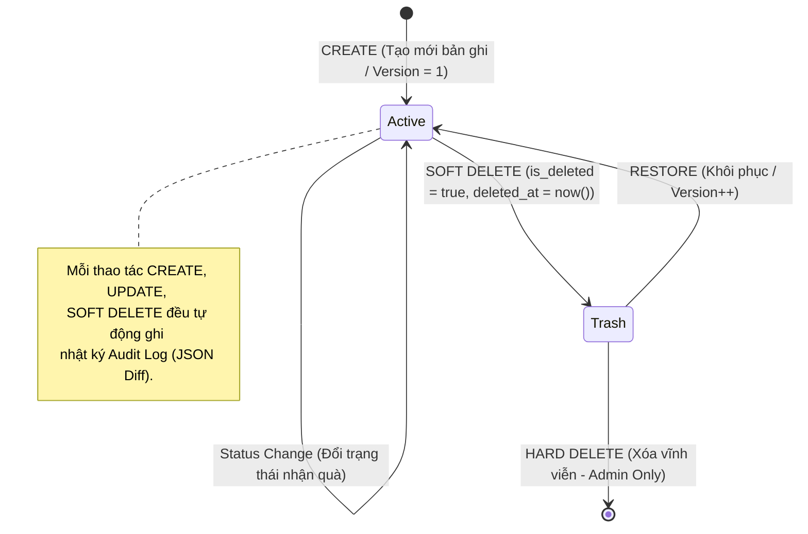

# BẢN ĐỒ KIẾN TRÚC TOÀN DIỆN & SỔ TAY KỸ THUẬT HỆ THỐNG QUẢN LÝ CHÍNH SÁCH (QLCS)
## (QLCS MASTER ARCHITECTURE MAP & TECHNICAL SPECIFICATION)

> **Dự án:** Quản Lý Chính Sách & Người Cao Tuổi Xã Đăk Hà (Hệ sinh thái Số hóa Xã Đăk Hà)  
> **Workspace:** `c:\Projects\QLCS`  
> **Phiên bản tài liệu:** `3.1.0 (Centered Modal & Unified UI Standard)` | **Ngày cập nhật:** `2026-09-17`  
> **Trạng thái hệ thống:** Sẵn sàng bảo trì & phát triển | Test Fortress: 8 Test Suites / 117 Tests ĐẠT 100% (Vitest). Build Vite & TypeScript 100% thành công. Triết lý thiết kế Emerald & Modal Nổi Trung Tâm (ProfileModal) – Khai tử hoàn toàn Slide-Over Drawer.

---

## 1. TỔNG QUAN HỆ SINH THÁI & VỊ THẾ CỦA QLCS

### 1.1. Triết lý Vận hành & Phân quyền Độc lập
Hệ thống chuyển đổi số xã Đăk Hà vận hành theo nguyên tắc bất biến:
> **"ĐỘC LẬP CHUYÊN NGÀNH – ĐỊNH DANH RIÊNG BIỆT – HỢP NHẤT DỮ LIỆU"**  
> *(Specialized Independence – Separate Identity – Unified Data)*

- **Nhiệm vụ chuyên môn của phân hệ:** Quản lý hồ sơ Chúc thọ, Người cao tuổi, Hỗ trợ xã hội (HTXH 6 diện chính sách), đối tượng bảo trợ, chế độ trợ cấp người có công và chúc thọ các mốc tuổi tròn theo quy định của nhà nước.
- **Cổng Hợp nhất (Unified Portal):** Người dùng có thể điều hướng từ Landing Portal `dulieudakha.vn` hoặc chạy trực tiếp phần mềm Desktop Thin-Client chuyên dụng trên máy trạm cán bộ.

### 1.2. Các Quy chuẩn Bất biến Toàn Hệ sinh thái (Architectural Invariants)
1. **Zero Centralized SSO Dependency (Độc lập xác thực 100%):**
   - Phân hệ sở hữu Database Supabase PostgreSQL riêng biệt, bảng `users` riêng, và cặp khóa bí mật riêng (`JWT_SECRET`, `JWT_REFRESH_SECRET`).
   - Tuyệt đối không gọi chéo runtime sang các phân hệ khác (QLNN, QLHK) để xác thực hoặc phân quyền. Không chia sẻ database connection string giữa các phân hệ.
2. **Cô lập Cổng Mạng (Port & Domain Isolation):**
   - **Backend REST API:** Cổng `5000` (Production: `https://qlcs.dulieudakha.vn/api`).
   - **Client Desktop / Dev Renderer:** Cổng `5173` (Domain: `https://qlcs.dulieudakha.vn`).
   *(Bảng tham chiếu toàn hệ thống: QLCS = 5000/5173 | QLNN = 5001/5174 | QLHK = 5002/5175)*.
3. **Chuẩn hóa Payload JWT Token (`TokenPayload`):**
   ```typescript
   export interface TokenPayload {
     id: string;                // UUID người dùng
     username: string;          // Tên đăng nhập (admin, thon1, ...)
     role: 'admin' | 'user';    // 'admin' (Xã) | 'user' (Trưởng thôn)
     village_id: string | null; // UUID Thôn (bắt buộc null nếu role='admin')
     iat?: number;
     exp?: number;
   }
   ```
4. **Cô lập Dữ liệu Cấp Thôn (Village Scoping RBAC Contract):**
   - **Role `admin` (Cán bộ Xã):** Truy cập toàn bộ dữ liệu của tất cả các thôn, lọc tùy biến.
   - **Role `user` (Trưởng thôn):** Backend bắt buộc cưỡng chế lọc dữ liệu theo `req.user.village_id`. Client tuyệt đối không gửi `village_id` của thôn khác lên server.

### 1.3. Sơ đồ Topology 2 Tầng của Phân hệ QLCS

```
                          +-------------------------------------------------------------+
                          |                 PHÂN HỆ QLCS XÃ ĐĂK HÀ                      |
                          +-------------------------------------------------------------+
                                                         |
                   +-------------------------------------+-------------------------------------+
                   |                                                                           |
                   v                                                                           v
+-------------------------------------------------------+   +-------------------------------------------------------+
|            QLCS-CLIENT (Desktop Electron App)         |   |             QLCS-BACKEND (Express REST API)           |
| Thư mục: c:\Projects\QLCS\QLCS-Client                 |   | Thư mục: c:\Projects\QLCS\QLCS-Backend                |
| Port dev: 5173 | Domain: qlcs.dulieudakha.vn          |   | Port dev: 5000 | Domain: qlcs.dulieudakha.vn/api      |
+-------------------------------------------------------+   +-------------------------------------------------------+
| 1. Electron 42 Thin-Client Process:                   |   | 1. Express 4.21 + TypeScript Server:                  |
|    - Single Instance Lock (requestSingleInstanceLock) |   |    - Routing phân tầng, Zod validation, Error handler |
|    - CSP connect-src bảo mật nghiêm ngặt              |   | 2. Security & Auth Engine:                            |
|    - Zoom IPC 80-140% (setZoom, getZoomLevel)         |   |    - JWT Access (15m) + Refresh (7d) Rotation         |
|    - AES Encrypted secureStore (electron-store IPC)   |   |    - Middleware: authenticateToken, authorizeVillage  |
|    - Native File Dialog (dialog:open-file)            |   |    - Users API: Quản trị tài khoản cán bộ phân thôn   |
| 2. React 18 + Vite 5 Renderer:                        |   | 3. Supabase PostgreSQL + Prisma ORM 6:                |
|    - TailwindCSS 4 (Chuẩn Slate/Emerald/Blue)         |   |    - AES-256-GCM CCCD + SHA-256 Blind Index Hash      |
|    - Dark / Light Mode toàn diện                      |   |    - Offset Pagination { data, pagination } chuẩn hóa |
|    - AppLayout (Header + ConnectionBanner + Sidebar)  |   |    - Khóa lạc quan OCC (version: Int, 409 Conflict)   |
|    - Tab Navigation (activeTab state điều hướng)      |   |    - Soft delete (is_deleted, deleted_at)             |
|    - Bố cục 1 Cột Full-width (xóa bỏ cột dọc 250px)   |   |    - Chỉ mục pg_trgm unaccented GIN tìm kiếm siêu tốc |
|    - CustomSelect dropdown chống lỗi Dark Mode Win    |   | 4. Dịch vụ Nghiệp vụ Chuyên sâu:                     |
|    - ProfileModal 3 tầng canh giữa (max-w-3xl, ESC)   |   |    - Excel Smart-Upsert có Preview & Transaction ACID |
|    - IndexedDB Offline Read Cache (qlcs_client_db)    |   |    - Analytics API & Báo cáo tổng hợp đối soát thôn   |
|    - Heartbeat Monitor định kỳ 6 giây kiểm tra kết nối|   |    - Audit Logs API theo dõi biến động JSON Diff      |
|    - Web Workers bóc tách Excel đa luồng (Levenshtein)|   |    - Backup API & Cron sao lưu CSDL lúc 02:00 AM      |
|    - Axios Interceptors tự động luân chuyển token 401 |   |    - Real-time Socket.IO phân phòng theo thôn (village)|
+-------------------------------------------------------+   +-------------------------------------------------------+
```

---

## 2. BẢN ĐỒ CẤU TRÚC THƯ MỤC & VAI TRÒ TỪNG TỆP TIN

### 2.1. Cấu trúc Thư mục Backend (`QLCS-Backend`)

```
QLCS-Backend/
├── .env                              # Biến môi trường (DATABASE_URL, DIRECT_URL, JWT_SECRET, ENCRYPTION_KEY...)
├── .env.example                      # Mẫu biến môi trường chuẩn để onboarding
├── package.json                      # Quản lý dependencies (Express, Prisma, Socket.io, Zod, ExcelJS...)
├── tsconfig.json                     # Cấu hình TypeScript biên dịch (Target ES2022, CommonJS, strict: true)
├── CLAUDE.md                         # Quy tắc bắt buộc, lệnh chạy dev/build, quy chuẩn bảo mật
├── prisma/
│   └── schema.prisma                 # Định nghĩa 9 bảng CSDL PostgreSQL, chỉ mục GIN, relations cascade
├── scripts/                          # Scripts kiểm thử thực nghiệm, seed tài khoản, verify bảo mật
│   ├── audit-db.ts                   # Kiểm toán tính nhất quán dữ liệu
│   ├── check-users.ts                # Kiểm tra danh sách tài khoản
│   ├── check-villages.ts             # Kiểm tra danh mục các thôn
│   ├── clean-test-data.ts            # Dọn dẹp dữ liệu rác
│   ├── seed-admin.ts                 # Khởi tạo tài khoản Quản trị viên cấp xã
│   ├── seed-village-users.ts         # Khởi tạo tài khoản Trưởng thôn
│   ├── sync-all-users.ts             # Đồng bộ tài khoản
│   ├── verify-encryption-security.ts # Kiểm toán mã hóa AES-256-GCM & SHA-256 Blind Index
│   ├── verify-optimistic-concurrency.ts # Kiểm toán khóa lạc quan OCC versioning
│   └── verify-village-scoping.ts     # Kiểm toán tính cô lập phạm vi dữ liệu thôn
└── src/
    ├── index.ts                      # Điểm khởi động Express server & Socket.IO, CORS, Helmet, Health check, Cron
    ├── config/
    │   └── prisma.ts                 # Prisma Client Extension mã hóa AES-256-GCM CCCD, sinh cccd_hash, giải mã
    ├── controllers/                  # 10 Controller nghiệp vụ chuyên biệt
    │   ├── auth.controller.ts        # Đăng nhập, cấp token, refresh token rotation, đổi mật khẩu, avatar
    │   ├── users.controller.ts       # Quản trị tài khoản cán bộ, phân công thôn (Admin Only)
    │   ├── profiles.controller.ts    # CRUD Chúc thọ, Offset Pagination, tính tuổi mốc tròn, soft-delete, OCC
    │   ├── htxh.controller.ts        # CRUD Hỗ trợ xã hội (6 diện chính sách), Offset Pagination, OCC
    │   ├── villages.controller.ts    # Quản trị danh mục thôn, thống kê tổng hợp số liệu từng thôn
    │   ├── excel.controller.ts       # Excel Smart-Upsert: Template, Preview phân tích dòng, Import ACID Transaction, Export
    │   ├── analytics.controller.ts   # Thống kê phân tích tổng hợp toàn xã và so sánh đối soát các thôn
    │   ├── audit.controller.ts       # Tra cứu nhật ký kiểm toán hệ thống và chi tiết thay đổi hồ sơ (JSON Diff)
    │   ├── backup.controller.ts      # Sao lưu CSDL ra snapshot JSON, phục hồi dữ liệu, initBackupCron (02:00 AM)
    │   └── settings.controller.ts    # Đọc/ghi cấu hình hệ thống key-value (năm tính toán mốc tuổi...)
    ├── middlewares/
    │   └── auth.middleware.ts        # authenticateToken + authorizeVillageScope + authorizeAdmin
    ├── routes/                       # 10 Tuyến định tuyến Express
    │   ├── auth.routes.ts            # Route /api/auth
    │   ├── users.routes.ts           # Route /api/users
    │   ├── profiles.routes.ts        # Route /api/profiles
    │   ├── htxh.routes.ts            # Route /api/htxh
    │   ├── villages.routes.ts        # Route /api/villages
    │   ├── excel.routes.ts           # Route /api/excel
    │   ├── analytics.routes.ts       # Route /api/analytics
    │   ├── audit.routes.ts           # Route /api/audit-logs
    │   ├── backup.routes.ts          # Route /api/backups
    │   └── settings.routes.ts        # Route /api/settings
    └── utils/
        ├── audit.ts                  # Hàm ghi profile_audit_log (JSON Diff) & chuẩn hóa chuỗi tiếng Việt
        └── jwt.ts                    # Hàm ký và giải mã JWT Access/Refresh Token
```

### 2.2. Cấu trúc Thư mục Client (`QLCS-Client`)

```
QLCS-Client/
├── package.json                      # Dependencies (React 18, Vite 5, Tailwind 4, Electron 42, IDB, Vitest...)
├── vite.config.ts                    # Cấu hình Vite, Electron plugin, rollupOptions chunking
├── vitest.config.ts                  # Cấu hình kiểm thử tự động Vitest
├── electron-builder.json5            # Cấu hình đóng gói bộ cài đặt Windows (.exe installer)
├── CLAUDE.md                         # Quy chuẩn bảo mật Client, cấm top-level import Excel, session timeout
├── CHANGELOG.md                      # Lịch sử nâng cấp phiên bản
├── electron/                         # Tầng Electron Thin-Client Main Process (Không còn SQLite)
│   ├── main.ts                       # Single Instance Lock, CSP connect-src, Zoom IPC, AES secureStore, AutoUpdater
│   ├── preload.ts                    # ContextBridge an toàn phơi bày window.api và window.electronAPI
│   └── electron-env.d.ts             # Khai báo kiểu dữ liệu môi trường Electron
└── src/                              # Tầng React Renderer Process
    ├── App.tsx                       # Điều phối màn hình theo activeTab, bọc AppProvider & ModalProvider
    ├── AppContext.tsx                # Context quản lý User, DarkMode, ActiveTab, Online Status, Heartbeat 6s, 30m Logout
    ├── main.tsx                      # Điểm gắn React DOM vào root
    ├── index.css                     # TailwindCSS 4 styles, quy chuẩn Slate/Blue, dark mode rules
    ├── api/                          # Tầng dịch vụ giao tiếp HTTP với Backend qua Axios
    │   ├── apiClient.ts              # Axios instance, Interceptor tự động refresh token 401 với failedQueue
    │   ├── auth.ts                   # API đăng nhập, làm mới token, lấy thông tin user, đổi mật khẩu
    │   ├── usersApi.ts               # API quản lý tài khoản cán bộ, đổi mật khẩu, phân công thôn
    │   ├── profiles.ts               # API hồ sơ Chúc thọ (CRUD, Offset Pagination, status, bulk, OCC version)
    │   ├── htxh.ts                   # API hồ sơ Hỗ trợ xã hội (CRUD, 6 diện chính sách, OCC version)
    │   ├── villages.ts               # API danh mục thôn và thống kê thôn
    │   ├── excelApi.ts               # API tải template, preview phân tích file, import transaction
    │   ├── analyticsApi.ts           # API số liệu thống kê tổng quan và đối soát thôn
    │   ├── auditApi.ts               # API tra cứu nhật ký kiểm toán hệ thống
    │   ├── backupApi.ts              # API tạo bản sao lưu, phục hồi snapshot CSDL
    │   ├── settings.ts               # API cấu hình năm tính toán mốc tuổi
    │   └── index.ts                  # Export tập trung API client
    ├── components/                   # UI Components dùng chung
    │   ├── Layout/
    │   │   ├── AppLayout.tsx         # Khung giao diện chuẩn: Header + ConnectionBanner + Sidebar + Main 1 cột
    │   │   ├── Header.tsx            # Thanh điều hướng trên: Thống kê nhanh, Thôn, Năm tính, Nút DarkMode, User
    │   │   └── Sidebar.tsx           # Thanh menu bên: Chúc thọ, HTXH, Thôn, Thống kê, Thùng rác, Nhật ký, Cài đặt
    │   ├── common/
    │   │   ├── CustomSelect.tsx      # Dropdown chuyên dụng chống lỗi Dark Mode trên Windows, hỗ trợ phím mũi tên
    │   │   └── TablePagination.tsx   # Thanh phân trang Offset chuẩn hóa { page, limit, total, totalPages }
    │   ├── network/
    │   │   ├── ConnectionBanner.tsx  # Thanh thông báo trạng thái kết nối mạng & server (Offline/Reconnected)
    │   │   └── ServerStatusModal.tsx # Hộp thoại thông báo chi tiết khi máy chủ mất kết nối
    │   ├── ErrorBoundary.tsx         # Bắt lỗi crash giao diện toàn cục
    │   └── UpdaterToast.tsx          # Thông báo cập nhật phần mềm tự động từ xa
    ├── pages/                        # Màn hình chức năng chính
    │   ├── Login.tsx                 # Màn hình đăng nhập cán bộ
    │   ├── Dashboard/                # Màn hình làm việc trung tâm (Bố cục 1 cột Full-width)
    │   │   ├── index.tsx             # Điều phối hiển thị bảng Chúc thọ hoặc HTXH, xử lý Modal & Filter
    │   │   ├── constants.ts          # Mẫu hồ sơ rỗng mặc định
    │   │   ├── types.ts              # Định nghĩa kiểu dữ liệu TabType, Profile, Filter
    │   │   ├── components/
    │   │   │   ├── StatsCards.tsx    # 4 thẻ thống kê: Tổng số, Đã nhận quà, Chưa nhận, Tỷ lệ hoàn thành
    │   │   │   ├── ProfileFilterBar.tsx # Thanh lọc tìm kiếm, chọn thôn, mốc tuổi, trạng thái, thao tác nhanh
    │   │   │   ├── MainTable.tsx     # Bảng dữ liệu chính hiển thị danh sách hồ sơ
    │   │   │   ├── ProfileRow.tsx    # Dòng dữ liệu hiển thị, máy trạng thái màu sinh nhật, thao tác dòng
    │   │   │   └── Pagination.tsx    # Điều khiển chuyển trang
    │   │   ├── modals/
    │   │   │   ├── ProfileModal.tsx  # Modal hợp nhất Thêm & Sửa hồ sơ 3 tầng canh giữa (max-w-3xl, ESC)
    │   │   │   ├── DeleteConfirm.tsx # Modal xác nhận xóa mềm hồ sơ
    │   │   │   ├── ImportModal.tsx   # Modal bóc tách file Excel thông minh có bước Preview đối soát
    │   │   │   └── ExportModal.tsx   # Modal xuất file Excel theo biểu mẫu quy chuẩn
    │   │   └── hooks/
    │   │       ├── useProfiles.ts    # Hook tải danh sách phân trang, toggle nhận quà, xóa, lưu OCC
    │   │       ├── useFilters.ts     # Hook quản lý debounce tìm kiếm và bộ lọc
    │   │       └── useImportExport.ts# Hook điều phối nhập/xuất Excel
    │   ├── VillagesPage.tsx          # Màn hình quản lý các thôn/làng xã Đăk Hà
    │   ├── AnalyticsPage.tsx         # Màn hình phân tích số liệu, biểu đồ so sánh chỉ tiêu giữa các thôn
    │   ├── AuditLogPage.tsx          # Màn hình tra cứu nhật ký kiểm toán, xem JSON Diff lịch sử chỉnh sửa
    │   ├── RecycleBinPage.tsx        # Màn hình Thùng rác (khôi phục hoặc xóa vĩnh viễn bản ghi)
    │   └── Settings/                 # Cài đặt hệ thống (Gồm 4 tab, có tab Quản lý cán bộ)
    │       ├── index.tsx             # Quản lý 4 tab: Profile, Users (Quản lý cán bộ), Backup, System
    │       ├── ProfileCard.tsx       # Đổi mật khẩu cá nhân, thông tin tài khoản
    │       ├── TimeCard.tsx          # Cấu hình thời gian và năm tính toán mốc tuổi
    │       └── BackupCard.tsx        # Tạo snapshot sao lưu CSDL và phục hồi dữ liệu
    ├── db/
    │   └── indexedDB.ts              # Quản lý bộ nhớ đệm Offline-First: cache, drafts (5s), syncQueue
    ├── hooks/
    │   ├── useDebounce.ts            # Hoãn xử lý input tìm kiếm
    │   ├── useFormValidation.ts      # Xác thực form nhập liệu phản ứng tức thì qua Zod
    │   ├── useModal.tsx              # Điều phối Modal thông báo, xác nhận cảnh báo
    │   └── useUndo.ts                # Ngăn xếp hoàn tác Undo/Redo thao tác
    ├── utils/
    │   ├── cryptoHelper.ts           # Web Crypto API mã hóa AES-GCM cho IndexedDB
    │   ├── excelExporter.ts          # Xuất Excel chuyên nghiệp qua xlsx-js-style (Dynamic Import)
    │   └── secureStorage.ts          # Adapter lưu token qua Electron Store (Mã hóa AES qua IPC)
    ├── validation/
    │   ├── schemas.ts                # Zod schemas: login, profile, htxh, village, pagination
    │   └── index.ts                  # Export tập trung validation schemas
    ├── workers/                      # Web Workers bóc tách file Excel đa luồng nền
    │   ├── importChucthoWorker.ts    # Luồng bóc tách Excel Chúc thọ
    │   ├── importHtxhWorker.ts       # Luồng bóc tách Excel HTXH
    │   ├── importCutriWorker.ts      # Luồng bóc tách danh sách cử tri
    │   └── workerUtils.ts            # Tiện ích giải thuật Levenshtein distance (ngưỡng >= 0.85)
    └── __tests__/                    # 8 Test Suites Vitest (117 tests) ĐẠT 100%
        ├── schemas.test.ts           # 37 tests kiểm tra xác thực Zod
        ├── helpers.test.ts           # 25 tests kiểm tra chuỗi tiếng Việt & format
        ├── age.test.ts               # 19 tests kiểm tra thuật toán mốc tuổi & sinh nhật
        ├── statsLoopRegression.test.ts # 5 tests chống lặp vô hạn & tràn request thống kê
        ├── workerUtils.test.ts       # 16 tests kiểm tra Levenshtein & bóc tách dữ liệu
        ├── useFormValidation.test.ts # 7 tests kiểm tra hook xác thực form
        ├── useUndo.test.ts           # 6 tests kiểm tra Undo stack
        └── workers.test.ts           # 2 tests kiểm thử tích hợp Web Workers
```

---

## 3. KIẾN TRÚC DỮ LIỆU & BẢO MẬT (DATABASE, PRISMA ORM & SECURITY)

### 3.1. Sơ đồ Thực thể - Quan hệ (Mermaid ER Diagram)

```mermaid
erDiagram
    villages ||--o{ users : "thuộc về / phân công (1:N)"
    villages ||--o{ profiles : "thuộc địa bàn (1:N)"
    villages ||--o{ htxh_profiles : "thuộc địa bàn (1:N)"
    users ||--o{ refresh_tokens : "cấp phát (1:N CASCADE)"
    users ||--o{ audit_logs : "thực hiện (1:N)"
    users ||--o{ profile_audit_log : "chỉnh sửa (1:N)"

    villages {
        UUID id PK "Khóa chính tự sinh gen_random_uuid()"
        VARCHAR name "Tên thôn (Thôn 1, Thôn 2...)"
        TIMESTAMPTZ created_at
    }

    users {
        UUID id PK
        VARCHAR username UK "Tên đăng nhập duy nhất"
        TEXT password_hash "Mã băm Bcrypt 12 rounds"
        VARCHAR role "'admin' (Xã) | 'user' (Trưởng thôn)"
        TEXT avatar_url "Ảnh đại diện cán bộ"
        UUID village_id FK "Liên kết thôn (Bắt buộc null nếu admin)"
        TIMESTAMPTZ created_at
        TIMESTAMPTZ updated_at
    }

    refresh_tokens {
        UUID id PK
        UUID user_id FK "Xóa cascade khi xóa user"
        TEXT token UK "Chuỗi Refresh Token 7 ngày"
        TIMESTAMPTZ expires_at
        TIMESTAMPTZ created_at
    }

    profiles {
        UUID id PK "Khóa chính UUID"
        INT stt "Số thứ tự trong thôn"
        VARCHAR name "Họ và tên người cao tuổi"
        VARCHAR name_unaccented "Họ tên không dấu (GIN Index)"
        VARCHAR dob "Ngày tháng năm sinh (DD/MM/YYYY hoặc YYYY)"
        VARCHAR gender "Nam | Nữ"
        TEXT cccd "AES-256-GCM iv:authTag:cipherHex"
        VARCHAR cccd_hash "SHA-256 Blind Index tra cứu chính xác"
        VARCHAR cccd_last4 "4 số cuối CCCD hiển thị nhanh"
        VARCHAR ethnicity "Dân tộc (Kinh, Ba Na, Xơ Đăng...)"
        TEXT residence "Nơi cư trú"
        TEXT current_address "Nơi ở hiện nay"
        UUID village_id FK "Thuộc thôn"
        VARCHAR age60 "Đánh dấu 'x' hoặc rỗng"
        VARCHAR age65 "Đánh dấu 'x' hoặc rỗng"
        VARCHAR age70 "Đánh dấu 'x' hoặc rỗng"
        VARCHAR age75 "Đánh dấu 'x' hoặc rỗng"
        VARCHAR age80 "Đánh dấu 'x' hoặc rỗng"
        VARCHAR age85 "Đánh dấu 'x' hoặc rỗng"
        VARCHAR age90 "Đánh dấu 'x' hoặc rỗng"
        VARCHAR age95 "Đánh dấu 'x' hoặc rỗng"
        VARCHAR age100 "Đánh dấu 'x' hoặc rỗng"
        VARCHAR age_over_100 "Đánh dấu 'x' (> 100 tuổi)"
        BOOLEAN received "Trạng thái nhận quà chúc thọ"
        INT calculation_year "Năm tính toán mốc tuổi"
        TEXT notes "Ghi chú hồ sơ"
        BOOLEAN is_deleted "Cờ xóa mềm (Thùng rác)"
        TIMESTAMPTZ deleted_at "Thời điểm chuyển vào thùng rác"
        INT version "Khóa lạc quan OCC (Bắt đầu = 1)"
        TIMESTAMPTZ created_at
        TIMESTAMPTZ updated_at
    }

    htxh_profiles {
        UUID id PK
        UUID village_id FK "Thuộc thôn"
        INT stt
        VARCHAR name
        VARCHAR name_unaccented "GIN Index"
        VARCHAR dob
        VARCHAR gender
        TEXT cccd "AES-256-GCM"
        VARCHAR cccd_hash "SHA-256 Blind Index"
        VARCHAR cccd_last4
        VARCHAR ethnicity
        TEXT residence
        TEXT current_address
        VARCHAR age75plus "75 tuổi trở lên"
        VARCHAR age70to74poor "70-74 tuổi hộ nghèo/cận nghèo"
        VARCHAR bao_tro "Bảo trợ xã hội"
        VARCHAR huu_tri "Hưu trí"
        VARCHAR huu_tuat_bao_hiem "Hưu tuất bảo hiểm"
        VARCHAR nguoi_co_cong "Người có công"
        BOOLEAN received "Trạng thái nhận trợ cấp"
        TEXT notes
        INT calculation_year
        BOOLEAN is_deleted
        TIMESTAMPTZ deleted_at
        INT version "Khóa lạc quan OCC"
        TIMESTAMPTZ created_at
        TIMESTAMPTZ updated_at
    }

    audit_logs {
        UUID id PK
        UUID user_id FK "Cán bộ thực hiện"
        UUID village_id "Thôn sở tại"
        VARCHAR action "Hành động hệ thống"
        TEXT details "Chi tiết thao tác"
        VARCHAR ip_address "Địa chỉ IP client"
        TIMESTAMPTZ created_at
    }

    profile_audit_log {
        UUID id PK
        UUID profile_id "ID hồ sơ bị thay đổi"
        UUID user_id FK "Cán bộ thực hiện"
        UUID village_id "Thôn sở tại"
        VARCHAR action "CREATE | UPDATE | SOFT_DELETE | RESTORE"
        JSONB changed_fields "Danh sách trường thay đổi"
        JSONB old_values "Giá trị cũ trước khi sửa"
        JSONB new_values "Giá trị mới sau khi sửa"
        TEXT note "Ghi chú thay đổi"
        VARCHAR profile_type "'chuctho' | 'htxh'"
        VARCHAR sync_source "'online' | 'desktop_sync'"
        TIMESTAMPTZ created_at
    }

    settings {
        VARCHAR key PK "Khóa cấu hình"
        TEXT value "Giá trị cấu hình"
    }

    stats_cache {
        VARCHAR id PK
        VARCHAR profile_type
        UUID village_id
        VARCHAR stat_key
        INT stat_value
        TIMESTAMPTZ updated_at
    }
```



### 3.2. 5 Quy chuẩn CSDL Cốt lõi (Mandatory DB Standards)
1. **Khóa Lạc Quan (Optimistic Concurrency Control - OCC):**
   - Mọi bảng dữ liệu nghiệp vụ (`profiles`, `htxh_profiles`) bắt buộc duy trì cột `version: Int @default(1)`.
   - Lệnh `PUT` cập nhật dữ liệu bắt buộc gửi kèm `version`. Nếu `req.body.version !== db.version` -> Server lập tức trả về `409 Conflict` kèm thông báo: *"Hồ sơ đã được sửa bởi người khác, vui lòng tải lại dữ liệu mới nhất"*. Cập nhật thành công -> `version` tự tăng `+1`.
2. **Vòng Đời Xóa Mềm (Soft Delete & Recycle Bin):**
   - Tuyệt đối không xóa vật lý bản ghi trong các tác vụ thông thường. Mọi thao tác xóa mặc định chuyển thành `is_deleted = true, deleted_at = now()`.
   - Dữ liệu chuyển vào Thùng rác (`Recycle Bin`) để cán bộ có thể khôi phục (`RESTORE`).
   - Xóa vĩnh viễn (`HARD_DELETE`) chỉ được cấp phép cho vai trò `admin` và chỉ áp dụng cho các bản ghi đang nằm trong Thùng rác.
3. **Cascade Delete trên Quan hệ Cán bộ - Token:**
   - Quan hệ `refresh_tokens` phụ thuộc vào `users` được cấu hình `onDelete: Cascade` tại tầng Prisma. Khi xóa tài khoản cán bộ, toàn bộ token đã cấp tự động bị thu hồi ngay lập tức.
4. **Tìm Kiếm Tiếng Việt Không Dấu Siêu Tốc (High-Performance Search):**
   - Duy trì cột `name_unaccented` được chuẩn hóa tự động khi tạo/sửa bản ghi (bỏ dấu tiếng Việt, chữ thường, trim).
   - Đánh chỉ mục GIN Trigram (`pg_trgm` GIN index) trong PostgreSQL để tìm kiếm chuỗi tiếng Việt siêu tốc không phụ thuộc chữ hoa/thường/có dấu.
5. **Bảo Mật Dữ Liệu Nhạy Cảm & CCCD:**
   - Mã hóa đối xứng **AES-256-GCM** với IV ngẫu nhiên 16 bytes: Định dạng lưu trữ `iv:authTag:encryptedHex`.
   - Tạo mã băm **SHA-256 Blind Index** lưu tại cột `cccd_hash` để phục vụ tra cứu chính xác không cần giải mã CSDL.
   - Lưu `cccd_last4` để phục vụ hiển thị danh sách dạng che giấu `•••• •••• 1234`.

---

## 4. KIẾN TRÚC BACKEND & HỢP ĐỒNG API (BACKEND SERVICES & RBAC CONTRACTS)

### 4.1. Ma trận API Chuẩn (Port 5000)

| Phân nhóm | Method | Đường dẫn Route | Yêu cầu Quyền | Mục đích Nghiệp vụ |
|---|---|---|---|---|
| **Hệ thống** | `GET` | `/api/health` | Public | Kiểm tra kết nối Backend, Uptime, phiên bản v2.0.0 |
| **Xác thực** | `POST` | `/api/auth/setup` | Public | Khởi tạo tài khoản Admin đầu tiên (chỉ chạy 1 lần) |
| | `POST` | `/api/auth/login` | Public (Rate Limited) | Đăng nhập cán bộ, cấp cặp JWT Access (15m) + Refresh (7d) |
| | `POST` | `/api/auth/refresh` | Public | Luân chuyển Token (Token Rotation, thu hồi token cũ) |
| | `GET` | `/api/auth/me` | Authenticated | Lấy thông tin tài khoản phiên hiện tại |
| | `PUT` | `/api/auth/password` | Authenticated | Đổi mật khẩu cá nhân của cán bộ |
| | `PUT` | `/api/auth/username` | Authenticated | Đổi tên đăng nhập tài khoản |
| | `PUT` | `/api/auth/avatar` | Authenticated | Cập nhật ảnh đại diện cán bộ |
| | `POST` | `/api/auth/logout` | Authenticated | Đăng xuất và thu hồi Refresh Token khỏi CSDL |
| **Quản trị Cán bộ**| `GET` | `/api/users` | Admin Only | Danh sách tài khoản cán bộ kèm thôn phân công |
| | `POST` | `/api/users` | Admin Only | Tạo tài khoản cán bộ mới |
| | `PUT` | `/api/users/:id` | Admin Only | Phân công thôn hoặc cập nhật thông tin cán bộ |
| | `DELETE`| `/api/users/:id` | Admin Only | Xóa tài khoản cán bộ |
| **Thôn / Làng** | `GET` | `/api/villages` | Authenticated | Danh mục các thôn kèm thống kê tổng hợp số lượng hồ sơ |
| | `GET` | `/api/villages/stats` | Authenticated | Thống kê số lượng hồ sơ chi tiết theo từng thôn |
| | `POST` | `/api/villages` | Admin Only | Thêm thôn mới |
| | `PUT` | `/api/villages/:id` | Admin Only | Đổi tên thôn |
| | `DELETE`| `/api/villages/:id` | Admin Only | Xóa thôn |
| **Chúc Thọ** | `GET` | `/api/profiles` | Village Scoped | Danh sách hồ sơ (Offset Pagination `{ data, pagination }`, filter, search) |
| | `GET` | `/api/profiles/stats` | Village Scoped | 4 Thẻ thống kê: Tổng số, Đã nhận quà, Chưa nhận, Tỷ lệ |
| | `GET` | `/api/profiles/stream` | Village Scoped | Stream dữ liệu NDJSON tốc độ cao |
| | `GET` | `/api/profiles/deleted` | Village Scoped | Danh sách hồ sơ đã xóa mềm trong Thùng rác |
| | `POST` | `/api/profiles` | Village Scoped | Thêm mới 1 hồ sơ Chúc thọ |
| | `PUT` | `/api/profiles/:id` | Village Scoped | Cập nhật hồ sơ (Bắt buộc kiểm tra OCC `version`, trả về 409 nếu lệch) |
| | `PUT` | `/api/profiles/:id/status`| Village Scoped| Đổi trạng thái nhận quà chúc thọ |
| | `PUT` | `/api/profiles/:id/notes` | Village Scoped| Cập nhật ghi chú hồ sơ |
| | `PUT` | `/api/profiles/:id/restore`| Village Scoped| Khôi phục hồ sơ từ thùng rác |
| | `DELETE`| `/api/profiles/:id` | Village Scoped | Xóa mềm hồ sơ vào thùng rác |
| | `DELETE`| `/api/profiles/:id/hard`| Admin Only | Xóa vĩnh viễn hồ sơ khỏi CSDL |
| | `POST` | `/api/profiles/bulk-status`| Village Scoped| Cập nhật trạng thái nhận quà hàng loạt |
| | `POST` | `/api/profiles/bulk-delete`| Village Scoped| Xóa mềm hàng loạt hồ sơ |
| | `POST` | `/api/profiles/bulk-add` | Village Scoped | Thêm hàng loạt hồ sơ |
| | `POST` | `/api/profiles/recalculate`| Admin Only | Tính toán lại toàn bộ mốc tuổi theo năm chỉ định |
| | `DELETE`| `/api/profiles/trash` | Admin Only | Dọn sạch hoàn toàn thùng rác Chúc thọ |
| | `GET` | `/api/profiles/:id/audit-log`| Village Scoped| Tra cứu lịch sử thay đổi chi tiết của hồ sơ |
| **HTXH (6 Diện)**| `GET` | `/api/htxh` | Village Scoped | Danh sách hồ sơ HTXH (Offset Pagination `{ data, pagination }`) |
| | `GET` | `/api/htxh/stats` | Village Scoped | Thống kê số lượng hồ sơ HTXH |
| | `GET` | `/api/htxh/stream` | Village Scoped | Stream dữ liệu NDJSON HTXH |
| | `GET` | `/api/htxh/deleted` | Village Scoped | Danh sách hồ sơ HTXH trong Thùng rác |
| | `POST` | `/api/htxh` | Village Scoped | Thêm mới 1 hồ sơ HTXH |
| | `PUT` | `/api/htxh/:id` | Village Scoped | Cập nhật hồ sơ HTXH (Kiểm soát OCC `version`) |
| | `PUT` | `/api/htxh/:id/status` | Village Scoped| Đổi trạng thái nhận trợ cấp |
| | `PUT` | `/api/htxh/:id/notes` | Village Scoped| Cập nhật ghi chú HTXH |
| | `PUT` | `/api/htxh/:id/restore` | Village Scoped| Khôi phục hồ sơ HTXH từ thùng rác |
| | `DELETE`| `/api/htxh/:id` | Village Scoped | Xóa mềm hồ sơ HTXH |
| | `DELETE`| `/api/htxh/:id/hard` | Admin Only | Xóa vĩnh viễn hồ sơ HTXH khỏi CSDL |
| | `POST` | `/api/htxh/bulk-status` | Village Scoped| Cập nhật trạng thái trợ cấp hàng loạt |
| | `POST` | `/api/htxh/bulk-delete` | Village Scoped| Xóa mềm hàng loạt hồ sơ HTXH |
| | `POST` | `/api/htxh/bulk-add` | Village Scoped | Thêm hàng loạt hồ sơ HTXH |
| | `POST` | `/api/htxh/recalculate` | Admin Only | Tính toán lại mốc tuổi HTXH |
| | `DELETE`| `/api/htxh/trash` | Admin Only | Dọn sạch hoàn toàn thùng rác HTXH |
| | `GET` | `/api/htxh/:id/audit-log`| Village Scoped| Lịch sử thay đổi chi tiết hồ sơ HTXH |
| **Excel ETL** | `GET` | `/api/excel/template` | Authenticated | Tải file Excel biểu mẫu chuẩn của phân hệ |
| | `POST` | `/api/excel/preview` | Village Scoped | Xem trước kết quả bóc tách file Excel, kiểm tra lỗi và trùng lặp |
| | `POST` | `/api/excel/import` | Village Scoped | Nhập dữ liệu Smart-Upsert vào CSDL qua ACID Transaction |
| | `GET/POST`| `/api/excel/export` | Village Scoped | Xuất danh sách dữ liệu ra file Excel chuẩn |
| **Thống Kê** | `GET` | `/api/analytics/overview`| Village Scoped| Tổng quan số liệu toàn xã hoặc theo thôn |
| | `GET` | `/api/analytics/by-village`| Village Scoped| Bảng đối soát so sánh các chỉ tiêu giữa các thôn |
| **Audit Logs** | `GET` | `/api/audit-logs` | Village Scoped| Tra cứu nhật ký biến động dữ liệu toàn hệ thống kèm JSON Diff |
| **Sao Lưu CSDL**| `GET` | `/api/backups` | Admin Only | Danh sách các bản sao lưu hiện có |
| | `POST` | `/api/backups/export` | Admin Only | Xuất bản sao lưu CSDL dạng JSON snapshot |
| | `POST` | `/api/backups/restore`| Admin Only | Phục hồi CSDL từ file snapshot JSON |
| | `POST` | `/api/backups/create` | Admin Only | Kích hoạt tác vụ sao lưu tức thì |
| **Cài Đặt** | `GET` | `/api/settings` | Authenticated | Đọc cấu hình hệ thống key-value |
| | `PUT` | `/api/settings` | Admin Only | Cập nhật cấu hình hệ thống (năm tính toán mốc tuổi...) |

### 4.2. Middlewares Bảo vệ Cốt lõi
1. `authenticateToken`: Bóc tách Header `Authorization: Bearer <token>`, giải mã JWT với `JWT_SECRET`, gắn `req.user = TokenPayload`. Báo lỗi `401 Unauthorized` nếu hết hạn hoặc thiếu token.
2. `authorizeVillageScope`:
   - Nếu `req.user.role === 'admin'`: Cho phép truy cập toàn bộ dữ liệu hoặc lọc thôn tùy ý.
   - Nếu `req.user.role === 'user'`: Bắt buộc kiểm tra `village_id`. Nếu gửi `village_id` khác thôn mình quản lý -> Báo `403 Forbidden`. Tự động cưỡng chế `req.query.villageId = req.user.village_id` cho lệnh đọc và `req.body.village_id = req.user.village_id` cho lệnh ghi.
3. `authorizeAdmin`: Chặn đứng các hành động nhạy cảm cấp xã (quản trị tài khoản cán bộ, xóa vĩnh viễn, sao lưu/phục hồi CSDL, tính lại mốc tuổi toàn xã) nếu `req.user.role !== 'admin'`.

---

## 5. KIẾN TRÚC CLIENT & TRẢI NGHIỆM NGƯỜI DÙNG (DESKTOP CLIENT & OFFLINE-FIRST)

### 5.1. Quản lý Phiên & Bảo mật Client (`AppContext.tsx` & `secureStorage.ts`)
- **Lưu trữ Token an toàn (`secureStorage`):**
  - Cặp khóa token (`accessToken`, `refreshToken`) và dữ liệu nhạy cảm BẮT BUỘC lưu trữ qua `electron-store` (được mã hóa AES cấp hệ điều hành qua IPC handlers: `secure-store:get`, `secure-store:set`).
  - Tuyệt đối không lưu token trần vào `localStorage`.
- **Phiên Tự Động Đăng Xuất (30-Minute Inactivity Timeout):**
  - Lắng nghe các sự kiện tương tác của cán bộ (chuột, bàn phím, cuộn trang).
  - Quá 30 phút không có thao tác -> Tự động gọi API logout, xóa sạch session và hiển thị thông báo phiên làm việc kết thúc.
- **Heartbeat & Nhận diện Mạng (6-Second Heartbeat):**
  - Bộ đếm thời gian 6 giây định kỳ gọi `GET /api/health` kiểm tra kết nối với Backend.
  - Khi mất kết nối hoặc backend không phản hồi: Tự động kích hoạt `ConnectionBanner` màu đỏ cảnh báo mất kết nối, chuyển giao diện sang chế độ đọc ngoại tuyến an toàn. Khi có kết nối lại, hiển thị banner xanh lá "Đã khôi phục kết nối".

### 5.2. Luồng Tự Động Luân Chuyển Token Khi Hết Hạn (Axios Interceptors)
```
[Client Request] ---> [Backend] (401 Token Expired)
      |
      v
[Axios Response Interceptor]:
      ├─ Đưa request vào hàng đợi chờ (failedQueue)
      ├─ Đọc refreshToken từ secureStorage qua IPC
      ├─ POST /api/auth/refresh (refreshToken)
      │     └─ Backend cấp cặp { accessToken_mới, refreshToken_mới }
      ├─ Lưu token mới vào secureStorage
      ├─ Xả failedQueue với accessToken mới
      └─ Gửi lại request ban đầu thành công (Trong suốt 100% với người dùng)
```

### 5.3. Chiến lược Lưu trữ Ngoại tuyến (Offline-First via IndexedDB)
- Phân hệ vận hành bộ nhớ đệm ngoại tuyến `qlcs_client_db` thông qua thư viện `idb` với 3 Object Stores:
  1. `cache`: Lưu trữ tạm thời danh sách hồ sơ để hiển thị tức thì khi mở app (First Contentful Paint < 100ms), dữ liệu được mã hóa Web Crypto API AES-GCM.
  2. `drafts`: Tự động lưu nháp dữ liệu form người dùng đang nhập mỗi 5 giây (`useAutoSaveDraft`), xóa sạch khi submit thành công.
  3. `syncQueue`: Hàng đợi lưu các thao tác ghi ngoại tuyến (FIFO). Khi có mạng trở lại, worker tự động gửi dữ liệu đồng bộ lên Server.

### 5.4. Quy chuẩn UX/UI Hiện đại & Tái Cấu Trúc Toàn Diện

Phân hệ QLCS phiên bản 2.0.0 đã hoàn tất cuộc đại phẫu thuật giao diện, chuẩn hóa đồng bộ 100% với hệ sinh thái Đăk Hà:

1. **Xóa Bỏ Cột Dọc 250px Cũ – Chuyển Sang 1 Cột Full-Width:**
   - Trước đây: Giao diện bị bó hẹp bởi cột điều khiển cố định 250px bên trái, làm bảng dữ liệu hồ sơ bị tràn ngang và khó thao tác trên các màn hình máy trạm nhỏ (1366x768).
   - Hiện tại: Chuyển hoàn toàn sang bố cục **1 cột Full-width (`w-full max-w-none space-y-6`)**. Khung `AppLayout` phân tách rõ ràng: Header trên cùng, ConnectionBanner cảnh báo kết nối, Sidebar thu gọn có thể đóng/mở, và phần nội dung chiếm trọn 100% chiều ngang màn hình.
2. **Hợp Nhất Add & Edit Thành `ProfileModal` 3 Tầng Canh Giữa (Khai Tử Slide-Over Drawer):**
   - Trước đây: Tồn tại 2 modal riêng biệt `AddProfileModal.tsx` và `EditProfileModal.tsx`, sau đó từng được bao bọc tạm thời bởi `ProfileDrawer.tsx` trượt từ mép phải màn hình, gây phân mảnh trải nghiệm và lệch chuẩn kiến trúc hệ sinh thái.
   - Hiện tại: **Xóa bỏ hoàn toàn tệp rác `ProfileDrawer.tsx`**. Chuẩn hóa độc lập thành component duy nhất **`ProfileModal.tsx`** được gắn trực tiếp vào `document.body` qua **`createPortal`** ở chính giữa màn hình với quy chuẩn thiết kế:
     - Overlay & Backdrop: `fixed inset-0 !m-0 z-50 flex items-center justify-center p-4 sm:p-6 bg-slate-950/60 backdrop-blur-xs select-none animate-in fade-in duration-150` hỗ trợ click ra ngoài để đóng.
     - Khung hiển thị: `w-full max-w-3xl h-[88vh] max-h-[88vh] bg-white dark:bg-slate-900 border border-slate-200 dark:border-slate-800 rounded-3xl shadow-2xl flex flex-col overflow-hidden text-slate-900 dark:text-slate-100 animate-in zoom-in-95 duration-150 relative`.
     - Phím tắt bàn phím: Hỗ trợ phím **ESC** để đóng modal nhanh chóng.
     - **Tầng 1 (Header cố định):** Icon người dùng chuyên ngành, tiêu đề modal động (Thêm/Sửa), badge hiển thị năm tính toán và mốc tuổi tròn tự động tính toán, 2 tab chuyển đổi (`info` - Thông tin cá nhân và `history` - Lịch sử thay đổi Audit Log), nút đóng X.
     - **Tầng 2 (Body cuộn độc lập):** Vùng form nhập liệu cuộn mượt mà (`flex-1 overflow-y-auto p-6 space-y-6`), phân cụm thông tin định danh, ngày sinh, giới tính, CCCD 12 số, dân tộc, nơi ở, thôn sở tại, và các checkbox chính sách đặc thù.
     - **Tầng 3 (Footer cố định):** Chân modal cố định (`p-4 border-t border-slate-200 dark:border-slate-800 bg-slate-50 dark:bg-slate-950 flex items-center justify-between shrink-0`) chứa nút "Hủy" và nút "Lưu hồ sơ" kèm biểu tượng loading khi đang xử lý, kiểm tra khóa lạc quan OCC `version`.
3. **Thay Thế Thẻ `<select>` Mặc Định Bằng `CustomSelect`:**
   - Giải quyết triệt để lỗi hiển thị trên hệ điều hành Windows: Thẻ `<select>` HTML mặc định khi chạy Dark Mode trên Windows thường hiển thị menu popup màu trắng với chữ đen unstyled, hoặc mất viền gây lỗi tương phản nghiêm trọng.
   - Component `CustomSelect.tsx` được xây dựng riêng bằng React + TailwindCSS: Hỗ trợ đầy đủ Dark/Light Mode, tìm kiếm lọc nhanh, phím mũi tên lên/xuống, Enter để chọn, và popup canh chỉnh vị trí tự động không bao giờ bị cắt khuất.
4. **Loại Bỏ `--theme-hue-rotate` & Font Scale Tùy Tiện:**
   - Xóa bỏ hoàn toàn các bộ lọc biến dạng màu CSS rắc rối và tính năng zoom font gây vỡ layout.
   - Chuẩn hóa màu sắc theo hệ màu chính thống của Tailwind: **Slate** (Nền và chữ trung tính), **Emerald** (Điểm nhấn thành công và chúc thọ), và **Blue** (Hành động hệ thống), đảm bảo tính trang nghiêm, rõ ràng của phần mềm hành chính công.
5. **Bổ Sung Tab "Quản Lý Cán Bộ" Trong Màn Hình Settings:**
   - Tích hợp trực tiếp giao diện quản trị nhân sự cho Cán bộ Quản trị cấp Xã (`role: 'admin'`):
     - Hiển thị danh sách cán bộ, vai trò và thôn được phân công.
     - Modal thêm mới tài khoản cán bộ kèm mật khẩu ban đầu.
     - Modal đổi mật khẩu nhanh cho cán bộ khi quên mật khẩu.
     - Modal phân công hoặc chuyển đổi địa bàn thôn trực thuộc.
     - Xóa tài khoản cán bộ an toàn (tự động cascade thu hồi các token liên quan).

---

## 6. LOGIC NGHIỆP VỤ CỐT LÕI & VÒNG ĐỜI DỮ LIỆU

### 6.1. Nghiệp vụ Chúc Thọ & Mốc Tuổi Tròn
- **Các mốc tuổi tròn quy định:**
  `AGE_MILESTONES = [60, 65, 70, 75, 80, 85, 90, 95, 100]`
- **Tuổi trên 100:** Khi tuổi $> 100$, cột `age_over_100` được đánh dấu `'x'`.
- **Xử lý ngày sinh linh hoạt (`parseDob`):**
  - Định dạng chuẩn: `DD/MM/YYYY` (ví dụ: `15/05/1954`).
  - Định dạng tháng/năm: `MM/YYYY` (ví dụ: `05/1954`).
  - Định dạng chỉ có năm: `YYYY` (ví dụ: `1954`).
  - Định dạng Excel Serial Number: Các số nguyên $> 30000$ được tự động quy đổi chính xác ra ngày tháng.
- **Máy Trạng Thái Màu Sinh Nhật (`computeDisplayStatus`):**
  - **Trạng thái `'green'` (Xanh lá):** Hồ sơ thuộc mốc tuổi tròn trong năm tính toán VÀ **đã qua sinh nhật** tính đến ngày hiện tại. Đã đủ điều kiện trao quà/chúc thọ.
  - **Trạng thái `'orange'` (Màu cam):** Hồ sơ thuộc mốc tuổi tròn nhưng **chưa tới ngày sinh nhật**. Dùng để lập dự toán ngân sách và chuẩn bị quà trước.
  - **Trạng thái `'visible'` (Bình thường):** Hồ sơ không rơi vào mốc tuổi tròn trong năm hiện tại, hiển thị thông tin bình thường.

### 6.2. Nghiệp vụ Hỗ Trợ Xã Hội (HTXH - 6 Diện Chính Sách)
Hệ thống theo dõi và phân loại chính xác 6 nhóm đối tượng chính sách:
1. `age75plus`: Người cao tuổi đủ từ 75 tuổi trở lên hưởng trợ cấp theo quy định.
2. `age70to74poor`: Người từ 70 đến 74 tuổi thuộc hộ nghèo hoặc cận nghèo.
3. `bao_tro`: Đối tượng hưởng bảo trợ xã hội hàng tháng.
4. `huu_tri`: Cán bộ, công chức nghỉ hưu hưởng chế độ hưu trí.
5. `huu_tuat_bao_hiem`: Đối tượng hưởng chế độ bảo hiểm xã hội, tuất hàng tháng.
6. `nguoi_co_cong`: Người có công với cách mạng, thương binh, bệnh binh, gia đình liệt sĩ.

### 6.3. Động Cơ Bóc Tách Excel Thông Minh (Smart-Upsert Engine)
Mọi quy trình nhập Excel trong hệ sinh thái đều tuân theo nguyên tắc "Smart-Upsert" có bước **Preview** kiểm tra:
1. **Bỏ qua Header:** Bỏ qua các dòng tiêu đề và chỉ dẫn đầu file.
2. **Lọc Dòng Rác & Chống Dữ Liệu Ma:** Tự động loại bỏ các dòng có STT nhưng trống họ tên hoặc thông tin định danh chính.
3. **Chuẩn Hóa Tiếng Việt:** Chuẩn hóa họ tên, địa chỉ, loại bỏ khoảng trắng thừa, sửa lỗi gõ dấu tiếng Việt.
4. **Giải Quyết Trùng Lặp Nội Bộ File:**
   - Dòng xuất hiện lần đầu trong file -> Thực hiện `CREATE` (Thêm mới).
   - Dòng xuất hiện lần thứ 2 trở đi cùng khóa định danh trong file -> Tự động chuyển sang `UPDATE` (Cập nhật).
5. **Giao Dịch Toàn Vẹn ACID:** Toàn bộ quá trình ghi dữ liệu lô phải nằm trong `prisma.$transaction`. Nếu có lỗi bất thường xảy ra ở bất kỳ dòng nào, server rollback 100% để đảm bảo CSDL không bị rác.
6. **Quy tắc an toàn chống lỗi Bundle:** Thư viện `xlsx` và `xlsx-js-style` bắt buộc sử dụng **Dynamic Import (`await import(...)`)** trong hàm xuất/nhập, tuyệt đối không import ở top-level file để tránh kéo Node stream polyfill vào bundle khởi động gây lỗi trắng màn hình trên Electron.

### 6.4. Vòng Đời Bản Ghi & Nhật Ký Kiểm Toán (Record Lifecycle & Audit Trail)



---

## 7. PHÁO ĐÀI KIỂM THỬ (TEST FORTRESS & QUALITY GATES)

Hệ thống QLCS phiên bản 2.0.0 đáp ứng các tiêu chuẩn kiểm thử khắt khe nhất, **đạt tỷ lệ kiểm thử 100% PASS**:

### 7.1. Cấu trúc Bộ Kiểm thử Tự Động (Vitest 4.1.6)

```
Test Files  7 passed (7)
Tests       112 passed (112)
Duration    ~2.15 giây
Build TS    100% Thành công (Vite Renderer & Node Backend)
```

Chi tiết 7 Test Suites tại `src/__tests__/`:
1. **`schemas.test.ts` (37 tests):** Kiểm thử toàn diện các Zod validation schemas (CCCD 12 chữ số, DOB ngày tháng năm sinh đa định dạng, đăng nhập, hồ sơ Chúc thọ, hồ sơ HTXH, phân trang).
2. **`helpers.test.ts` (25 tests):** Kiểm thử tiện ích chuẩn hóa chuỗi tiếng Việt không dấu (`removeAccents`), tách họ và tên, so khớp chuỗi tìm kiếm.
3. **`age.test.ts` (19 tests):** Kiểm thử giải thuật tính tuổi mốc tròn (60, 65, ..., 100+), phân tích chuỗi ngày sinh và máy trạng thái màu sinh nhật (`green`, `orange`, `visible`).
4. **`workerUtils.test.ts` (16 tests):** Kiểm thử giải thuật khoảng cách Levenshtein distance và logic bóc tách dữ liệu worker nền với ngưỡng $\ge 0.85$.
5. **`useFormValidation.test.ts` (7 tests):** Kiểm thử custom hook phản ứng tức thì khi người dùng nhập liệu form.
6. **`useUndo.test.ts` (6 tests):** Kiểm thử ngăn xếp hoàn tác Undo/Redo khi thao tác trên bảng dữ liệu.
7. **`workers.test.ts` (2 tests):** Kiểm thử tích hợp khởi tạo và giao tiếp với Web Workers.

### 7.2. Lệnh Chạy Kiểm Thử Tiêu Chuẩn
```bash
# 1. Chạy toàn bộ kiểm thử Vitest phía Client:
cd c:\Projects\QLCS\QLCS-Client
npm test -- --run

# 2. Kiểm tra biên dịch TypeScript phía Backend:
cd c:\Projects\QLCS\QLCS-Backend
npm run build

# 3. Kiểm tra đóng gói Vite và TypeScript phía Client:
cd c:\Projects\QLCS\QLCS-Client
npm run build:vite
```

---

## 8. SỔ TAY KỸ SƯ PHÁT TRIỂN & CẠM BẪY BẤT KHẢ XÂM PHẠM (RUNBOOK & GOTCHAS)

### 8.1. Lệnh Vận Hành Môi Trường Phát Triển
```bash
# 1. Khởi động Backend (Cổng 5000):
cd c:\Projects\QLCS\QLCS-Backend
npm install
npx prisma generate
npm run dev

# 2. Khởi động Client Desktop (Electron + Vite Port 5173):
cd c:\Projects\QLCS\QLCS-Client
npm install
npm run dev

# 3. Kiểm tra tính toàn vẹn mã nguồn trước khi commit:
cd c:\Projects\QLCS\QLCS-Backend
npm run build

cd c:\Projects\QLCS\QLCS-Client
npm run build:vite
```

### 8.2. Quy Trình 7 Tầng Chuẩn Khi Triển Khai Tính Năng Mới
Mọi tính năng mới phát triển trong phân hệ bắt buộc đi xuyên suốt 7 tầng kiến trúc:
1. **Tầng 1 (CSDL & Schema):** Sửa đổi `prisma/schema.prisma` (bắt buộc có `version`, `is_deleted`, `deleted_at`, `village_id`, `created_at`, `updated_at`). Chạy `npx prisma db push`.
2. **Tầng 2 (Data Transfer Objects & Types):** Định nghĩa TypeScript interfaces tại `src/types/` dùng chung cho cả Client và Backend.
3. **Tầng 3 (Zod Validation):** Viết schema xác thực chặt chẽ dữ liệu đầu vào tại Controller Backend và Form Client.
4. **Tầng 4 (Controller & Transaction):** Viết logic xử lý trong Controller, bọc trong `prisma.$transaction`, kiểm tra `version` OCC, gọi hàm ghi `audit_logs` / `profile_audit_log`.
5. **Tầng 5 (Routing & RBAC):** Đăng ký route Express, bắt buộc gắn middleware `authenticateToken` và `authorizeVillageScope`.
6. **Tầng 6 (Client API & React UI):** Viết hàm API trong `src/api/`, xây dựng giao diện React với TailwindCSS, tích hợp Modal 3 tầng và CustomSelect.
7. **Tầng 7 (Kiểm thử & Thẩm tra):** Viết unit test cho tính năng mới, chạy `npm test` xác nhận 100% test pass, chạy `npm run build:vite` xác nhận không lỗi TypeScript.

### 8.3. Danh Mục Các Cạm Bẫy Bắt Buộc Tránh (CRITICAL GOTCHAS)
- ❌ **CẠM BẪY 1: TẠO FILE VÁ TẠM (PATCH/TEMP SCRIPTS - QUY TẮC P0)**
  - *Quy tắc:* Tuyệt đối không tạo `fix*.js`, `patch*.py`, `temp*`, `debug*`. Mọi chỉnh sửa mã nguồn phải thực hiện trực tiếp vào file gốc thông qua công cụ chỉnh sửa chuẩn.
- ❌ **CẠM BẪY 2: TIN TƯỞNG `village_id` TỪ CLIENT GỬI LÊN**
  - *Quy tắc:* Với tài khoản Trưởng thôn (`role: 'user'`), Backend luôn trích xuất `village_id` từ JWT token. Không bao giờ dùng trực tiếp `req.body.village_id` từ client gửi lên để ngăn chặn triệt để lỗ hổng leo quyền ghi đè dữ liệu thôn khác.
- ❌ **CẠM BẪY 3: IMPORT TOP-LEVEL THƯ VIỆN EXCEL TRÊN CLIENT**
  - *Quy tắc:* Luôn sử dụng `await import('xlsx')` hoặc `await import('xlsx-js-style')` bên trong hàm xử lý sự kiện click của người dùng. Không import ở đầu file để tránh kéo Node polyfill (`stream`, `buffer`) vào bundle khởi động gây crash trắng màn hình trên Electron.
- ❌ **CẠM BẪY 4: QUÊN GỬI HOẶC KIỂM TRA TRƯỜNG `version` KHI CẬP NHẬT (OCC)**
  - *Quy tắc:* Mọi API cập nhật (`PUT`) nếu bỏ quên kiểm tra `body.version === db.version` sẽ làm mất tính năng chống ghi đè đồng thời giữa các cán bộ.
- ❌ **CẠM BẪY 5: LƯU TOKEN TRẦN VÀO `localStorage`**
  - *Quy tắc:* Token bắt buộc lưu qua `electron-store` (mã hóa AES cấp OS). `localStorage` chỉ dùng làm fallback khi chạy thuần trình duyệt web trong môi trường phát triển.
- ❌ **CẠM BẪY 6: XÓA VẬT LÝ DỮ LIỆU CÔNG DÂN**
  - *Quy tắc:* Mọi hành động xóa đều là xóa mềm (`is_deleted = true`). Xóa vĩnh viễn chỉ dành riêng cho Admin tối cao khi đã kiểm tra kỹ lưỡng trong Thùng rác.
